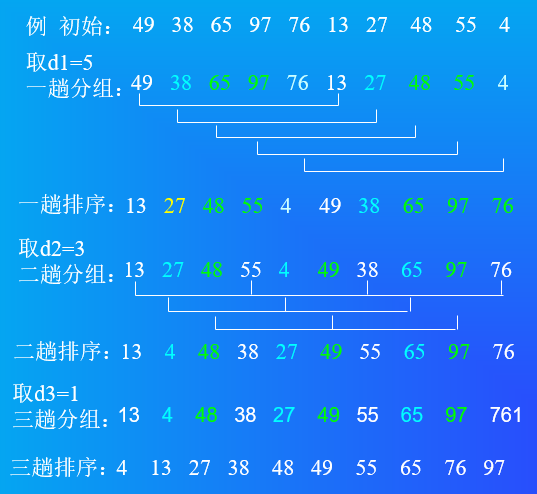

排序过程：先取一个正整数d1<n，把所有相隔d1的记录放一组，组内进行直接插入排序；然后取d2<d1，重复上述分组和排序操作；直至di=1，即所有记录放进一个组中排序为止

```java
/*
 * 希尔排序：先取一个小于n的整数d1作为第一个增量，
 * 把文件的全部记录分成（n除以d1）个组。所有距离为d1的倍数的记录放在同一个组中。
 * 先在各组内进行直接插入排序；然后，取第二个增量d2<d1重复上述的分组和排序，
 * 直至所取的增量dt=1(dt<dt-l<…<d2<d1)，即所有记录放在同一组中进行直接插入排序为止。 
 */
public class ShellSort {
	public static void sort(int[] data) {
		for (int i = data.length / 2; i > 2; i /= 2) {
			for (int j = 0; j < i; j++) {
				insertSort(data, j, i);
			}
		}
		insertSort(data, 0, 1);
	}

	private static void insertSort(int[] data, int start, int inc) {
		for (int i = start + inc; i < data.length; i += inc) {
			for (int j = i; (j >= inc) && (data[j] < data[j - inc]); j -= inc) {
				swap(data, j, j - inc);
			}
		}
	}
}
/*
 * 属于插入类排序,是将整个无序列分割成若干小的子序列分别进行插入排序 　　 
 * 排序过程：先取一个正整数d1<n，把所有序号相隔d1的数组元素放一组，
 * 组内进行直接插入排序；然后取d2<d1，重复上述分组和排序操作；直至di=1， 即所有记录放进一个组中排序为止 　　 
 * 初始：d=5 　　49 38 65 97 76 13 27 49 55 04 　　 
 * 49 13 　　|-------------------| 　　 
 * 38 27     |-------------------| 　　 
 * 65 49 　　|-------------------| 　　 
 * 97 55     |-------------------| 　　 
 * 76 04 　　|-------------------| 　　 
 * 一趟结果 　　13 27 49 55 04 49 38 65 97 76 　　 
 * d=3 　　 13 27 49  55 04 49 38 65 97 76 　　 
 * 13 55 38 76 |------------|------------|------------| 　　 
 * 27 04 65 |------------|------------| 　　 
 * 49 49 97 |------------|------------| 　　
 * 二趟结果  13 04 49* 38 27 49 55 65 97 76 　　 
 * d=1 　　13 04 49 38 27 49 55 65 97 76
 * 　　 |----|----|----|----|----|----|----|----|----| 　　 三趟结果 　　
 * 04 13 27 38 49 49 55 65 76 97
 */
```



实现方法2

```c++
void ShellSort(int array[], int len)
{
	int i = 0;
	int j = 0;
	int k = -1;
	int temp = -1;
	int gap = len;
	do
	{
		 //业界统一实验的平均最好情况，经过若干次后，收敛为1
		gap = gap / 3 + 1; //O（n*1.3）
	
		for(i=gap; i<len; i+=gap)
		{
			k = i;
			temp = array[k];

			for(j=i-gap; (j>=0) && (array[j]>temp); j-=gap)
			{
				array[j+gap] = array[j];
				k = j;
			}
			array[k] = temp;
		}
	}while( gap > 1 );
}
```

## 希尔排序特点

- 子序列的构成不是简单的“逐段分割”，而是将相隔某个增量的记录组成一个子序列
- 希尔排序可提高排序速度，因为
  - 分组后n值减小，n²更小，而T(n)=O(n²)，所以T(n)从总体上看是减小了
  - 关键字较小的记录跳跃式前移，在进行最后一趟增量为1的插入排序时，序列已基本有序
- 增量序列取法（Shell 排序的执行时间依赖于增量序列）
  - 没有1以外的公因子（序列互质）
  - 最后一个增量值必须为1