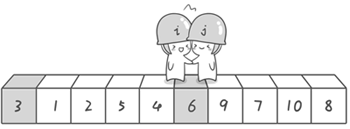

上一节的冒泡排序可以说是我们学习第一个真正的排序算法，并且解决了桶排序浪费空间的问题，但在算法的执行效率上却牺牲了很多，它的时间复杂度达到了O(N2)。假如我们的计算机每秒钟可以运行10亿次，那么对1亿个数进行排序，桶排序则只需要0.1秒，而冒泡排序则需要1千万秒，达到115天之久，是不是很吓人。那有没有既不浪费空间又可以快一点的排序算法呢？那就是“快速排序”啦！光听这个名字是不是就觉得很高端呢。

假设我们现在对“6  1  2 7  9  3  4  5 10  8”这个10个数进行排序。首先在这个序列中随便找一个数作为基准数（不要被这个名词吓到了，就是一个用来参照的数，待会你就知道它用来做啥的了）。为了方便，就让第一个数6作为基准数吧。接下来，需要将这个序列中所有比基准数大的数放在6的右边，比基准数小的数放在6的左边，类似下面这种排列。

```
3  1  2 5  4  6  9 7  10  8
```

在初始状态下，数字6在序列的第1位。我们的目标是将6挪到序列中间的某个位置，假设这个位置是k。现在就需要寻找这个k，并且以第k位为分界点，左边的数都小于等于6，右边的数都大于等于6。想一想，你有办法可以做到这点吗？

给你一个提示吧。请回忆一下冒泡排序，是如何通过“交换”，一步步让每个数归位的。此时你也可以通过“交换”的方法来达到目的。具体是如何一步步交换呢？怎样交换才既方便又节省时间呢？先别急着往下看，拿出笔来，在纸上画画看。我高中时第一次学习冒泡排序算法的时候，就觉得冒泡排序很浪费时间，每次都只能对相邻的两个数进行比较，这显然太不合理了。于是我就想了一个办法，后来才知道原来这就是“快速排序”，请允许我小小的自恋一下(^o^)。

方法其实很简单：分别从初始序列“6  1  2 7  9  3  4  5 10  8”两端开始“探测”。先从右往左找一个小于6的数，再从左往右找一个大于6的数，然后交换他们。这里可以用两个变量i和j，分别指向序列最左边和最右边。我们为这两个变量起个好听的名字“哨兵i”和“哨兵j”。刚开始的时候让哨兵i指向序列的最左边（即i=1），指向数字6。让哨兵j指向序列的最右边（即j=10），指向数字8。


首先哨兵j开始出动。因为此处设置的基准数是最左边的数，所以需要让哨兵j先出动，这一点非常重要（请自己想一想为什么）。哨兵j一步一步地向左挪动（即j--），直到找到一个小于6的数停下来。接下来哨兵i再一步一步向右挪动（即i++），直到找到一个数大于6的数停下来。最后哨兵j停在了数字5面前，哨兵i停在了数字7面前。


现在交换哨兵i和哨兵j所指向的元素的值。交换之后的序列如下。

```
6  1  2  5  9 3  4  7  10  8
```


到此，第一次交换结束。接下来开始哨兵j继续向左挪动（再友情提醒，每次必须是哨兵j先出发）。他发现了4（比基准数6要小，满足要求）之后停了下来。哨兵i也继续向右挪动的，他发现了9（比基准数6要大，满足要求）之后停了下来。此时再次进行交换，交换之后的序列如下。

```
6  1  2 5  4  3  9  7 10  8
```

第二次交换结束，“探测”继续。哨兵j继续向左挪动，他发现了3（比基准数6要小，满足要求）之后又停了下来。哨兵i继续向右移动，糟啦！此时哨兵i和哨兵j相遇了，哨兵i和哨兵j都走到3面前。说明此时“探测”结束。我们将基准数6和3进行交换。交换之后的序列如下。

```
3  1 2  5  4  6  9 7  10  8
```




到此第一轮“探测”真正结束。此时以基准数6为分界点，6左边的数都小于等于6，6右边的数都大于等于6。回顾一下刚才的过程，其实哨兵j的使命就是要找小于基准数的数，而哨兵i的使命就是要找大于基准数的数，直到i和j碰头为止。

OK，解释完毕。现在基准数6已经归位，它正好处在序列的第6位。此时我们已经将原来的序列，以6为分界点拆分成了两个序列，左边的序列是“3  1 2  5  4”，右边的序列是“9  7  10  8”。接下来还需要分别处理这两个序列。因为6左边和右边的序列目前都还是很混乱的。不过不要紧，我们已经掌握了方法，接下来只要模拟刚才的方法分别处理6左边和右边的序列即可。现在先来处理6左边的序列现吧。

左边的序列是“3  1  2 5  4”。请将这个序列以3为基准数进行调整，使得3左边的数都小于等于3，3右边的数都大于等于3。好了开始动笔吧。

如果你模拟的没有错，调整完毕之后的序列的顺序应该是。

```
2  1  3  5  4
```

OK，现在3已经归位。接下来需要处理3左边的序列“2 1”和右边的序列“5 4”。对序列“2 1”以2为基准数进行调整，处理完毕之后的序列为“1 2”，到此2已经归位。序列“1”只有一个数，也不需要进行任何处理。至此我们对序列“2 1”已全部处理完毕，得到序列是“1 2”。序列“5 4”的处理也仿照此方法，最后得到的序列如下。

```
1  2  3 4  5  6 9  7  10  8
```

对于序列“9  7  10  8”也模拟刚才的过程，直到不可拆分出新的子序列为止。最终将会得到这样的序列，如下。

```
1  2  3 4  5  6  7  8 9  10
```

到此，排序完全结束。细心的同学可能已经发现，快速排序的每一轮处理其实就是将这一轮的基准数归位，直到所有的数都归位为止，排序就结束了。下面上个霸气的图来描述下整个算法的处理过程。


快速排序之所比较快，因为相比冒泡排序，每次交换是跳跃式的。每次排序的时候设置一个基准点，将小于等于基准点的数全部放到基准点的左边，将大于等于基准点的数全部放到基准点的右边。这样在每次交换的时候就不会像冒泡排序一样每次只能在相邻的数之间进行交换，交换的距离就大的多了。因此总的比较和交换次数就少了，速度自然就提高了。当然在最坏的情况下，仍可能是相邻的两个数进行了交换。因此快速排序的最差时间复杂度和冒泡排序是一样的都是O(N2)，它的平均时间复杂度为O(NlogN)。其实快速排序是基于一种叫做“二分”的思想。我们后面还会遇到“二分”思想，到时候再聊。先上代码，如下。

可以输入以下数据进行验证

```
1061279345108
```

运行结果是

```
12345678910
```

下面是程序执行过程中数组a的变化过程，带下划线的数表示的已归位的基准数。

快速排序由 C. A. R. Hoare（东尼霍尔，Charles Antony Richard Hoare）在1960年提出，之后又有许多人做了进一步的优化。如果你对快速排序感兴趣可以去看看东尼霍尔1962年在Computer Journal发表的论文“Quicksort”以及《算法导论》的第七章。快速排序算法仅仅是东尼霍尔在计算机领域才能的第一次显露，后来他受到了老板的赏识和重用，公司希望他为新机器设计一个新的高级语言。你要知道当时还没有PASCAL或者C语言这些高级的东东。后来东尼霍尔参加了由Edsger Wybe Dijkstra（1972年图灵奖得主，这个大神我们后面还会遇到的到时候再细聊）举办的“ALGOL 60”培训班，他觉得自己与其没有把握去设计一个新的语言，还不如对现有的“ALGOL 60”进行改进，使之能在公司的新机器上使用。于是他便设计了“ALGOL 60”的一个子集版本。这个版本在执行效率和可靠性上都在当时“ALGOL 60”的各种版本中首屈一指，因此东尼霍尔受到了国际学术界的重视。后来他在“ALGOL X”的设计中还发明了大家熟知的“case”语句，后来也被各种高级语言广泛采用，比如PASCAL、C、Java语言等等。当然，东尼霍尔在计算机领域的贡献还有很多很多，他在1980年获得了图灵奖。