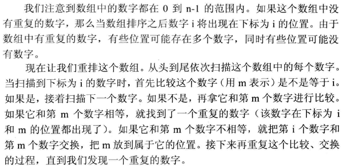
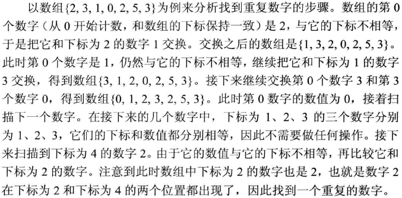

## 数组中重复的数字

长度为n的数组的所有数字都在0~n-1范围 

方法1：把数组排序，然后从头到尾扫描排序后的数组即可。

方法2：哈希表，但是需要增加存储哈希表的空间

方法3：





```c++
/* 
 * Question Description:
 * (Question 6 in <Coding Intervies>) An array contains n numbers ranging from 0 to n-1. 
 * There are some numbers duplicated in the array. It is not clear how many numbers are duplicated or 
 * how many times a number gets duplicated. How do you find a duplicated number in the array? 
 * For example, if an array of length 7 contains the numbers {2, 3, 1, 0, 2, 5, 3}, 
 * the implemented function (or method) should return either 2 or 3
*/

#include <stdio.h>

// Parameters:
//        numbers:     an array of integers
//        length:      the length of array numbers
//        duplication: (Output) the duplicated number in the array number
// Return value:       true if the input is valid, and there are some duplications in the array number
//                     otherwise false
bool duplicate(int numbers[], int length, int* duplication) 
{     
    if(numbers == NULL || length <= 0)
    {
        return false;
    }

    for(int i = 0; i < length; ++i) 
    {         
        if(numbers[i] < 0 || numbers[i] > length - 1)             
            return false;     
    }  

    for(int i = 0; i < length; ++i) 
    {         
        while(numbers[i] != i) 
        {             
            if(numbers[i] == numbers[numbers[i]]) 
            {                 
                *duplication = numbers[i];             
                return true;
            }  

            // swap numbers[i] and numbers[numbers[i]]             
            int temp = numbers[i];             
            numbers[i] = numbers[temp];             
            numbers[temp] = temp;         
        }     
    }          
    
    return false;
}  

//================= Test Code =================
bool contains(int array[], int length, int number)
{
    for(int i = 0; i < length; ++i)
    {
        if(array[i] == number)
            return true;
    }
        
    return false;
}
    
void test(char* testName, int numbers[], int lengthNumbers, 
          int expected[], int expectedExpected, bool validArgument)
{
    printf("%s begins: ", testName);
        
    int duplication;
    bool validInput = duplicate(numbers, lengthNumbers, &duplication);

    if(validArgument == validInput)
    {
        if(validArgument)
        {
            if(contains(expected, expectedExpected, duplication))
            {
                printf("Passed.\n");
            }
            else
            {
                printf("FAILED.\n");
            }
        }
        else
        {
            printf("Passed.\n");
        }
    }
    else
    {
        printf("FAILED.\n");
    }
}
    
// The duplicated number is the smallest number
static void test1()
{
    int numbers[] = {2, 1, 3, 1, 4};
    int duplications[] = {1};
    test("Test1", numbers, sizeof(numbers) / sizeof(int), 
         duplications, sizeof(duplications) / sizeof(int), true);
}
    
// The duplicated number is the greatest number
static void test2()
{
    int numbers[] = {2, 4, 3, 1, 4};
    int duplications[] = {4};
    test("Test2", numbers, sizeof(numbers) / sizeof(int), 
         duplications, sizeof(duplications) / sizeof(int), true);
}
    
// There are more than one duplicated number
static void test3()
{
    int numbers[] = {2, 4, 2, 1, 4};
    int duplications[] = {2, 4};
    test("Test3", numbers, sizeof(numbers) / sizeof(int), 
         duplications, sizeof(duplications) / sizeof(int), true);
}
    
// no duplicated numbers
static void test4()
{
    int numbers[] = {2, 1, 3, 0, 4};
    int duplications[] = {-1}; // not in use in the test function
    test("Test4", numbers, sizeof(numbers) / sizeof(int), 
         duplications, sizeof(duplications) / sizeof(int), false);
}
    
// no duplicated numbers
static void test5()
{
    int numbers[] = {2, 1, 3, 5, 4};
    int duplications[] = {-1}; // not in use in the test function
    test("Test5", numbers, sizeof(numbers) / sizeof(int), 
         duplications, sizeof(duplications) / sizeof(int), false);
}

void main() 
{
    test1();
    test2();
    test3();
    test4();
    test5();
}
```

