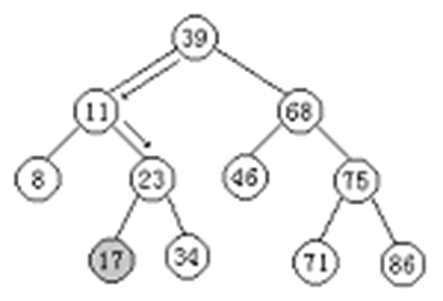
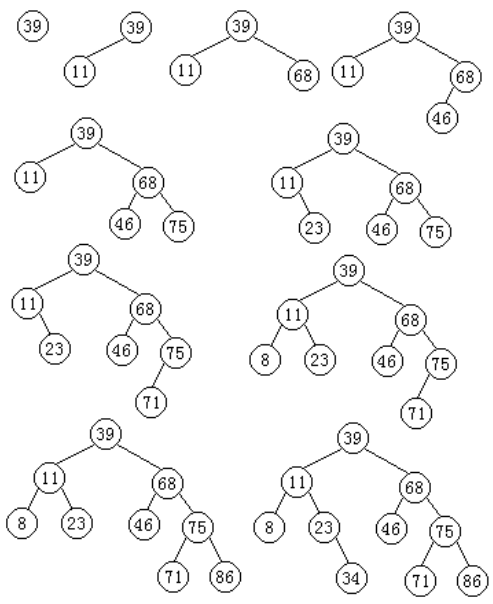
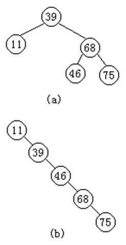
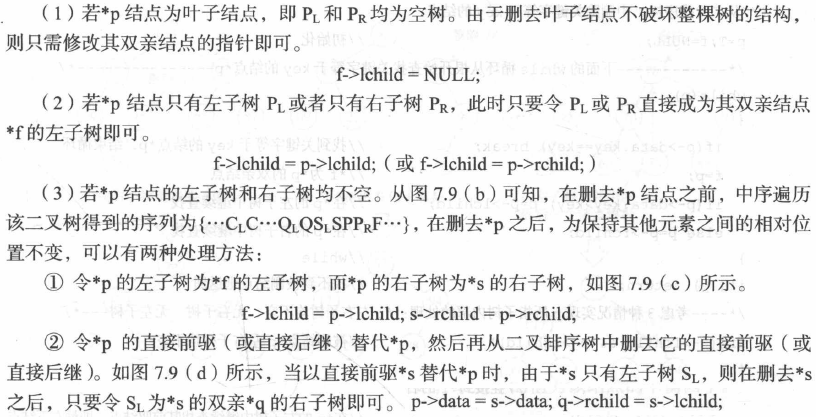
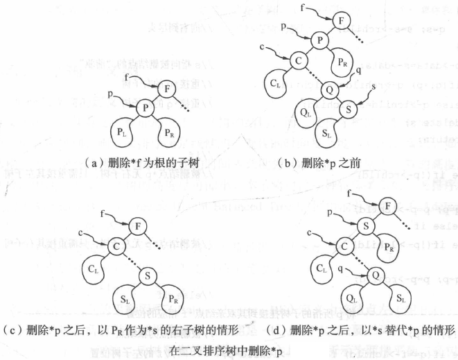

## 二叉查找树

二叉查找树(Binary Search Tree)，又被称为二叉搜索树。

它是特殊的二叉树：对于二叉树，假设x为二叉树中的任意一个结点，x节点包含关键字key，节点x的key值记为key[x]。如果y是x的左子树中的一个结点，则key[y] <= key[x]；如果y是x的右子树的一个结点，则key[y] >= key[x]。那么，这棵树就是二叉查找树。如下图所示


在二叉查找树中：

- 若任意节点的左子树不空，则左子树上所有结点的值均小于它的根结点的值
- 任意节点的右子树不空，则右子树上所有结点的值均大于它的根结点的值
- 任意节点的左、右子树也分别为二叉查找树
- 没有键值相等的节点（no duplicate nodes）


二叉排序树又称为二叉查找树，其定义为：二叉排序树或者是一棵空树，或者是具有如下性质的二叉树：

- 若它的左子树非空，则左子树上所有结点的值均小于根结点；
- 若它的右子树非空，则右子树上所有结点的值均大于根结点；
- 左、右子树本身又各是一棵二叉排序树。

左小右大，递归定义，中序遍历是有序的。二叉查找树结合了数组和链表的优点：查询快，增删快。

## 二叉排序树上的查找

二叉排序树的查找算法可以用递归和迭代两种方法实现。


- 在p为根的二叉排序树上进行查找的递归算法

```c++
template <class Type> BSTreeNode<Type> * BSTree<Type> ::
Find (const Type & k, BSTreeNode<Type> * p ) const{
    if ( p == NULL ){ //查找失败
    	return NULL;  
    }else if ( k < p->data ){ //在左子树上递归查找
		return Find ( k, p->leftChild );
    }else if ( k > p->data ){ //在右子树上递归查找
		return Find ( k, p->rightChild );
    }else{
    	return p;    //相等,查找成功
    }                 
}
```

- 在p为根的二叉排序树上进行查找的迭代算法

```c++
template <class Type> BSTreeNode<Type> * BSTree<Type> ::
Find(const Type & k, BSTreeNode<Type>* p)const {
    BSTreeNode<Type> * temp = p;
    if ( p != NULL ) {
        while ( temp != NULL ) {
        	if ( temp->data == k ) return temp;  //查找成功
        	if ( temp->data < k ){
        		temp = temp->rightChild; //查找右子树
        	}else{
        		temp = temp->leftChild;  //查找左子树
        	}      
        }
    }
    return temp; //查找失败
}
```
### 二叉排序树的插入

为了向二叉排序树中插入一个新元素，必须先检查这个元素在二叉排序树中是否已经存在。因此，在插入之前，首先在二叉排序树中检查待插入的数据元素，如果查找成功，说明树中已经存在这个数据元素，则不再插入；如果查找不成功，说明树中不存在关键字等于给定值的数据元素，把新元素插到查找操作失败的地方。



在二叉排序树中插入一个新元素的算法描述

```c++
//在p为根的二叉排序树插入结点的递归算法
template <class Type> void BSTree<Type>:: 
Insert (const Type & x, BSTreeNode<Type> * & p) {
	if ( p == NULL ){ //空二叉树
		p = new BSTreeNode<Type> (x); //创建数据元素x的结点
	}else if ( x < p->data ){         //在左子树插入
		Insert ( x, p->leftChild );
	}else if ( x > p->data ){         //在右子树插入
		Insert ( x, p->rightChild );            
	}else{ //结点x已存在
		cout << "There has node x" << endl;  
		exit (1);
	}
}
```


利用二叉排序树的插入算法，建立二叉排序树示例。

关键字的输入序列{39、11、68、46、75、23、71、8、86、34}



对于同样一组数据元素，由于输入顺序不同，建立起来的二叉排序树的形态也不同。例如，有3个数据元素{39、11、68}，图中的二叉排序树(a)、(b)、(c)、(d)、(e)分别是由输入序列：{68、11、39}、{68、39、11}、{39、11、68}、{11、68、39}、{11、39、68}得到的。


### 二叉排序树的删除

在二叉排序树中删除一个数据元素时，必须将因删除元素而断开的二叉链表重新链接起来，同时确保不会失去二叉排序树的性质。

此外，为了保证在执行删除后二叉排序树的查找性能不至于降低，还需要做到重新链接后二叉排序树的高度不能增加。

在二叉排序树中删除一个数据元素的算法思想如下：

1. 如果被删除的数据元素是叶子，则只需将其双亲指向它的指针置空，再释放该数据元素的存储空间即可；
2. 如果被删除的数据元素只有左子树而没有右子树，则可以拿它的左孩子顶替它的位置，再释放该数据元素的存储空间即可；
3. 如果被删除的数据元素只有右子树而没有左子树，可以拿它的右孩子顶替它的位置，再释放该数据元素的存储空间即可；
4. 如果被删除的数据元素左、右子树都存在，则有两种处理方法：
   - 其一，可以在它的右子树中寻找关键字值最小的数据元素（中序遍历中第一个被访问的数据元素）x，用x的值代替被删除数据元素的值，再来删除数据元素x（x没有左子树）；
   - 其二，可以在它的左子树中寻找关键字值最大的数据元素（中序遍历中最后一个被访问的数据元素）x，用x的值代替被删除数据元素的值，再来删除数据元素x（x没有右子树）。

二叉排序树中删除元素示例 


二叉排序树删除结点算法的C++实现如下

```c++
//在p为根的二叉排序树上删除关键字为k的结点
template <class Type>
void BSTree<Type> :: Delete (const Type &k, BSTreeNode<Type> * &p) {
    BSTreeNode<Type> * temp;
    if ( p != NULL ){
		if ( k < p->data ){
         	Delete ( k, p->leftChild ); 
		}else if ( k > p->data ){
          	Delete ( k, p->rightChild );
        }else if ( p->leftChild != NULL && p->rightChild != NULL ){ 
        	temp = Min ( p->rightChild );
            p->data = temp->data;
            Delete ( p->data, temp );  
        }else { 
        	temp = p;
            if ( p->leftChild == NULL ){
				p = p->rightChild;
            }else if ( p->rightChild == NULL ){
            	p = p->leftChild;
            }   
            delete temp;  
        }
    }
} 
```

```c++
// 在以node为根的二叉查找树中,返回最小的结点
BSTreeNode<Type>* Min(BSTreeNode<Type>* node){
    if( node->left == NULL )
        return node;
    return Min( node->left );
}
```

在二叉排序树上的查找过程实际上是走了一条从根到所查结点的路径，所需的比较次数为该结点所在的层次数。因此，查找成功时，关键字的比较次数不超过树的高度。但是含有n个结点的二叉排序树不是唯一的，从而树的高度就不一定相同。 

显然，当二叉排序树是完全二叉树时，其平均查找性能最佳为log₂n，与有序表的折半查找相同。当二叉排序树退化为一棵单支树时，二叉排序树的平均查找性能最差为：(n+1)/2，与顺序表的平均查找长度相同。



## 二叉查找树的实现

### 二叉查找树的Java实现

二叉查找树节点的定义

```java
public class BSTree<T extends Comparable<T>> {

    private BSTNode<T> mRoot; // 根结点

    public class BSTNode<T extends Comparable<T>> {
        T key;                // 关键字(键值)
        BSTNode<T> left;      // 左孩子
        BSTNode<T> right;     // 右孩子
        BSTNode<T> parent;    // 父结点

        public BSTNode(T key, BSTNode<T> parent, BSTNode<T> left, BSTNode<T> right) {
            this.key = key;
            this.parent = parent;
            this.left = left;
            this.right = right;
        }
    }
        ......
}
```
BSTree是二叉树，它保护了二叉树的根节点mRoot；mRoot是BSTNode类型，而BSTNode是二叉查找树的节点，它是BSTree的内部类。BSTNode包含二叉查找树的几个基本信息：

- key -- 它是关键字，是用来对二叉查找树的节点进行排序的
- left -- 它指向当前节点的左孩子
- right -- 它指向当前节点的右孩子
- parent -- 它指向当前节点的父结点

左小右大，中序遍历是有序的。
```java
public class BSTree
{
	private Node	root;	// 根节点

	private class Node
	{
		Node	parrent;	// 父节点
		Node	left;		// 左孩子
		Node	right;		// 右孩子
		Object	data;       // 数据域

		public Node(Object data) {
			this.data = data;
		}
	}

	/**
	 * @param data 传递的数据         
	 * @return 父节点的值
	 */
	private Node findParrent(Object data, Node currentNode) {
		// 从根节点找
		Node temp = currentNode;
		Node parrent = currentNode;
		// 循环找
		while (temp != null) {
			parrent = temp;
			// 比较
			if (compare(data, temp.data)) {
				// data 大于 当前节点
				temp = temp.right;
			} else {
				// data 小于 当前节点
				temp = temp.left;
			}
		}
		return parrent;
	}
	
	public void update(Object oldData,Object newData){
		remove(oldData);
		add(newData);
	}

	/**
	 * 添加数据
	 * 
	 * @param data 要添加的数据
	 */
	public void add(Object data) {
		// 判断该数据是否存在
		if (contains(data))
			return;
		// 1.把数据放到节点中
		Node node = new Node(data);
		// 2.把节点链接到二叉树中
		// 是否有根节点
		if (root == null) {
			root = node;// 保存到根节点中
		} else {
			// 找位置,找父节点,比较父节点的值，小左边 大右边
			Node parrent = findParrent(data, root);
			// 设置新增节点的父节点
			node.parrent = parrent;
			// 比较
			if (compare(data, parrent.data)) {
				// 自己比父节点大
				parrent.right = node;
			} else {
				// 自己比父节点小
				parrent.left = node;
			}
		}
	}

	/**
	 * @param data
	 * @return 是否包含该数据
	 */
	public boolean contains(Object data) {
		return null != find(data);
	}
	
	private Node find(Object data) {
		Node temp = root;// 从根节点找
		while (temp != null) {
			// 判断数据
			if (temp.data.equals(data)
					&& temp.data.hashCode() == data.hashCode()) {
				// 找到数据
				break;
			} else if (compare(data, temp.data)) {
				// true data > temp
				// 从右边找
				temp = temp.right;
			} else {
				// false data < temp
				// 从坐标边找
				temp = temp.left;
			}
		}
		return temp;
	}

	public void remove(Object data) {
		// 1. 查找数据是否存在
		Node temp = find(data);

		// 2. 存在：找到数据节点
		if (temp != null) {
			// 存在
			// 3. 删除节点
			// 1. 根节点
			if (temp == root) {
				// 1.1 没有儿子
				if (temp.left == null && temp.right == null) {
					root = null;
				} else if (temp.right == null) {
					root = root.left;
					root.parrent = null;
					// 1.2 只有左儿子
				} else if (temp.left == null) {
					// 1.3 只有右儿子
					root = root.right;
					root.parrent = null;
				} else {
					// 1.4 两个儿子都有
					// 保留左儿子
					Node left = getLeft(temp);
					// left成为新的根节点
					root = left;
					left.parrent = null;
				}

			} else {// 2. 非根节点

				if (temp.left == null && temp.right == null) {
					// 2.1 没有儿子
					if (compare(temp.data, temp.parrent.data)) {
						//在父节点右边
						temp.parrent.right = null;
					} else {
						//在父节点左边
						temp.parrent.left = null;
					}
				} else if (temp.right == null) {
					// 2.2 只有左儿子
					if (compare(temp.data, temp.parrent.data)) {
						//在父节点右边
						temp.parrent.right = temp.left;
						temp.left.parrent = temp.parrent;
					} else {
						//在父节点左边
						temp.parrent.left = temp.left;
						temp.left.parrent = temp.parrent;
					}
				} else if (temp.left == null) {
					// 2.3 只有右儿子
					if (compare(temp.data, temp.parrent.data)) {
						//在父节点右边
						temp.parrent.right = temp.right;
						temp.right.parrent = temp.parrent;
					} else {
						//在父节点左边
						temp.parrent.left = temp.right;
						temp.right.parrent = temp.parrent;
					}
				} else {
					// 2.4 两个儿子都有
					Node left = getLeft(temp);
					//上面还有父节点（爷爷）
					if (compare(left.data, temp.parrent.data)) {
						//比爷爷节点大
						temp.parrent.right = left;
						left.parrent = temp.parrent;
					} else  {
						//比爷爷节点小
						temp.parrent.left = left;
						left.parrent = temp.parrent;
					}
				}
			}
		}
	}

	/**
	 * @param node 要删除的节点
	 * @return 左儿子节点
	 */
	private Node getLeft(Node node) {
		// 保留左儿子
		Node left = node.left;
		// 处理右节点
		Node rightNewParrent = findParrent(node.right.data, left);
      	// 把删除节点的右节点放到删除节点的左儿子最右边
		rightNewParrent.right = node.right;
		node.right.parrent = rightNewParrent;
		return left;
	}

	/**
	 * @param o1 第一个值        
	 * @param o2 第二个值          
	 * @return 如果o1 大于 o2 返回true 否则false
	 */
	public boolean compare(Object o1, Object o2) {
		boolean res = false;

		// 判断o1 有没有实现比较器
		if (o1 instanceof Comparable) {
			Comparable c1 = (Comparable) o1;
			Comparable c2 = (Comparable) o2;
			if (c1.compareTo(c2) > 0) {
				res = true;
			} else {
				// 默认值就是false
			}
		} else {// 传递的对象没有比较器
			res = o1.toString().compareTo(o2.toString()) > 0 ? true : false;
		}
		return res;
	}

	// 递归打印
	public void print() {
		print(root);
	}

	public void print(Node node) {
		if (node == null) {
			return;
		} else {
			// 中序遍历
			print(node.left);
			System.out.println(node.data + ",");
			print(node.right);
		}
	}
}
```

```java
public class TestTreeApp
{
	public static void main(String[] args) {
		
		BSTree trees = new BSTree();
		int[] datas = {55,33,44,88,66,99};
		for (int d : datas) {
			trees.add(d);
		}
		
		trees.print();
		System.out.println();
		
		//测试删除
		trees.update(33,77);
		trees.print();
	}
}
```
### 二叉查找树的C++实现

二叉查找树的二叉链表存储表示（数据结构严蔚敏版）

```c++
typedef struct ElemType{	
	char key;
}ElemType;

typedef struct BSTNode{
	ElemType data;	//结点数据域
	BSTNode *lchild,*rchild;	//左右孩子指针
}BSTNode,*BSTree;
```

二叉排序树的递归查找

```c++
BSTree SearchBST(BSTree T,char key) {
  //在根指针T所指二叉排序树中递归地查找某关键字等于key的数据元素
  //若查找成功，则返回指向该数据元素结点的指针，否则返回空指针
  if((!T)|| key==T->data.key) return T;       	            	//查找结束
  else if (key<T->data.key)  return SearchBST(T->lchild,key);	//在左子树中继续查找
  else return SearchBST(T->rchild,key);    		   			//在右子树中继续查找
}
```

二叉排序树的插入

```c++
void InsertBST(BSTree &T,ElemType e ) {
  //当二叉排序树T中不存在关键字等于e.key的数据元素时，则插入该元素
  if(!T) {                				//找到插入位置，递归结束
		 BSTree S = new BSTNode;        //生成新结点*S
         S->data = e;                   //新结点*S的数据域置为e   
         S->lchild = S->rchild = NULL;	//新结点*S作为叶子结点
         T = S;            				//把新结点*S链接到已找到的插入位置
  }
  else if (e.key< T->data.key) 
      InsertBST(T->lchild, e );			//将*S插入左子树
  else if (e.key> T->data.key) 
      InsertBST(T->rchild, e);			//将*S插入右子树
}
```

二叉排序树的创建

```c++
void CreateBST(BSTree &T ) {
  //依次读入一个关键字为key的结点，将此结点插入二叉排序树T中
  T=NULL;
  ElemType e;
  cin>>e.key;
  while(e.key!=ENDFLAG){   	//ENDFLAG为自定义常量，作为输入结束标志
    InsertBST(T, e);        //将此结点插入二叉排序树T中
    cin>>e.key;
  }          
}
```

二叉查找树的删除






```c++
void DeleteBST( BSTree &T, char key )
{
    // 从二叉排序树T中删除关键字等于key的结点
    BSTree  p   = T;
    BSTree  f   = NULL;             // 初始化
    BSTree  q;
    BSTree  s;
    /*------------下面的while循环从根开始查找关键字等于key的结点*p-------------*/
    while ( p )
    {
        if ( p->data.key == key )
            break;                  // 找到关键字等于key的结点*p，结束循环
        f = p;                      // *f为*p的双亲结点
        if ( p->data.key > key )
            p = p->lchild;          // 在*p的左子树中继续查找
        else p = p->rchild;         // 在*p的右子树中继续查找
    }
    if ( !p )
        return;                         // 找不到被删结点则返回
    /*―考虑三种情况实现p所指子树内部的处理：*p左右子树均不空、无右子树、无左子树―*/
    if ( (p->lchild) && (p->rchild) )   // 被删结点*p左右子树均不空
    {
        q  = p;
        s  = p->lchild;
        while ( s->rchild )             // 在*p的左子树中继续查找其前驱结点，即最右下结点
        {
            q = s; 
          	s = s->rchild;
        }                               // 向右到尽头
        p->data = s->data;              // s指向被删结点的“前驱”
        if ( q != p )
        {
            q->rchild = s->lchild;      // 重接*q的右子树
        }  else q->lchild = s->lchild;  // 重接*q的左子树
        delete s;
    }else    {
        if ( !p->rchild )               // 被删结点*p无右子树，只需重接其左子树
        {
            q = p; 
          	p = p->lchild;
        }else if ( !p->lchild )         // 被删结点*p无左子树，只需重接其右子树
        {
            q = p; 
          	p = p->rchild;
        }
        /*――――――――――将p所指的子树挂接到其双亲结点*f相应的位置――――――――*/
        if ( !f )
            T = p;                  // 被删结点为根结点
        else if ( q == f->lchild )
            f->lchild = p;          // 挂接到*f的左子树位置
        else f->rchild = p;         // 挂接到*f的右子树位置
        delete q;
    }
}
```