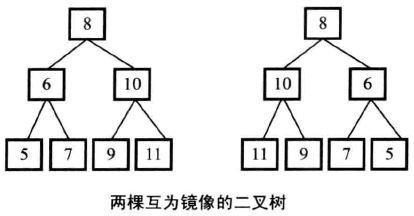

## 二叉树的镜像

请完成一个函数，输入一个二叉树，该函数输出二叉树的镜像。




- 交换根节点的左右子树
- 交换值为10的结点的左右子结点
- 交换值为6的结点的左右子结点


```c++
struct BinaryTreeNode 
{
    int                    m_nValue; 
    BinaryTreeNode*        m_pLeft;  
    BinaryTreeNode*        m_pRight; 
};
// 递归实现
void MirrorRecursively(BinaryTreeNode *pNode)
{
    if((pNode == NULL) || (pNode->m_pLeft == NULL && pNode->m_pRight))
        return;
	// 交换pNode结点的左右子结点
    BinaryTreeNode *pTemp = pNode->m_pLeft;
    pNode->m_pLeft = pNode->m_pRight;
    pNode->m_pRight = pTemp;
    
    if(pNode->m_pLeft)
        MirrorRecursively(pNode->m_pLeft);  

    if(pNode->m_pRight)
        MirrorRecursively(pNode->m_pRight); 
}
// 循环实现
void MirrorIteratively(BinaryTreeNode* pRoot)
{
    if(pRoot == NULL)
        return;

    std::stack<BinaryTreeNode*> stackTreeNode;
    stackTreeNode.push(pRoot);

    while(stackTreeNode.size() > 0)
    {
        BinaryTreeNode *pNode = stackTreeNode.top();
        stackTreeNode.pop();

        BinaryTreeNode *pTemp = pNode->m_pLeft;
        pNode->m_pLeft = pNode->m_pRight;
        pNode->m_pRight = pTemp;

        if(pNode->m_pLeft)
            stackTreeNode.push(pNode->m_pLeft);

        if(pNode->m_pRight)
            stackTreeNode.push(pNode->m_pRight);
    }
}
```

