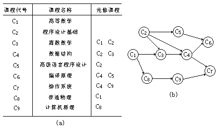
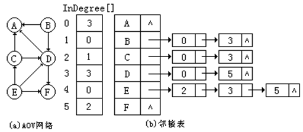
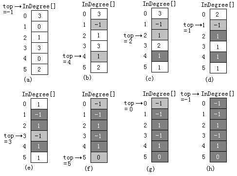
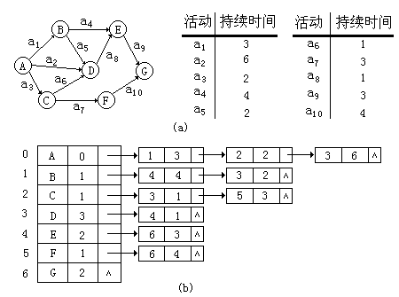
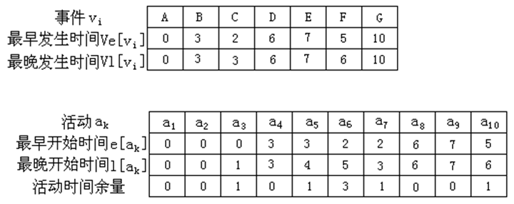

## 活动网络

通常我们把计划、施工过程、生产流程、程序流程等都当成一个工程。除了很小的工程外，一般都把工程分为若干个叫做“活动”的子工程。完成了这些活动，整个工程就完成了。

在本节中将介绍两种活动网络：用顶点表示活动的网络(AOV网络)和用边表示活动的网络(AOE网络)。 

## 用顶点表示活动的网络 

一般地，可以用有向图表示一个工程。在这种有向图中，用顶点表示活动，用弧&lt;i,j>表示活动i必须在活动j开始之前完成。这种有向图叫做用顶点表示活动的网络(Activity 0n Vertex)，记作AOV网络。

计算机专业学生的学习就是一个工程，每一门课程的学习就是整个工程中的一个活动。右图给出了若干门必修的课程，及其先修关系。 



在AOV网络中不能出现有向回路，即有向环。如果在AOV网络中出现了有向环，则意味着某项活动的开始要以自己的完成作为先决条件，显然这是不可能的事情。因此，对给定的AOV网络，必须先判断它是否存在有向环。

检测AOV网络中是否存在有向环的一种方法是对AOV网络构造它的拓扑有序序列。即将AOV网络中各个顶点排列成一个线性有序的序列，使得AOV网络中所有的前驱和后继关系都能得到满足。这种构造AOV网络全部顶点的拓扑有序序列的运算就叫做拓扑排序。 

例如，对学生课程先修关系图进行拓扑排序，得到的拓扑有序序列为：

```
C1 , C2 , C3 , C4 , C5 , C6 , C8 , C9 , C7 
或  
C1 , C8 , C9 , C2 , C5 , C3 , C4 , C7 , C6
```

从上述例子可以看出，一个AOV网络的拓扑有序序列并不是唯一的。进行拓扑排序的方法是：

（1）在AOV网络中选一个没有直接前驱的顶点v；并输出之；

（2）从图中删去该顶点，同时删去所有从顶点v发出的弧；

（3）重复以上步骤（1）和（2）,直到没有直接前驱的顶点全部输出。如果图中所有顶点已全部输出，则拓扑有序序列形成，拓扑排序完成；否则说明图中还剩下一些顶点，它们都有直接前驱，再也找不到没有前驱的顶点了，这时AOV网络中必定存在有向环。


最后得到的拓扑有序序列为：E、C、B、D、F、A。它满足了图中给出的所有前驱和后继关系。在拓扑排序中对于本来没有这种关系的顶点，如 B 和 E 也人为地排出了先后关系。

在拓扑排序算法中，AOV网络可以用邻接表存储。为了方便查找入度为0的顶点，在邻接表中增设了一个顶点入度数组InDegree[]，以记录各个顶点的入度。

入度数组InDegree[]的初始化由图的构造函数完成，在输入弧数据之前，先令InDegree[i]＝0(i＝0，1，…，n-1)。以后每输入一条弧&lt;i,j>，在建立一个弧结点，并将它插入到相应弧链表中的同时，顶点j的入度数增加1。下图给出AOV网络的邻接表表示的例子。



作相应修改后图邻接表的类定义

```c++
class Graph {
friend class <int,int> VertexNode;
friend class <int> ArcNode;
private
    VertexNode <int , char > * VertexesTable;
    int * InDegree; //入度数组，记录每一个顶点的入度   
	int CurrentNumVertexes; 当前的顶点数    
   	int CurrentNumArcs; //当前的边（或弧）数
    int GetVertexPos( const char &v );// 取顶点v在数组中的位置
public:
    Graph(char v[ ] , int num = MaxVertexes ) ;
    void TopologicalOrder();//拓扑排序
};
```

修改后的构造函数

```c++
Graph ( vertexType v[ ] , int num = MaxVertexes ) :
CurrentNumVertexes(0), CurrentNumArcs(0){
    int e, t, h; 
    vertexType tail, head; 
    arcType w;
    VertexesTable = new VertexNode<int, char>[MaxVertexes];
    InDegree = new int [MaxVertexes];// 创建入度表
    for ( int i = 0; i < num; i++){  // 输入各顶点信息
      	InsertVertex ( v[ i ] ); 
      	InDegree [i]=0; 
    }    
	cin >> e;                    //输入边的条数
    for ( i = 0; i < e; i++) {   //逐条输入边
       cin >> tail >> head >> w; //输入一条边
       while ((t = GetVertexPos ( tail ))==-1)
            cout<<"输入的顶点(tail)不存在"; 
       while ((h = GetVertexPos ( head ))==-1)
             cout<<"输入的顶点(head)不存在";
       InsertArc ( k, j, weight );    //插入一条边
       InDegree[j]++;  //顶点j的入度加一
    }     
}
```

在拓扑排序算法中，还需要使用一个存放入度为零的顶点的堆栈，供选择和输出入度为零的顶点。在拓扑排序过程中，一旦一个顶点的直接前驱全部输出，就将该顶点加入堆栈中。

### 拓扑排序算法可以描述如下

（1）建立入度为零的顶点栈；		
（2）当入度为零的顶点栈为空时算法转步骤（6），否则继续步骤（3）；		
（3）入度为零的顶点栈中栈顶元素v出栈,并输出之顶点v；		
（4）从AOV网络中删去顶点v和所有从顶点v发出的弧&lt;v、j>，并将顶点j的入度减一；		
（5）如果顶点j入度减至0，则将该顶点进入入度为零的顶点栈；转步骤（2）；		
（6）如果输出顶点个数少于AOV网络的顶点个数，则输出网络中存在有向环的信息；算法结束。

在算法实现时，为了建立入度为零的顶点栈，可以不另外分配存储空间，直接利用顶点的入度数组InDegree[]中入度为零的元素，建立入度为零的顶点的静态链栈。



### 拓扑排序算法的程序描述

```c++
void Graph :: TopologicalSort ( ) {
    int top = -1;     //入度为零的顶点栈初始化
    int n = 0, j;     //n为输出的顶点数，初始值为0
    ArcNode<int> * p; //弧的搜索指针
    for ( i = 0; i < n; i++ )    //入度为零的顶点进栈
        if (InDegree[i] == 0 ){ 
          	InDegree[i] = top;  
          	top = i; 
        }
    while (top!= -1) {           //继续拓扑排序
       	j = top; 
      	top = InDegree [top]; 
       	n++; //  输出的顶点数加一
       	cout << VertexesTable[j].data << endl;       
      	p = VertexesTable[j].firstarc; 
       	while ( p ) {            	  //扫描以顶点j为弧尾的所有弧
         	int k = p->adjvex;        //取弧头顶点为k
         	if (--InDegree[k] == 0){  //顶点k的入度减一
            	count[k] = top;  
              	top = k; 
            }
         	p = p->nextarc; // 取以顶点j为弧尾的下一条弧
        }
    }
    if ( n < CurrentVertexesNum )
       cout << "AOV网络中有回路(有向环)" << endl;
}
```

## 用边表示活动的网络 

在一个带权有向无环图中，用弧表示一个工程中的各项活动(Activity)，用弧上的权值表示相应活动的持续时间(Duration)，用顶点表示事件(Event)，则这样的有向图叫做用边表示活动的网络，简称AOE网络。

 

AOE网络在某些工程估算方面是非常有用的。例如，人们通过AOE网络可以了解到：

（1）完成整个工程至少需要多少时间？

（2）为缩短完成工程所需的时间, 应当加快哪些活动进度？或者说哪些活动是影响整个工程进度的关键所在?

由于整个工程只有一个工程开始事件和工程完成事件，所以在AOE网络中也只有一个入度为0的顶点（称为源点）用于表示这个开始事件；只有一个出度为0的顶点（称为汇点）用于表示这个完成事件。

在AOE网络中有些活动是必须按先后顺序进行的，例如活动a1和a4；而有些活动是可以并行进行的，例如活动a4和a5。因此，从源点到汇点的路径可能不止一条，这些路径的长度（即相应路径上所有活动的持续时间之和）可能是不同的，但只有当各条路径上的所有活动都完成了，整个工程才算完成。

因此，整个工程完成所需的最短时间取决于从源点到汇点的最长路径长度。这条路径长度最长的路径就叫做关键路径（Critical Path），关键路径上的所有活动都是关键活动（即不按期完成就会影响整个工程完成的活动）。 

例如，前图（a）所示的AOE网络，其关键路径有两条，它们分别是：（A、B、E、G），（A、D、E、G），关键活动包括：a1、a2 、a4、a8和a9。 

在AOE网络中要找出关键路径，就必须先找出关键活动。为了求关键活动，在此，先定义几个有关的量：

（1）事件Vi 的最早可能发生时间：从源点V0 到顶点Vi 的最长路径长度，用Ve[i]表示。Ve[i]决定了以顶点Vi为弧尾的弧所代表的活动可以开始的最早时间。

（2）事件Vi的最迟允许发生时间：在保证整个工程不推迟完成的前提下，顶点Vi 所对应的事件的最迟允许发生时间，用Vl[i]表示。

（3）活动ak 的最早可能开始时间 e[k]：设活动ak 对应的弧为&lt;Vi,Vj>，则e[k]是从源点V0到顶点Vi 的最长路径长度。因此, e[k] = Ve[i]。

（4）活动ak 的最迟允许开始时间 l[k]：l[k]是在保证整个工程不推迟完成的前提下，活动ak的最迟允许开始时间。显然，l[k] = Vl[j] - dur(&lt;i,j>) 。其中，dur(&lt;i,j>) 是完成 ak 所需的时间。

（5）活动ak 的时间余量：活动ak 的最迟允许开始时间和最早可能开始时间之差（l[k]-e[k]）。显然，时间余量为零的活动ak（l[k]==e[k]）是关键活动。

为找出关键活动，需要求各个活动的e[k]与l[k]，以判别是否l[k]==e[k]。而为了求得e[k]与l[k]，需要先求得各个顶点Vi 的Ve[i]和Vl[i]。 

求Ve[i]和Vl[i]可以分两步进行：

（1）第一步：求Ve[i]的递推公式

从Ve[0] = 0开始，向前递推

iVe[j] = Max{ Ve[i] + dur(&lt;i,j>) | &lt;Vi,Vj> ∈ T }, j = 1, 2, ..., n-1;

其中, T是所有以顶点Vj为弧头的弧&lt;Vi、Vj>的集合。

（2）第二步：求Vl[i]的递推公式

从Vl[n-1] = Ve[n-1]开始，反向递推

jVl[i] = Min{ Vl[j] - dur(&lt;i,j>) | &lt;Vi,Vj> ∈ T }, i =0, 1, 2, ..., n-2;

其中, T是所有以顶点Vi为弧尾的弧&lt; Vi,Vj >的集合。

当求出了AOE网络中每个顶点Vi的Ve[i]和Vl[i]，就可以再计算每一个活动ak的最早可能开始时间e[k]和最晚允许开始时间l[k]。

设活动ak (k = 1, 2, …, e)对应带权有向边&lt;Vi,Vj>，它的持续时间用dur (&lt;Vi, Vj>) 表示，则有：

- e[k] = Ve[i]
- l[k] = Vl[j] - dur(&lt;Vi,Vj>)；k = 1, 2, …, e

然后再通过判断是否e[k] == l[k]，就可找出关键活动，从而求得关键路径。

计算关键路径的算法步骤如下：

1. 输入n个顶点和e条带权的有向边，建立邻接表结构
2. 从源点V0出发，令Ve[0]=0，按拓扑有序的顺序计算每个顶点的Ve[j]（j=1，2，…，n-1）。若拓扑排序中遍历的顶点数小于n，则说明网络中存在有向环，不能继续求关键路径
3. 从汇点Vn-1出发，令Vl[n-1]=Ve[n-1]，按逆拓扑有序顺序求各顶点的Vl[i]（i=0，1，…，n-2）
4. 根据各顶点Vi的Ve[i]和Vl[i]值，求各条弧ak的e[k]和l[k]
5. 输出关键活动ak（e[k]==l[k]即为关键活动）

例如，对前图（a）所示的AOE网络的计算结果如下图所示。由此可求得关键活动为：a1、a2、a4、a8和a9。因此，关键路径有两条，它们分别是：（A、B、E、G），（A、D、E、G）。



在计算关键路径时，可以借用上一节的拓扑排序算法，在进行拓扑排序时计算各顶点Vi的Ve[i]；

由于逆拓扑有序序列是拓扑有序序列的逆序。所以可以在算法中增设一个栈，在拓扑排序时，可以把拓扑有序序列中每一个顶点依次入栈，在拓扑排序完成后（计算完Ve[]），栈中的顶点再依次出栈并计算其Vl[]。

### 求关键路径算法的C++实现

```c++
void graph :: CriticalPath ( ) {
    int i, j, p, k, e, l;
    int * Ve = new int[CurrentVertexesNum];
    int * Vl = new int[CurrentVertexesNum];
    ArcNode<int> *p ;
    for ( i = 0; i < CurrentVertexesNum; i++ ) Ve[i] = 0;
    for ( i = 0; i < CurrentVertexesNum; i++ ) {
      p = VertexesTable[i].firstarc;      
      while ( p != NULL ) {
        j = p->adjvex;
        if ( Ve[i] + p->weight > Ve[j] )
          Ve[j] = Ve[i] + p->weight; 
        p = p->nextarc;
      }
    }
    for ( i = 0; i < n; i++ ) Vl[i] = Ve[n-1];    
	for ( i = n-2; i; i-- ) {
        p = VertexesTable[i].firstarc;
        while ( p != NULL ) {
          j = p->adjvex;
          if ( Vl[j] - p->weight < Vl[i])
            Vl[i] = Vl[j] - p->weight;
          p = p->nextarc;  
         }
    }    
	for ( i = 0; i < n; i++ ) {
       p = VertexesTable[i].firstarc;
       while ( p != NULL ) {
         j = p->adjvex;	
         e = Ve[i];  l = Vl[j] - p->weight;
         if ( l == e ) 
          cout<< "<" << VertexesTable[i].data
             << "," <<VertexesTable[j].data<< ">"
            << "是关键活动" << endl;
         p = p->nextarc;        
       }
    }
}
```