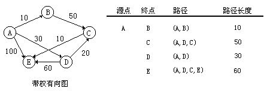
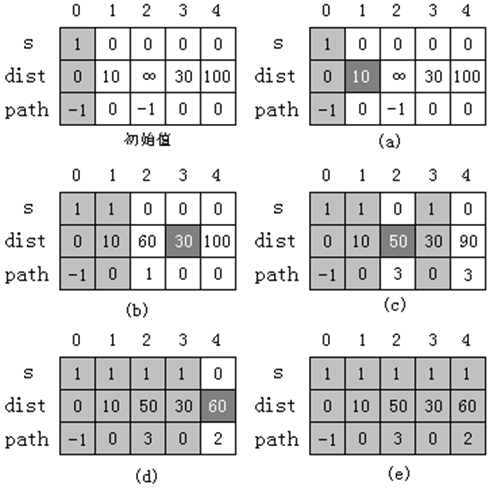

## 弧上权值为非负情形的单源点最短路径问题 

所谓弧上权值为非负情形的单源点最短路径问题就是对于给定一个带权有向图G（G中所有弧上的权均为非负值）与源点v，求从v到G中其余各顶点的最短路径。

如下图所示的带权有向图。设源点为A，则源点A到其余顶点的最短路径分别为：（A、B）路径长度为10，（A、D、C）路径长度为50，（A、D）路径长度为30，（A、D、C、E）路径长度为60。



迪杰斯特拉(Dijkstra)提出了按路径长度的递增次序，逐条产生最短路径的方法。首先求出从源点v0到其余各顶点中长度最短的一条，然后参照它求出长度次短的一条最短路径，依次类推，直到从源点v0到其余各顶点的最短路径全部求出为止。

具体做法是：设集合S存放已经求出的最短路径的终点，初始状态时，集合S中只有一个源点v0（S={v0}）。以后每求得一条最短路径(v0，…，vk)，就将vk加入到集合S中，直到全部顶点都加入到集合S中，算法就可以结束了。

如图给出了按照迪杰斯特拉算法对前图所示带权有向图逐步求最短路径的过程。


在迪杰斯特拉算法中，为了记录当前找到的从源点v0到其余各顶点的最短路径长度，需引入一个辅助数组dist[]。它的每一个分量dist[i]表示当前找到的从源点v0到终点vi的相对最短路径的长度。它的初始状态是：若从源点v0到顶点vi有弧，则dist[i]为该弧上的权值；否则dist[i]为∞。

同时，为了记录从源点v0到其余各顶点的最短路径，还需引入一个辅助数组path[]。它的每一个分量path[i]表示从源点v0到顶点vi的最短路径上的顶点vi的直接前驱顶点。

设第一条最短路径为(v0，vi)，则有：dist[i]＝Min{dist[j] | vj ∈ V-S}

那么下一条最短路径是哪一条呢？假设下一条最短路径的终点是vk，则可想而知，它或者是(v0，vk)，或者是(v0，vi，vk)。其长度或者是弧 $ <v_0，v_k> $ 上的权值，或者是dist[i]与弧 $ <v_i，v_k> $ 上的权值之和。

一般情况下，假设S是已求得的最短路径的终点的集合，vx(vx ∈ V-S)为下一条最短路径的终点，则可证明：这条最短路径必然是从v0出发，或者直接到达顶点vx，或者中间只经过S中的顶点便可到达顶点vx的路径中的一条。对此可以用反证法加以证明。 

如图是前图所示的带权有向图为例，利用迪杰斯特拉算法，逐次选取从源点v0到其余各顶点的最短路径的过程中辅助数组dist、path和S的变化。



为了利用迪杰斯特拉算法计算最短路径，需要在图的邻接矩阵存储结构的类定义中增加用于表示辅助数组的成员数据。

```c++
class Graph {  //图的类定义  
private:
    float * dist; //最短路径长度数组
    int *path;	 //最短路径数组
    int *s; //最短路径顶点集	
public:
    void ShortestPath ( int n, int v);
    int choose ( int );
}
```

迪杰斯特拉算法的实现1

```c++
void Graph :: ShortestPath ( int n, int v ){
    float min ; 
    int u ;
    dist = new float[n]; 
  	path = new int[n];
  	s = new int[n]; 
  	// 选择不在集合S中且具有最短路径的顶点u
    for ( int i = 0; i < n; i++) {
        dist[i] = Arcs[v][i]; //dist数组初始化
        s[i] = 0;  
      
        if ( i != v && dist[i] < MAXNUM){
          	path[i] = v;
        }else{
          	path[i] = -1;//path数组初始化
        }
        
    	S[v] = 1; //顶点v加入顶点集合s
		for ( i = 0; i < n-1; i++ ){
        	min = MAXNUM;  
          	u = v;
        }
      
        for ( int j = 0; j < n; j++ ){
             if ( !s[j] && dist[j] < min ){
             	u = j;  
             	min = dist[j]; 
             }
        }
        s[u] = 1; //将顶点u加入集合S
        for ( int w = 0; w < n; w++ ){//修改dist和path
              if ( !s[w] && dist[u] + Arcs[u][w] < dist[w] ) {
              		dist[w] = dist[u] + Arcs [u][w]; 
              		path[w] = u;  
              }
        }
  	}
} 
```
迪杰斯特拉算法的实现2

```c++
void ShortestPath_DIJ(AMGraph G, int v0){ 
    //用Dijkstra算法求有向网G的v0顶点到其余顶点的最短路径 
    int v , i , w , min;
	int n = G.vexnum;         //n为G中顶点的个数 

	for(v = 0; v < n; ++v){   //n个顶点依次初始化 
		S[v] = false;         //S初始为空集 
		D[v] = G.arcs[v0][v]; //将v0到各个终点的最短路径长度初始化为弧上的权值 
		if(D[v] < MaxInt){
          	Path [v] = v0; //如果v0和v之间有弧，则将v的前驱置为v0
		}else{
          	Path [v] = -1; //如果v0和v之间无弧，则将v的前驱置为-1 
		}
	}

	S[v0]=true;  //将v0加入S 
	D[v0]=0;     //源点到源点的距离为0 

	//初始化结束，开始主循环，每次求得v0到某个顶点v的最短路径，将v加到S集
	for(i = 1;i < n; ++i){				//对其余n-1个顶点，依次进行计算 
        min= MaxInt; 
        for(w = 0; w < n; ++w) 
			if(!S[w] && D[w] < min){	//选择一条当前的最短路径，终点为v 
				v = w; 
				min = D[w];
			}      	
		S[v]=true;                   	//将v加入S 
		for(w = 0;w < n; ++w)           //更新从v0出发到集合V?S上所有顶点的最短路径长度 
			if(!S[w] && (D[v] + G.arcs[v][w] < D[w])){ 
				D[w] = D[v] + G.arcs[v][w];  //更新D[w] 
				Path [w] = v;              //更改w的前驱为v 
			}
    }
}
```

迪杰斯特拉算法的实现3

```c++
// Dijkstra算法，求有向网G的v0顶点到其余顶点v的最短路径P[v]及带权长度D[v]   
// P[v]的值为前驱顶点下标,D[v]表示v0到v的最短路径长度和
void ShortestPath_Dijkstra(MGraph G, int v0, Patharc *P, ShortPathTable *D)
{    
	int v,w,k,min;    
	int final[MAXVEX]; // final[w]=1表示求得顶点v0至vw的最短路径
	for(v=0; v<G.numVertexes; v++)    // 初始化数据
	{        
		final[v] = 0;			// 全部顶点初始化为未知最短路径状态
		(*D)[v] = G.arc[v0][v]; // 将与v0点有连线的顶点加上权值
		(*P)[v] = -1;		    // 初始化路径数组P为-1 
	}

	(*D)[v0] = 0;  // v0至v0路径为0  
	final[v0] = 1;    // v0至v0不需要求路径        
	// 开始主循环，每次求得v0到某个v顶点的最短路径   
	for(v=1; v<G.numVertexes; v++)   
	{
		min=INFINITY;    // 当前所知离v0顶点的最近距离        
		for(w=0; w<G.numVertexes; w++) // 寻找离v0最近的顶点    
		{            
			if(!final[w] && (*D)[w]<min)             
			{                   
				k=w;                    
				min = (*D)[w];    // w顶点离v0顶点更近            
			}        
		}        
		final[k] = 1;    // 将目前找到的最近的顶点置为1
		for(w=0; w<G.numVertexes; w++) // 修正当前最短路径及距离
		{
			// 如果经过v顶点的路径比现在这条路径的长度短的话
			if(!final[w] && (min+G.arc[k][w]<(*D)[w]))   
			{    // 说明找到了更短的路径，修改D[w]和P[w]
				(*D)[w] = min + G.arc[k][w];  // 修改当前路径长度               
				(*P)[w]=k;        
			}       
		}   
	}
}
```