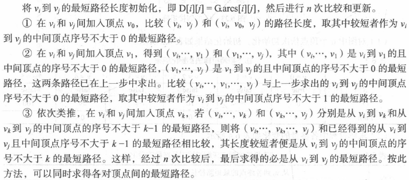

## 所有顶点之间的最短路径 

前两节中都是考虑单源点的情况，接下来讨论求一个带权有向图中每一对顶点vi和vj之间的最短路径和最短路径长度的问题。 

求解此问题的一个办法是：如果图中各条弧上的权值均大于0，则分别以每一个顶点为源点，重复执行迪杰斯特拉算法n次，就可求得每一对顶点之间的最短路径及最短路径长度，总的执行时间是0(n³)。

在本节中将介绍另一种更直接的算法：弗洛伊德(Floyd)算法。 

弗洛伊德算法的基本思想是：

设置一个n×n的方阵序列A(k)（k=0、1、……、n-1）。其中除对角线的矩阵元素都等于0外，其它元素A(k)\[i]\[j]表示从顶点i到顶点j经过的中间顶点序号不超过k的最短有向路径长度。

初始时设置A(-1)，它以任意两个顶点之间的直接有向弧的权值作为两个顶点的路径长度，即对于任意两个顶点i和j如若它们之间存在弧，则以此弧上的权值作为它们之间的最短路径长度；若它们之间不存在弧，则以MAXNUM（机器可表示的在问题中不会遇到的最大数）作为它们之间的最短路径长度，因此，A(-1)\[]\[]=Arcs\[]\[]。

以后逐步尝试在原路径中依次加入其它顶点作为中间顶点。如果增加中间顶点后，得到的路径长度比原来的路径长度减少了，则以此新路径代替原路径，并修改相应的矩阵元素，代入新的更短的路径长度。

如图给出了利用弗洛伊德算法求最短路径过程中的方阵序列 。


### Floyd算法的实现1（数据结构C++实现）

```c++
void Graph :: Floyd ( int n ) {
    for ( int i = 0; i < n; i++ ){    //矩阵A(-1)与path(-1)初始化
        for ( int j = 0; j < n; j++ ) {
            a[i][j] = Arcs[i][j];
            if ( i != j && a[i][j] < MAXNUM ) 
                path[i][j] = i;   //从 i 到 j 有直接的路径（弧） 
            else path[i][j] = -1; //从 i 到 j 没直接的路径（弧）
        }   
    }
	// 从i号顶点到j号顶点只经过前k号点的最短路径
    for ( int k = 0; k < n; k++ ){     //产生A(k)及path(k)
        for ( i = 0; i < n; i++ ){
          for ( j = 0; j < n; j++ )
              if ( a[i][k] + a[k][j] < a[i][j] ) { 
                  a[i][j] = a[i][k] + a[k][j];
                  path[i][j] = path[k][j];
              }//缩短路径长度, 经过 k 到 j 
        }
    } 
}
```
由path路径数组得出最短路径

### Floyd算法的实现2（数据结构严蔚敏版）

算法步骤



```c++
void ShortestPath_Floyed(AMGraph G){ 
    //用Floyd算法求有向网G中各对顶点i和j之间的最短路径 
	int i , j , k ;
    for (i = 0; i < G.vexnum; ++i)  //各对结点之间初始已知路径及距离 
        for(j = 0; j < G.vexnum; ++j){ 
            D[i][j] = G.arcs[i][j]; 
            if(D[i][j] < MaxInt && i != j)  Path[i][j]=i; //如果i和j之间有弧，则将j的前驱置为i 
            else Path [i][j] = -1;  //如果i和j之间无弧，则将j的前驱置为-1 
		}
  		// 从i号顶点到j号顶点只经过前k号点的最短路径
		for(k = 0; k < G.vexnum; ++k) 
			for(i = 0; i < G.vexnum; ++i) 
				for(j = 0; j < G.vexnum; ++j)
					if(D[i][k] + D[k][j] < D[i][j]){ //从i经k到j的一条路径更短 
						D[i][j] = D[i][k]+D[k][j];   //更新D[i][j] 
						Path[i][j] = Path[k][j];     //更改j的前驱为k 
					}
}
```
### Floyd算法的实现3（大话数据结构版）

```c++
void ShortestPath_Floyd(MGraph G, Patharc *P, ShortPathTable *D)
{    
	int v,w,k;    
	for(v=0; v<G.numVertexes; ++v) // 初始化D与P  
	{        
		for(w=0; w<G.numVertexes; ++w)  
		{
			(*D)[v][w]=G.arc[v][w];	// D[v][w]值即为对应点间的权值
			(*P)[v][w]=w;		    // 初始化P
		}
	}
	for(k=0; k<G.numVertexes; ++k)   
	{
		for(v=0; v<G.numVertexes; ++v)  
		{        
			for(w=0; w<G.numVertexes; ++w)    
			{
				if ((*D)[v][w]>(*D)[v][k]+(*D)[k][w])
				{	// 如果经过下标为k顶点路径比原两点间路径更短
					(*D)[v][w]=(*D)[v][k]+(*D)[k][w]; // 将当前两点间权值设为更小的一个
					(*P)[v][w]=(*P)[v][k]; // 路径设置为经过下标为k的顶点
				}
			}
		}
	}
}
```

最短路径

```c++
for(v=0; v<G.numVertexes; ++v)   
{        
	for(w=v+1; w<G.numVertexes; w++)  
	{
		printf("v%d-v%d weight: %d ",v,w,D[v][w]);
		k=P[v][w];				// 获得第一个路径顶点下标
		printf(" path: %d",v);	// 打印源点
		while(k!=w)				// 如果路径顶点下标不是终点
		{
			printf(" -> %d",k);	// 打印路径顶点
			k=P[k][w];			// 获得下一个路径顶点下标
		}
		printf(" -> %d\n",w);	// 打印终点
	}
	printf("\n");
}
```