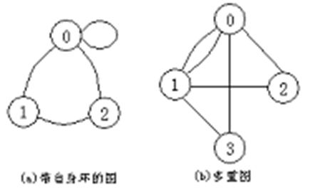
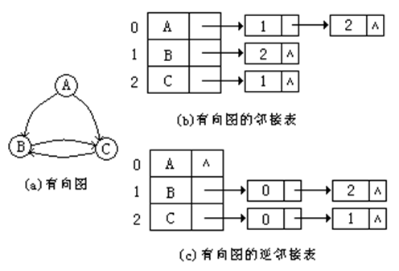
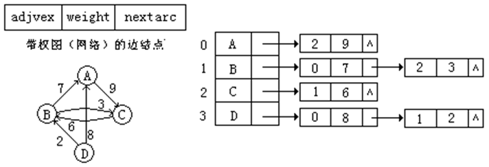
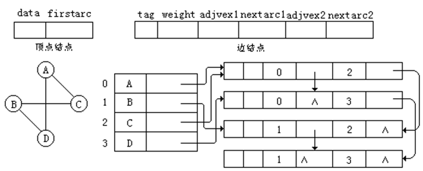
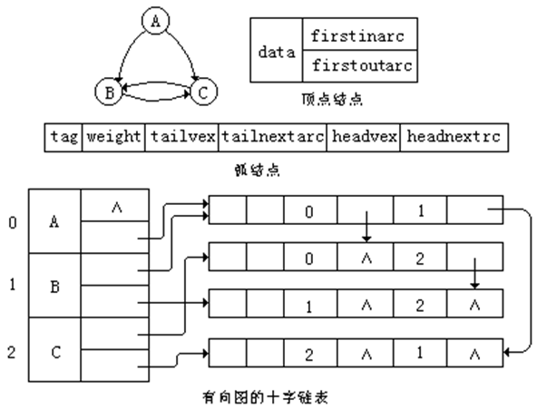
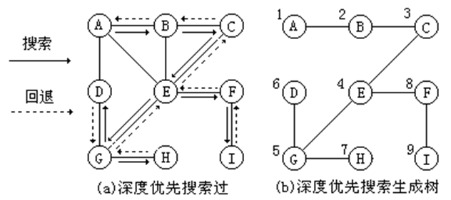
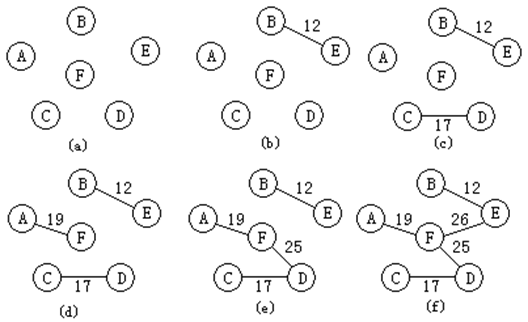

## 图Graph

图（Graph）是一种较树更为复杂的非线性数据结构。在树形结构中，数据元素之间的关系是层次型的，树中除叶子以外的每一个数据元素可以和它下一层的多个数据元素存在关系；但除根元素以外的每一个数据元素只能且必须和它上一层中的一个数据元素存在关系。而在图形结构中，数据元素之间的关系是任意的，图中每一个数据元素可以和任何其它数据元素相关联。

## 图的基本概念

图是由数据元素的集合及数据元素间的关系集合组成的一种数据结构：

Graph＝（V,E)，其中 ：V= { x | x ∈ 某个数据对象} 是数据元素的集合，在图中，数据元素一般被称为顶点(vertex)；E = {(v、w) | v，w ∈ V } 或 E = {&lt;v、w> | v, w ∈ V && Path (v、w)}是数据元素之间关系的集合，也叫做边(edge)集合；Path (v、w)表示从顶点v到顶点w的一条单向通路，它是有方向的。

### 无向图和有向图

在图中如果顶点对(v、w)是无序的，则称此图为无向图(undirected graph)，顶点对(v、w)称为与顶点v和顶点w相关联的一条边。由于这条边没有方向，所以(v、w)与(w、v)是同一条边；

在图中如果顶点对&lt;v、w>是有序的，则称此图为有向图(directed graph)，顶点对&lt;v、w>称为从顶点v到顶点w的一条有向边（又称为弧），其中v称为有向边&lt;v、w>的始点（弧尾）；w称为有向边&lt;v、w>的终点（弧头）。显然&lt;v、w>与&lt;w、v>是两条不同的弧。

### 无向图和有向图的示例

上图所示的4个图，其中G1和G2是无向图，G3和G4是有向图。在图G3和G4中，为了表示有向边，边的方向用箭头画出，箭头从有向边的始点指向有向边的终点；在无向图中用线段表示边。

### 一些限制

第一、图中不能有从顶点自身到自身的边(即自身环)，就是说不应有形如(x，x)或&lt;x，x>的边。如图(a)所示的带自身环的图不讨论。

第二、两个顶点v和w之间相关联的边不能多于一条。如图(b)所示的多重图也不讨论。

## 图的术语 

1．完全图(complete graph)：在有n个顶点的无向图中，若有 n(n-1)／2条边，则称此无向图为完全无向图。在有n个顶点的有向图中，若有n(n-1)条边，则称此图为完全有向图。在完全图中边（弧）数目达到最大。

2．权(weight)：在某些图的应用中，边（弧）上具有与它相关的系数，称之为权。这些权可以表示从一个顶点到另一个顶点的距离、花费的代价、所需的时间、次数等。这种带权图也被称为网络(network)。

3．邻接点(adjacent vertex)：如果(v，w)是无向图G中的一条边，则称v与w互为邻接顶点，且边(v，w)称为依附于顶点v和w。如果<v、w>是有向图G 中的一条弧，则称顶点v邻接到顶点w（也称v是w的前驱），顶点w邻接自顶点v（也称w是v的后继），弧<v，w>与顶点v与w相关联。

4．子图(subgraph)：设有两个图G＝(V，E)和G´＝(V´，E´)。若V´∈V且E´ ∈E，则称图G´是图G的子图。下图(a)和(b)给出无向图G1的两个子图，图(c)和(d)给出有向图G3的两个子图。

5．顶点的度(degree)：在无向图中，一个顶点v的度是依附于顶点v的边的条数，记作TD(v)。在有向图中，以顶点v为始点的有向边的条数称为顶点v的出度，记作OD(v)；以顶点v为终点的有向边的条数称为顶点v的入度，记作ID(v)。有向图中顶点v的度等于该顶点的入度与出度之和：TD(v)＝ID(v)十OD(v)。

6．路径(path)：在图G＝(V，E)中，若从顶点vi出发，沿一些边（或弧）经过一些顶点vp₁、vp₂、…、vpk，到达顶点vj，则顶点序列(vi、vp₁、vp₂、…、 vpk、vj )被称为从顶点vi到顶点vj的路径。

7．路径长度(path length)：对于不带权的图，路径长度是指此路径上边的数目。对于带权图，路径长度是指路径上各边的权之和。

8．简单路径与回路(cycle)：对于一路径（v₁、v₂、…、vm），若路径上各顶点均不相同，则称这路径为简单路径。若路径上第一个顶点v₁和最后一个顶点vm相同，则称这样的路径为回路或环。

9．连通图与连通分量：在无向图中，若从顶点vi到顶点vj有路径，则称顶点vi与vj是连通的。如果无向图中任意两个顶点都是连通的，则称此无向图是连通图。非连通图的极大连通子图（包括所有连通的顶点和这些顶点依附的所有的边）叫做连通分量。

如下图（a）所示是一个非连通图，图（b）所示是相应的三个连通分量。

10．强连通图与强连通分量(strongly connected digraph)：在有向图中，若对于顶点vi和vj，存在一条从vi到vj和从vj到vi的路径，则称顶点vi和顶点vj是强连通。如果有向图中任意两个顶点都是强连通的，则称此有向图为强连通图。非强连通图的极大强连通子图叫做强连通分量。

11．生成树(spanning tree)：一个连通图的生成树是它的极小连通子图，它包含图中全部n个顶点和仅使这n个顶点连通的n-1条边。如果一个有向图只有一个入度为零的顶点，且其它顶点的入度均为1，则称这个有向图为有向树。一个有向图的生成森林由若干棵有向树组成，生成森林含有图中所有的顶点，且只有足以构成若干棵互不相交的有向树的弧。

## 图的存储结构

由于在图中，任何两个顶点之间都可能存在联系，所以无法在存储位置上反映数据元素之间的联系，因此图没有顺序存贮结构。按图中顶点之间的联系，图的存储结构似乎采用多重链表表示比较恰当。但是若采用多重链表，则链表中结点的结构难以确定。因为结点中的指针数若按顶点度的最大值来设置，则会浪费空间，因为有很多顶点的度小于最大值；若顶点的指针数按每个顶点的度数来设置，则存储结构中会有很多顶点的结构不一致，给图的运算带来困难。因此，图的存储结构不宜采用多重链表。 

图的存贮结构应根据具体问题的要求来设计。常用的存贮结构有邻接矩阵、邻接表、邻接多重表和十字链表。

### 邻接矩阵

在图的邻接矩阵表示中，除了记录每一个顶点信息的顶点表外，还有一个表示各个顶点之间关系的矩阵，称之为邻接矩阵。若设图G＝(V，E)是一个有n个顶点的图，则图的邻接矩阵是一个二维数组Arcs\[n][n]，它的定义为：

对于网络(或带权图)，邻接矩阵定义如下：

下图给出了无向图、有向图和有向网的邻接矩阵。其中一维数组Vertexes[]用于存储顶点的信息，二维数组Arcs[][]用于存储边（或弧）的信息。 

从图中可知，无向图的邻接矩阵是对称的，将第i行的元素值或第i列的元素值累加起来就得到顶点i的度。

有向图的邻接矩阵可能不对称。如果第i行第j列为1，则表示有一条从顶点Vi到顶点Vj的有向边，将第j列的所有元素值累加起来就得到顶点Vj的入度ID(Vj)；将第i行的所有元素值累加起来就得到顶点Vi的出度OD(Vi)。即

### 邻接表 

邻接表是邻接矩阵的改进。它把邻接矩阵的每一行改为一个单链表。

对于无向图，把依附于同一个顶点的边链接在同一个单链表中称为边链表，边链表中的每一个结点代表一条边叫做边结点。在边结点中保存着与该边相关联的另一顶点的序号和指向同一链表中下一个边结点的指针；

对于有向图，把从同一个顶点发出的弧链接在同一个单链表中称为弧链表，弧链表的每一个结点代表一条弧叫做弧结点，在弧结点中保存着该弧的弧头顶点序号和指向同一链表中下一个弧结点的指针。如果是带权图，则在边（弧）结点中还要保存该边（或弧）上的权值。

在邻接表中，对于图中的每一个顶点也用一个结点表示，称为顶点结点。顶点结点中保存了该顶点的信息和指向该顶点相应的边（弧）链表的指针。所有的顶点结点用顺序表存储，并假设顶点的序号为数组的下标。

下图给出了无向图的邻接表表示。从无向图的邻接表中可以看到，同一条边在邻接表中出现了两次，这是因为(vi，vj)与(vj，vi)虽是同一条边，但在邻接表中，(vi，vj)对应的边结点在顶点vi的边链表中；(vj，vi) 对应的边结点在顶点vj的边链表中。如果想知道顶点vi的度，只需统计顶点vi的边链表中边结点的个数即可。 

下图（b）所示的是有向图的邻接表表示。在有向图的邻接表中，一条弧在邻接表中只出现一次。如果统计顶点vi的弧链表中的弧结点个数，只能得到该顶点的出度，所以这种链表也称为出弧表；若想要知道该顶点的入度，必须检测其它所有的弧链表，看有多少个弧结点的弧头顶点序号为vi，显然，这是十分不方便的。

为此，对有向图可以建立逆邻接表，如图(c)所示。在有向图的逆邻接表中，顶点vi的弧链表中链接的是所有进入该顶点的弧，所以也称为入弧表。

对于带权图(网络)，必须在邻接表的边结点中增加一个存放边上的权值的域weight。如下图所示的是一个带权图的邻接表表示。

### 邻接多重表

在无向图的邻接多重表中，图的每一条边用一个边结点表示，它由六个域组成。其中，tag是标记域，标记该边是否被处理或被搜索过；wieght为边的信息域，用于存储边的权值；adjvex1和adjvex2是顶点域，表示该边所依附的两个顶点在图中的序号；nextarc1域是链接指针，指向下一条依附于顶点adjvex1的边；nextarc2也是链接指针，指向下一条依附于顶点adjvex2的边。对图中的每一个顶点用一个顶点结点表示，它有两个域组成。其中，data域存储有关顶点的信息；firstarc域是链接指针，指向第一条依附于该顶点的边。所有的顶点结点组成一个顺序表。

下图所示，给出了无向图的邻接多重表表示，及其两种结点的示例。在无向图的邻接多重表中，所需存储空间与表示无向图的邻接表相同。 

### 十字链表

在有向图的十字链表中，图中的每一条弧用一个弧结点表示。弧结点的结构与无向图邻接多重表中的边结点结构类似，也有六个域。其中，tag是标记域，标记该弧是否被处理或被搜索过；wieght为弧的信息域，用于存储弧的权值等信息；tailvex和headvex是分别表示弧尾顶点序号和弧头顶点序号的顶点域；tailnextarc域是链接指针，指向下一条以顶点tailvex为始点（弧尾）的弧；headnextarc也是链接指针，指向下一条以顶点headvex为终点（弧头）的弧。对有向图中的每一个顶点也用一个顶点结点表示，它由三个域组成。其中，data域存储有关顶点的信息；firstinarc域是链接指针，指向第一条以该顶点为终点的弧；firstoutarc域也是链接指针，指向第一条以该顶点为始点的弧。所有的顶点结点组成一个顺序表。 

下图给出了有向图十字链表表示示例及其顶点结点和弧结点的结构。 

在有向图的十字链表中，从顶点结点中的firstoutarc域出发，由弧结点中的tailnextarc域链接起来的链表，正好是原来的邻接表结构。统计该链表中弧结点的个数，可求得该顶点的出度。若从顶点结点的firstoutarc域出发，由弧结点中的headnextarc域链接起来的链表，正好是原来的逆邻接表结构。统计该链表中弧结点的个数，可求得该顶点的入度。

## 图的遍历与连通性 

对于给定的图，沿着一些边（或弧）访问图中所有的顶点，且使每个顶点仅被访问一次，这个过程叫做图的遍历。 

图的遍历通常有两种方法：深度优先遍历(Depth First Traversal)和广度优先遍历(Breadth First Traversal)。这两种方法对无向图和有向图都是适用的，但在下面的讨论中将主要介绍对无向图的遍历。 

### 深度优先遍历

图的深度优先遍历基于深度优先搜索DFS(Depth First Search)，深度优先搜索是从图中某一顶点v出发，在访问顶点v后，再依次从v的任一还没有被访问的邻接顶点w出发进行深度优先搜索，直到图中所有与顶点v有路径相通的顶点都被访问过为止。这是一个递归定义，所以图的深度优先搜索可以用递归算法实现。

下图（a）给出了深度优先搜索的示例。由于该图是连通的，所以从顶点A出发，通过一次深度优先搜索，就可以访问图中的所有顶点。图的深度优先搜索的访问顺序与树的前序遍历顺序类似。图 (b)给出了在深度优先搜索的过程中，访问的所有顶点和经过的边，图中各顶点旁附加的数字表示各顶点被访问的次序。在图 (b)中，共有n-1条边连结了所有n个顶点，在此把它称为图（a）的深度优先搜索生成树。

从指定的结点v开始进行深度优先搜索的算法的步骤是：

（1）访问结点v，并标记v已被访问	
（2）取顶点v的第一个邻接顶点w	
（3）若顶点w不存在，返回；否则继续步骤（4）		
（4）若顶点w未被访问，则访问结点w，并标记w已被访问；否则转步骤（5）		
（5）使w为顶点v的在原来w之后的下一个邻接顶点，转到步骤（3）

### 广度优先遍历

图的广度优先遍历基于广度优先搜索BFS (Breadth First Search)，广度优先搜索是从图中某一顶点v出发，在访问顶点v后再访问v的各个未曾被访问过的邻接顶点w1、w2、…、wk，然后再依次访问w1、w2、…、wk的所有还未被访问过的邻接顶点。再从这些访问过的顶点出发，再访问它们的所有还未被访问过的邻接顶点，……，如此下去，直到图中所有和顶点v由路径连通的顶点都被访问到为止。 

下图(a)给出了一个从顶点A出发进行广度优先搜索的示例。图(b)给出了由广度优先搜索得到的广度优先生成树，它由搜索时访问过的n个顶点和搜索时经历的n-1条边组成，各顶点旁边附的数字标明了顶点被访问的顺序。 

从指定的结点v开始进行广度优先搜索的算法步骤是：

（1）访问结点v，并标记v已被访问，同时顶点v入队列	
（2）当队列空时算法结束，否则继续步骤（3）
（3）队头顶点出队列为v	
（4）取顶点v的第一个邻接顶点w
（5）若顶点w不存在，转步骤（3）；否则继续步骤（6）		
（6）若顶点w未被访问，则访问顶点w，并标记w已被访问，同时顶点w入队列；否则继续步骤		
（7）使w为顶点v的在原来w之后的下一个邻接顶点，转到步骤（5）

## 连通分量

对于连通图，从任一顶点出发，只需一次调用深度优先搜索算法或广度优先搜索算法就可以访问到图中的所有顶点；对于非连通图时，从图中某一顶点出发，一次调用深度优先搜索算法或广度优先搜索算法不可能访问到图中的所有顶点，只能访问到该顶点所在的极大连通子图(即连通分量)的所有顶点。非连通图有n个连通分量，就要n次调用DFS或BFS才能访问图中的所有顶点。若从图的每一个连通分量中的一个顶点出发进行搜索，就可以求得图的所有连通分量。所谓连通分量是指非连通图中极大连通子图。 

## 最小生成树

一个连通图的生成树是原图的极小连通子图，它包含原图中的所有n个顶点和使n个顶点连通的n-1条边。这意味着对于生成树来说，若删除它的一条边，就会使生成树变成非连通图；若给它增加一条边，就会形成图中的一个回路。另一方面，一个连通图的生成树不是唯一的，使用不同的方法遍历图，可以得到不同的生成树；从不同的顶点出发，也可能得到不同的生成树；而且生成树有时还和图的存储结构中具体的结点顺序有关。 

对于一个带权的连通图(即网络)，如何找出一棵生成树，使得各边上的权值总和达到最小，这是一个有实际意义的问题。

对于这样一个有n个顶点的网络，可以有不同的生成树，每一棵生成树都可以构成通信网络。我们希望能够根据各条边上的权值，选择一棵总造价最小的生成树，这就是构造网络的最小(代价)生成树(Minimum-cost Spanning Tree)问题。 

## 克鲁斯卡尔(Kruskal)算法

克鲁斯卡尔(Kruskal)算法的基本思想是：设一个有n个顶点的连通网络G＝{V，E}，最初先构造一个包括全部n个顶点和0条边的森林F＝{T0、T1、…、Tn-1}，以后每一步向F中加入一条边（v、u），该边应当是所依附的两个顶点v和u分别在森林F的两棵不同的树上的所有边中具有最小权值的边。由于这条边的加入，使F中的某两棵树合并为一棵，树的棵数减一。如此，经过n-1步，最终得到一棵有n-1条边且各边权值总和达到最小的生成树——最小生成树。

对于前图(a)所示的连通网络，下图中(a)~(f)给出了按克鲁斯卡尔算法生成最小生成树的过程。 

在克鲁斯卡尔算法中，利用最小堆来存放连通网络中的边，堆中每个元素代表连通网络中的一条边，它有三个域组成：adjvex1、adjvex2和weight，其中adjvex1和adjvex2存储该边所依附的两个顶点的序号，weight存储边上的权值；在利用并查集存放所有连通分量，同一个连通分量的顶点组成并查集的一个子集（等价类）。

克鲁斯卡尔算法步骤如下：

（1）初始化，在并查集中，连通网络的每一个顶点独立成一个等价类，连通网络的所有的边建立最小堆，最小生成树T中没有任何边，T中边的条数计数器i为0

（2）如果T中边的条数计数器i等于顶点数减1，则算法结束；否则继续步骤（3）

（3）选取堆顶元素代表的边（v，u），同时调整堆

（4）利用并查集的运算检查依附于边（v，u）的两个顶点v和u是否在同一个连通分量(即并查集的同一个子集合)上，如果是则转步骤（2）；否则继续步骤（5）

（5）将边（v，u）加入到最小生成树T中，同时将这两个顶点所在的连通分量合并成一个连通分量(即并查集中的相应两个子集合并成一个子集)，继续步骤（2）

下图给出了对于前图（a）所示的连通网络，按克鲁斯卡尔算法构造最小生成树时最小堆和并查集的变化过程。在初始建堆时，边的输入顺序为：(A、B)，（A、C），（A、F），（B、E），（C、D），（C、F），（D、E），（D、F），（E，F）。 

## 普里姆(Prim)算法

普里姆(Prim)算法的基本思想是：假设连通网络为N＝(V，E)；TE为N的最小生成树上边的集合，开始时TE=；U为算法在构造最小生成树过程中已得到的顶点集，开始时U={u0}（u0V）。算法从N中的某一顶点u0出发，选择与u0关联的具有最小权值的边(u0、vi)，将顶点vi加入到生成树的顶点集合U中，(u0，vi)加入到集合TE中，以后每一步从一个顶点在U中，而另一个顶点在V-U中的各条边当中选择权值最小的边(u、v)（uU，vV-U），把顶点v加入到集合U中，边(v、u)加入到集合TE中。如此重复，直到网络中的所有顶点都加入到生成树顶点集合U（U=V）中为止。此时，TE中刚好有n-1条边，则T=（V，TE）为N的最小生成树。

对于前图（a）所示的连通网络，下图(a)(f)给出了按普里姆算法从顶点A开始构造最小生成树的过程。 

在利用普里姆算法构造最小生成树过程中，需要设置了一个辅助数组closearc[ ]，以记录从V-U中顶点到U中顶点具有最小权值的边。对每一个顶点v ∈ V-U，在辅助数组中有一个分量closearc[v]，它包括两个域：lowweight和nearvertex。其中，lowweight中存放顶点v到U中的各顶点的边上的当前最小权值(lowweight=0表示v ∈ U)；nearvertex记录顶点v到U中具有最小权值的那条边的另一个邻接顶点u（nearvertex=-1表示该顶点v为开始顶点）。在下面的普里姆算法描述中，连通网络采用邻接矩阵作为存储结构，并假设普里姆算法从顶点A（设顶点A的序号为0）出发（即u0=0）。 

普里姆算法步骤如下：

（1）初始化辅助数组closearc[]；

（2）重复下列步骤（3）和（4）n-1次

（3）在closearc[]中选择lowweight≠0 && lowweight最小的顶点v，即选中的权值最小的边为(closearc[v].nearvertex,i)。
（4）将closearc[v].lowweight改为0，表示顶点i已加入顶点集U中。并将边(closearc[v]. nearvertex、v)加入生成树T的边集合。

（5）对V-U中的每一个顶点j，如果依附于顶点j和刚加入U集合的新顶点v的边的权值Arcs\[v][j]小于原来依附于j和生成树顶点集合中顶点的边的最短距离closearc[j].lowweight，则修改closearc[j]，使其lowweight = Arcs\[v][j]}，nearvertex = v。

下图给出了对于前图（a）所示的连通网络，按普里姆算法构造最小生成树时辅助数组closearc[ ]的变化过程。

