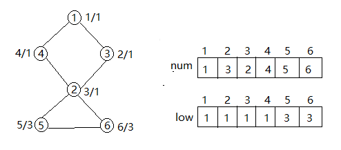

## 图的割点

在一个无向连通图中，如果删除某个顶点后，图不再连通（即任意两点不能到达），我们称这样的顶点为割点。

很容易想到的办法是：依次删除每一个一个顶点，然后用深度优先搜索或广度优先搜索来检查图是否依然连通。如果删除某一个顶点后，导致图不再连通。那么刚才删除的顶点就是割点。这种方法的时间的复杂度是O(N(N+M))。可以有更好的实现方法。



对于某个顶点u，如果存在至少一个顶点v（即顶点u的儿子），使得low[v] >= num[u]，即不能回到祖先，那么u点为割点。

```c++
#include<stdio.h>

int n, m, e[9][9];
int index;
int low[9], num[9], flag[9];

int min(int a, int b){
  	return a < b ? a : b;
}

void dfs(int cur, int father){
  	int child = 0;
  	index++;
  	num[cur] = index;
  	low[cur] = index;
  	for(int i=1; i<=n; i++){
      	if(e[cur][i] == 1){
          	if(num[i] == 0){
              	child++;
              	dfs(i,cur);
              	low[cur] = min(low[cur], low[i]);
              	if(cur != root && low[i] >= num[cur])
                  	flag[cur] = 1;
              	if(cur == root && child == 2)
                  	flag[cur] = 1;
          	}else if(i != father){
              	low[cur] = min(low[cur], low[i]);
          	}
      	}
  	}
}

int main(){
  	int t1, t2;
  	scanf("%d%d", &n, &m);
  	for(int i=1; i<m; i++){
      	scanf("%d%d", &t1, &t2);
      	e[t1][t2] = 1;
      	e[t2][t1] = 1;
  	}
  	root = 1;
  	dfs(1,root);
  	
  	return 0;
}
```


