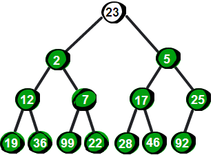
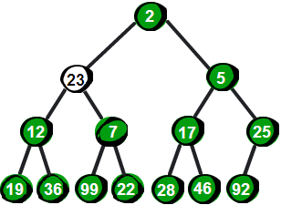
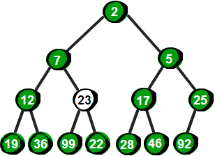
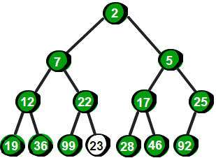
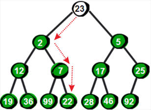
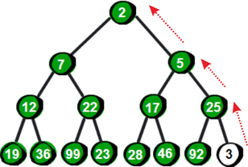
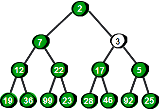
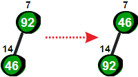
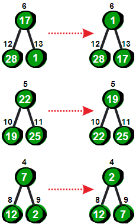
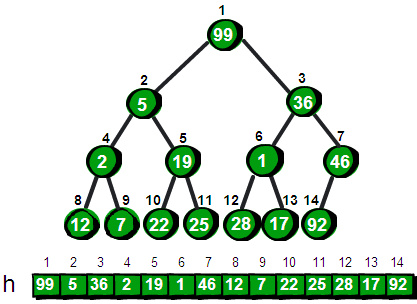

堆是什么？是一种特殊的完全二叉树，就像下面这棵树一样。


有没有发现这棵二叉树有一个特点，就是所有父结点都比子结点要小（注意：圆圈里面的数是值，圆圈上面的数是这个结点的编号，此规定仅适用于本节）。符合这样特点的完全二叉树我们称为最小堆。反之，如果所有父结点都比子结点要大，这样的完全二叉树称为最大堆。那这一特性究竟有什么用呢？

假如有14个数分别是99、5、36、7、22、17、46、12、2、19、25、28、1和92。请找出这14个数中最小的数，请问怎么办呢？最简单的方法就是将这14个数从头到尾依次扫一遍，用一个循环就可以解决。这种方法的时间复杂度是O(14)也就是O(N)。

```c
for(i=1;i<=14;i++)
{
    if(a[i]<min)    min=a[i];
}
```

现在我们需要删除其中最小的数，并增加一个新数23，再次求这14个数中最小的一个数。请问该怎么办呢？只能重新扫描所有的数，才能找到新的最小的数，这个时间复杂度也是O(N)。假如现在有14次这样的操作（删除最小的数后并添加一个新数）。那么整个时间复杂度就是O(14²)即O(N²)。那有没有更好的方法呢？堆这个特殊的结构恰好能够很好地解决这个问题。

首先我们先把这个14个数按照最小堆的要求（就是所有父结点都比子结点要小）放入一棵完全二叉树，就像下面这棵树一样。




很显然最小的数就在堆顶，假设存储这个堆的数组叫做h的话，最小数就是h[1]。接下来，我们将堆顶的数删除，并将新增加的数23放到堆顶。显然加了新数后已经不符合最小堆的特性，我们需要将新增加的数调整到合适的位置。那如何调整呢？



向下调整！我们需要将这个数与它的两个儿子2和5比较，并选择较小一个与它交换，交换之后如下。



我们发现此时还是不符合最小堆的特性，因此还需要继续向下调整。于是继续将23与它的两个儿子12和7比较，并选择较小一个交换，交换之后如下。



到此，还是不符合最小堆的特性，仍需要继续向下调整直到符合最小堆的特性为止。



我们发现现在已经符合最小堆的特性了。综上所述，当新增加一个数被放置到堆顶时，如果此时不符合最小堆的特性，则将需要将这个数向下调整，直到找到合适的位置为止，使其重新符合最小堆的特性。



向下调整的代码如下。

```c
void siftdown(int i) //传入一个需要向下调整的结点编号i，这里传入1，即从堆的顶点开始向下调整 
{
    int t,flag=0;//flag用来标记是否需要继续向下调整 
    //当i结点有儿子的时候（其实是至少有左儿子的情况下）并且有需要继续调整的时候循环执行
    while( i*2<=n && flag==0 )
    {        
        //首先判断他和他左儿子的关系，并用t记录值较小的结点编号 
        if( h[i] > h[i*2] )
            t=i*2;
        else
            t=i; 
        //如果他有右儿子的情况下，再对右儿子进行讨论 
        if(i*2+1 <= n)
        {
            //如果右儿子的值更小，更新较小的结点编号  
            if(h[t] > h[i*2+1])
                t=i*2+1;
        }
        //如果发现最小的结点编号不是自己，说明子结点中有比父结点更小的  
        if(t!=i)
        {
            swap(t,i);//交换它们，注意swap函数需要自己来写
            i=t;//更新i为刚才与它交换的儿子结点的编号，便于接下来继续向下调整 
        }
        else
            flag=1;//则否说明当前的父结点已经比两个子结点都要小了，不需要在进行调整了 
    }
}
```

我们刚才在对23进行调整的时候，竟然只进行了3次比较，就重新恢复了最小堆的特性。现在最小的数依然在堆顶为2。之前那种从头到尾扫描的方法需要14次比较，现在只需要3次就够了。现在每次删除最小的数并新增一个数，并求当前最小数的时间复杂度是O(3)，这恰好是O(log₂14)即O(log₂N)简写为O(logN)。假如现在有1亿个数（即N=1亿），进行1亿次删除最小数并新增一个数的操作，使用原来扫描的方法计算机需要运行大约1亿的平方次，而现在只需要1亿*log1亿次，即27亿次。假设计算机每秒钟可以运行10亿次，那原来则需要一千万秒大约115天！而现在只要2.7秒。是不是很神奇，再次感受到算法的伟大了吧。

说到这里，如果只是想新增一个值，而不是删除最小值又该如何操作呢？即如何在原有的堆上直接插入一个新元素呢？只需要直接将新元素插入到末尾，再根据情况判断新元素是否需要上移，直到满足堆的特性为止。如果堆的大小为N（即有N个元素），那么插入一个新元素所需要的时间也是O(logN)。例如我们现在要新增一个数3。



先将3与它的父结点25比较，发现比父结点小，为了维护最小堆的特性，需要与父结点的值进行交换。交换之后发现还是要比它此时的父结点5小，因此需要再次与父结点交换。至此又重新满足了最小堆的特性。向上调整完毕后如下。


向上调整的代码如下。

```c
void siftup(int i) //传入一个需要向上调整的结点编号i
{
    int flag=0; //用来标记是否需要继续向上调整
    if(i==1)  return; //如果是堆顶，就返回，不需要调整了    
    //不在堆顶 并且 当前结点i的值比父结点小的时候继续向上调整 
    while(i!=1 && flag==0)
    {
        //判断是否比父结点的小 
        if(h[i]<h[i/2])
            swap(i,i/2);//交换他和他爸爸的位置 
        else
            flag=1;//表示已经不需要调整了，当前结点的值比父结点的值要大 
        i=i/2; //这句话很重要，更新编号i为它父结点的编号，从而便于下一次继续向上调整 
    }
}
```

如何建立这个堆呢。可以从空的堆开始，然后依次往堆中插入每一个元素，直到所有数都被插入（转移到堆中为止）。因为插入第i个元素的所用的时间是O(log i)，所以插入所有元素的整体时间复杂度是O(NlogN)，代码如下。

```c
n=0;
for(i=1;i<=m;i++)
{
    n++;
    h[n]=a[i];  //或者写成scanf("%d",&h[n]);
    siftup();
}
```

其实我们还有更快得方法来建立堆。它是这样的。

直接把99、5、36、7、22、17、46、12、2、19、25、28、1和92这14个数放入一个完全二叉树中（这里我们还是用一个一维数组来存储完全二叉树）。


在这个棵完全二叉树中，我们从最后一个结点开始依次判断以这个结点为根的子树是否符合最小堆的特性。如果所有的子树都符合最小堆的特性，那么整棵树就是最小堆了。如果这句话没有理解不要着急，继续往下看。

首先我们从叶结点开始。因为叶结点没有儿子，所以所有以叶结点为根结点的子树（其实这个子树只有一个结点）都符合最小堆的特性（即父结点的值比子结点的值小）。这些叶结点压根就没有子节点，当然符合这个特性。因此所有叶结点都不需要处理，直接跳过。从第n/2个结点（n为完全二叉树的结点总数，这里即7号结点）开始处理这棵完全二叉树。注意完全二叉树有一个性质：最后一个非叶结点是第n/2个结点。

以7号结点为根的子树不符合最小堆的特性，因此要向下调整。



同理以6号、5号和4结点为根的子树也不符合最小对的特性，都需要往下调整。



下面是已经对7号、6号、5号和4结点为根结点的子树调整完毕之后的状态。



当然目前这棵树仍然不符合最小堆的特性，我们需要继续调整以3号结点为根的子树，即将3号结点向下调整。


同理继续调整以2号结点为根的子树，最后调整以1号结点为根的子树。调整完毕之后，整棵树就符合最小堆的特性啦。


小结一下这个创建堆的算法。把n个元素建立一个堆，首先我可以将这n个结点以自顶向下、从左到右的方式从1到n编码。这样就可以把这n个结点转换成为一棵完全二叉树。紧接着从最后一个非叶结点（结点编号为n/2）开始到根结点（结点编号为1），逐个扫描所有的结点，根据需要将当前结点向下调整，直到以当前结点为根结点的子树符合堆的特性。虽然讲起来起来很复杂，但是实现起来却很简单，只有两行代码如下：

```c
for(i=n/2;i>=1;i--)
    siftdown(i);
```

用这种方法来建立一个堆的时间复杂度是O(N)，如果你感兴趣可以尝试自己证明一下，嘿嘿。

堆还有一个作用就是堆排序，与快速排序一样堆排序的时间复杂度也是O(NlogN)。堆排序的实现很简单，比如我们现在要进行从小到大排序，可以先建立最小堆，然后每次删除顶部元素并将顶部元素输出或者放入一个新的数组中，直到堆为空为止。最终输出的或者存放在新数组中数就已经是排序好的了。

```c
//删除最大的元素
int deletemax()
{
    int t;
    t=h[1];//用一个临时变量记录堆顶点的值
    h[1]=h[n];//将堆得最后一个点赋值到堆顶
    n--;//堆的元素减少1
    siftdown(1);//向下调整
    return t;//返回之前记录的堆得顶点的最大值
}
```

建堆以及堆排序的完整代码如下：

```c
#include <stdio.h>
int h[101];//用来存放堆的数组
int n;//用来存储堆中元素的个数，也就是堆的大小
  
//交换函数，用来交换堆中的两个元素的值
void swap(int x,int y)
{
    int t;
    t=h[x];
    h[x]=h[y];
    h[y]=t;
}
  
//向下调整函数
void siftdown(int i) //传入一个需要向下调整的结点编号i，这里传入1，即从堆的顶点开始向下调整
{
    int t,flag=0;//flag用来标记是否需要继续向下调整
    //当i结点有儿子的时候（其实是至少有左儿子的情况下）并且有需要继续调整的时候循环执行
    while( i*2<=n && flag==0 )
    {        
        //首先判断他和他左儿子的关系，并用t记录值较小的结点编号
        if( h[i] > h[i*2] )
            t=i*2;
        else
            t=i;
        //如果他有右儿子的情况下，再对右儿子进行讨论
        if(i*2+1 <= n)
        {
            //如果右儿子的值更小，更新较小的结点编号  
            if(h[t] > h[i*2+1])
                t=i*2+1;
        }
        //如果发现最小的结点编号不是自己，说明子结点中有比父结点更小的  
        if(t!=i)
        {
            swap(t,i);//交换它们，注意swap函数需要自己来写
            i=t;//更新i为刚才与它交换的儿子结点的编号，便于接下来继续向下调整
        }
        else
            flag=1;//则否说明当前的父结点已经比两个子结点都要小了，不需要在进行调整了
    }
}
  
//建立堆的函数
void creat()
{
    int i;
    //从最后一个非叶结点到第1个结点依次进行向上调整
    for(i=n/2;i>=1;i--)
    {
        siftdown(i);
    }  
}
  
//删除最大的元素
int deletemax()
{
    int t;
    t=h[ 1];//用一个临时变量记录堆顶点的值
    h[1]=h[n];//将堆得最后一个点赋值到堆顶
    n--;//堆的元素减少1
    siftdown(1);//向下调整
    return t;//返回之前记录的堆得顶点的最大值
}
  
int main()
{
    int i,num;
    //读入数的个数
    scanf("%d",&num);
  
    for(i=1;i<=num;i++)
        scanf("%d",&h[ i]);
    n=num;   
  
    //建堆
    creat();
  
  
    //删除顶部元素，连续删除n次，其实夜就是从大到小把数输出来
    for(i=1;i<=num;i++)
        printf("%d ",deletemax());
  
    getchar();
    getchar();
    return 0;
}
```

可以输入以下数据进行验证

```
14
99 5 36 7 22 17 46 12 2 19 25 28 1 92
```

运行结果是

```
1 2 5 7 12 17 19 22 25 28 36 46 92 99
```

当然堆排序还有一种更好的方法。从小到大排序的时候不建立最小堆而建立最大堆。最大堆建立好后，最大的元素在h[1]。因为我们的需求是从小到大排序，希望最大的放在最后。因此我们将h[1]和h[n]交换，此时h[n]就是数组中的最大的元素。请注意，交换后还需将h[1]向下调整以保持堆的特性。OK现在最大的元素已经归位，需要将堆的大小减1即n--，然后再将h[1]和h[n]交换，并将h[1]向下调整。如此反复，直到堆的大小变成1为止。此时数组h中的数就已经是排序好的了。代码如下：

```c
//堆排序
void heapsort()
{
    while(n>1)
    {
        swap(1,n);
        n--;
        siftdown(1);
    }
}
```

完整的堆排序的代码如下，注意使用这种方法来进行从小到大排序需要建立最大堆。

```c
#include <stdio.h>
int h[101];//用来存放堆的数组
int n;//用来存储堆中元素的个数，也就是堆的大小
  
//交换函数，用来交换堆中的两个元素的值
void swap(int x,int y)
{
    int t;
    t=h[x];
    h[x]=h[y];
    h[y]=t;
}
  
//向下调整函数
void siftdown(int i) //传入一个需要向下调整的结点编号i，这里传入1，即从堆的顶点开始向下调整
{
    int t,flag=0;//flag用来标记是否需要继续向下调整
    //当i结点有儿子的时候（其实是至少有左儿子的情况下）并且有需要继续调整的时候循环就执行
    while( i*2<=n && flag==0 )
    {        
        //首先判断他和他左儿子的关系，并用t记录值较大的结点编号
        if( h[i] < h[i*2] )
            t=i*2;
        else
            t=i;
        //如果他有右儿子的情况下，再对右儿子进行讨论
        if(i*2+1 <= n)
        {
            //如果右儿子的值更大，更新较小的结点编号  
            if(h[t] < h[i*2+1])
                t=i*2+1;
        }
        //如果发现最大的结点编号不是自己，说明子结点中有比父结点更大的  
        if(t!=i)
        {
            swap(t,i);//交换它们，注意swap函数需要自己来写
            i=t;//更新i为刚才与它交换的儿子结点的编号，便于接下来继续向下调整
        }
        else
            flag=1;//则否说明当前的父结点已经比两个子结点都要大了，不需要在进行调整了
    }
}
  
//建立堆的函数
void creat()
{
    int i;
    //从最后一个非叶结点到第1个结点依次进行向上调整
    for(i=n/2;i>=1;i--)
    {
        siftdown(i);
    }  
}
  
//堆排序
void heapsort()
{
    while(n>1)
    {
        swap(1,n);
        n--;
        siftdown(1);
    }
}
  
int main()
{
    int i,num;
    //读入n个数
    scanf("%d",&num);
  
    for(i=1;i<=num;i++)
        scanf("%d",&h[ i]);
    n=num;   
  
    //建堆
    creat();
  
    //堆排序
    heapsort();
  
    //输出
    for(i=1;i<=num;i++)
        printf("%d ",h[ i]);
  
    getchar();
    getchar();
    return 0;
}
```

可以输入以下数据进行验证

```
14
99 5 36 7 22 17 46 12 2 19 25 28 1 92
```

运行结果是

```
1 2 5 7 12 17 19 22 25 28 36 46 92 99
```

OK，最后还是要总结一下。像这样支持插入元素和寻找最大（小）值元素的数据结构称之为优先队列。如果使用普通队列来实现这个两个功能，那么寻找最大元素需要枚举整个队列，这样的时间复杂度比较高。如果已排序好的数组，那么插入一个元素则需要移动很多元素，时间复杂度依旧很高。而堆就是一种优先队列的实现，可以很好的解决这两种操作。

另外Dijkstra算法中每次找离源点最近的一个顶点也可以用堆来优化，使算法的时间复杂度降到O((M+N)logN)。

堆还经常被用来求一个数列中第K大的数。只需要建立一个大小为K的最小堆，堆顶就是第K大的数。例如：假设有10个数，要求第三大的数。第一步选取任意三个数，比如说前3个，将这3个数建成最小堆，然后从第4个数开始，与堆顶的数比较，如果比堆顶的数要小，那么这个数就不要，如果比堆顶的数要大，则舍弃当前堆顶而将这个数作为新的堆顶，并再去维护堆，用同样的方法再去处理第5~10个数。

如果求一个数列中第K小的数，只最需要建立一个大小为K的最大堆，堆顶就是第K小的数，这种方法的时间复杂度是O(NlogK)。当然你也可以用堆来求前K大的数和前K小的数。你还能想出更快的算法吗？有兴趣的同学可以去阅读《编程之美》第二章第五节。

堆排序算法是由J.W.J. Williams在1964年发明，他同时描述了如何使用堆来实现一个优先队列。同年，由Robert W．Floyd提出了建立堆的线性时间算法。