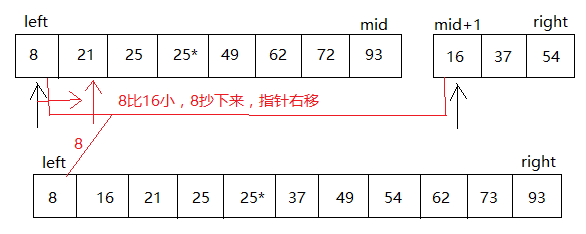

## 归并排序

基本思想：归并（Merge）排序法是将两个（或两个以上）有序表合并成一个新的有序表，即把待排序序列分为若干个子序列，每个子序列是有序的。然后再把有序子序列合并为整体有序序列。

实现方法1：Java语言

```c++
/*
 * 归并操作(merge)，也叫归并算法，指的是将两个已经排序的序列合并成一个序列的操作。 　　
 * 如设有数列{6，202，100，301，38，8，1} 　　
 * 初始状态： [6] [202] [100] [301] [38] [8] [1] 比较次数 　　
 * i=1 [6 202 ] [ 100 301] [ 8 38] [ 1 ]　3 　　
 * i=2 [ 6 100 202 301 ] [ 1 8 38 ]　4 　　
 * i=3　[ 1 6 8 38 100 202 301 ] 4 
 */
public class MergeSort {
	public static void sort(int[] data) {
		int[] temp = new int[data.length];
		mergeSort(data, temp, 0, data.length - 1);
	}

	private static void mergeSort(int[] data, int[] temp, int l, int r) {
		int mid = (l + r) / 2;
		if (l == r)
			return;
		mergeSort(data, temp, l, mid);
		mergeSort(data, temp, mid + 1, r);

		for (int i = l; i <= r; i++) {
			temp[i] = data[i];
		}
		int i1 = l;
		int i2 = mid + 1;
		for (int cur = l; cur <= r; cur++) {
			if (i1 == mid + 1)
				data[cur] = temp[i2++];
			else if (i2 > r)
				data[cur] = temp[i1++];
			else if (temp[i1] < temp[i2])
				data[cur] = temp[i1++];
			else
				data[cur] = temp[i2++];
		}
	}
}
```

实现方法2：C++语言



```c++
void Merge(int src[], int des[], int low, int mid, int high)
{
	int i = low;
	int j = mid + 1;
	int k = low;

	while( (i <= mid) && (j <= high) ) //将小的放到目的地中
	{
		if( src[i] < src[j] )
		{
			des[k++] = src[i++];
		}
		else
		{
			des[k++] = src[j++];
		}
	}

	while( i <= mid )  //若还剩几个尾部元素
	{
		des[k++] = src[i++];
	}

	while( j <= high ) //若还剩几个尾部元素
	{
		des[k++] = src[j++];
	}
}

//每次分为两路 当只剩下一个元素时，就不需要在划分
void MSort(int src[], int des[], int low, int high, int max)
{
	if( low == high ) //只有一个元素，不需要归并，结果赋给des[low]
	{
		des[low] = src[low]; 
	}
	else //如果多个元素，进行两路划分
	{
		int mid = (low + high) / 2;
		int* space = (int*)malloc(sizeof(int) * max);

		//递归进行两路，两路的划分 
		//当剩下一个元素的时，递归划分结束，然后开始merge归并操作
		if( space != NULL )
		{
			MSort(src, space, low, mid, max); 
			MSort(src, space, mid+1, high, max);
			Merge(space, des, low, mid, high); //调用归并函数进行归并
		}

		free(space);
	}
}

void MergeSort(int array[], int len) // O(n*logn)
{
	MSort(array, array, 0, len-1, len);
}
```