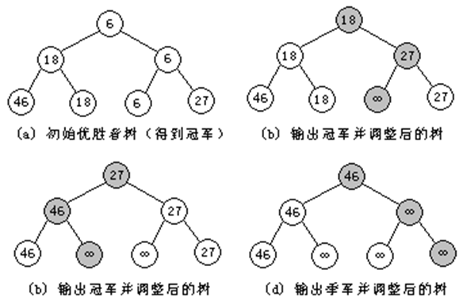

首先对n个记录的关键字进行两两比较，然后其中从n/2个较小者进行两两比较，如此重复直到选出最小关键字的记录。构成一颗完全二叉树

锦标赛排序构成的树是完全二叉树，其高度为$\lceil log_2n \rceil+1 $，其中n为排序表中数据元素个数。

因此，除第一次选出具有最小关键字的数据元素需要进行n-1次关键字比较外，重构优胜者树，选出具有次小、再次小、…关键字的数据元素所需的关键字比较次数均为$o(log_2n)$。

所以，总的关键字比较次数为$o(nlog_2n)$。数据元素的移动次数与关键字的比较次数相当，所以锦标赛排序总的时间复杂度为$o(nlog_2n)$。 

锦标赛排序也是一种不稳定的排序方法。 