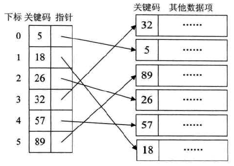
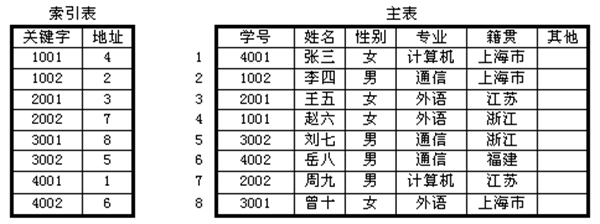
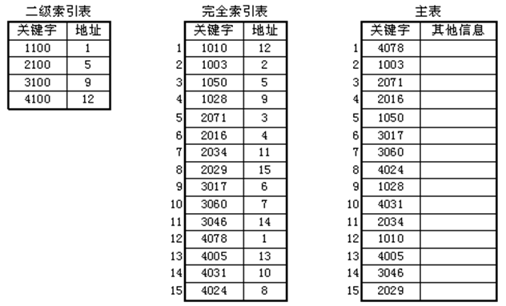
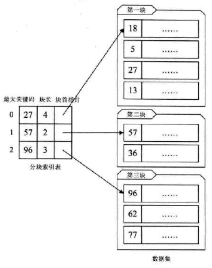
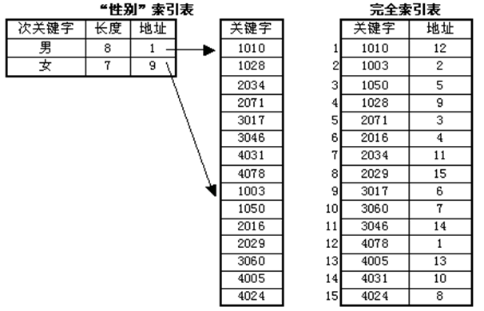
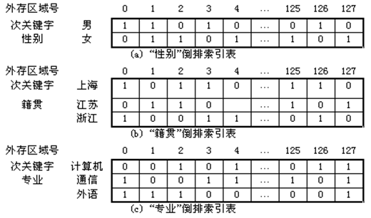

索引就是把一个关键字与它对应的记录相关联的过程。

索引的分类

- 线性索引
- 树形索引
- 多级索引

所谓线性索引就是将索引项集合组织为线性结构，也称为索引表。

三种线性索引：稠密索引、分块索引、倒排索引

## 稠密索引

在线性索引中，将索引集合中的每个记录对应一个索引项。

对于稠密索引这个索引表来说，索引项一定是按照关键码有序的排列。



## 索引顺序表

索引顺序表一般由主表和索引表两个部分组成，两者均采用顺序存储结构。主表中存放数据元素的全部信息，索引表中存放数据元素的主关键字和索引信息。一个学生信息的数据表如下图所示 ：



二级索引图示 ：



对二级索引结构进行查找时，一般分为二次查找。先在二级索引表中按给定值k进行查找，以确定待查子表的序号i，然后再在第i个子表中按给定值查找关键字等于k的索引项。如果找到关键字等于k的索引项，则可以根据索引项内的地址直接从外存中读取相应的数据元素；否则，表示查找失败。

二级索引查找成功时的平均查找长度：$ASL_{IndexSeq} = ASL_{Index} + ASL_{SubList}$

其中，ASL<sub>Index</sub> 是在二级索引表中查找成功的平均查找长度，ASL<sub>SubList</sub> 是在子表内查找成功的平均查找长度。

## 分块索引

分块有序就是把数据集的数据分成若干块，并且这些块需要满足两个条件：块内无序；块间有序。

对于分块有序的数据集，将每块对应一个索引项，这种索引方法叫做分块索引。

我们定义的分块索引的索引项结构分为三个数据项：

- 最大关键码，它存储了每一块中的最大关键字
- 存储了块中的记录个数，以便循环时使用
- 用于指向块首数据元素的指针



```c
#define _CRT_SECURE_NO_WARNINGS
#include <stdio.h>
#include <stdlib.h>
//索引顺序查找（分块查找）
struct indexBlock   //定义块的结构
{
	int max;
	int start;
	int end;
} indexBlock[4];   //定义索引表，里面有4个struct对象

int blockSearch(int key, int a[])
{
	int i = 0;
	int j;

	while (i<3 && key>indexBlock[i].max) //确定在哪个子表中 
		i++;

	if (i >= 3)  //大于分的块数，则返回-1,找不到该数     
		return -1;

	j = indexBlock[i].start;    //j等于块范围的起始值

	while (j <= indexBlock[i].end && a[j] != key) //在确定的块内进行查找  
		j++;

	if (j > indexBlock[i].end) //如果大于块范围的结束值，则说明没有要查找的数，j置为-1     
		j = -1;

	return j;
}

int main()
{
	int j = -1;
	int a[] = {0, 1, 2, 3, 4, 5, 6, 7, 8, 9, 10, 11, 12, 13, 14, 15 }; //查找表
	printf("已知查找表:\n");
	for (int i = 0; i < 15; i++) 
		printf("%d ", a[i]);

	printf("\n");

	for (int i = 0; i < 3; i++) 
	{
		indexBlock[i].start = j + 1; //确定每个块范围的起始值
		j = j + 1;

		indexBlock[i].end = j + 3;   //确定每个块范围的结束值
		j = j + 3;

		indexBlock[i].max = a[j];    //确定每个块范围中元素的最大值
	}

	printf("请输入你要查找的数：\n");
	int key;
	scanf("%d", &key);
	int index = blockSearch(key, a);

	if (index >= 0) {
		printf("查找成功！你要查找的数查找表中的位置是：%d\n", index);
	}
	else{

		printf("查找失败！你要查找的数不在查找表中。\n");
	}

	system("pause");
	return 0;
}
```
## 倒排表

有时除主关键字外，可以把一些在查找时经常用到的属性设定为次关键字，并以每一个属性作为次关键字建立次索引表，并称为倒排索引表。

倒排索引表有链式和单元式两种结构。在链式倒排索引表中，列出了作为次关键字属性的所有取值，并对每一个取值建立有序链表，把所有具有相同属性值的主关键字按其递增的顺序或按其在主索引表中的存储地址递增的顺序链接在一起。因此，链式倒排索引表包括三个部分：次关键字、链表长度和有序链表。  

链式倒排索引结构图示：



## 单元式倒排索引表

在单元式倒排索引表的各个索引项中存放表示各外存区域是否存有相应数据元素的标识（以0或1表示）。于是，整个单元式倒排索引表将形成一个(二进制数的)位矩阵。 



若要查找上海籍通信专业的男生，可以对“男性”、“上海”、“通信”三个二进制位串进行按位“与”运算，就可求得所查数据元素在外存区域的区号。
```
       1 1 0 1 0 … 0 1 0
       1 0 1 1 0 … 1 1 0
 AND   1 0 0 1 1 … 1 0 1
       -----------------
       1 0 0 1 0 … 0 0 0
```
根据上述运算结果可以知道：上海籍通信专业男生的数据元素在0号、3号等外存区域，此时可以把相应外存区域的数据元素读入内存再进行查找就可以得到所需要的结果。