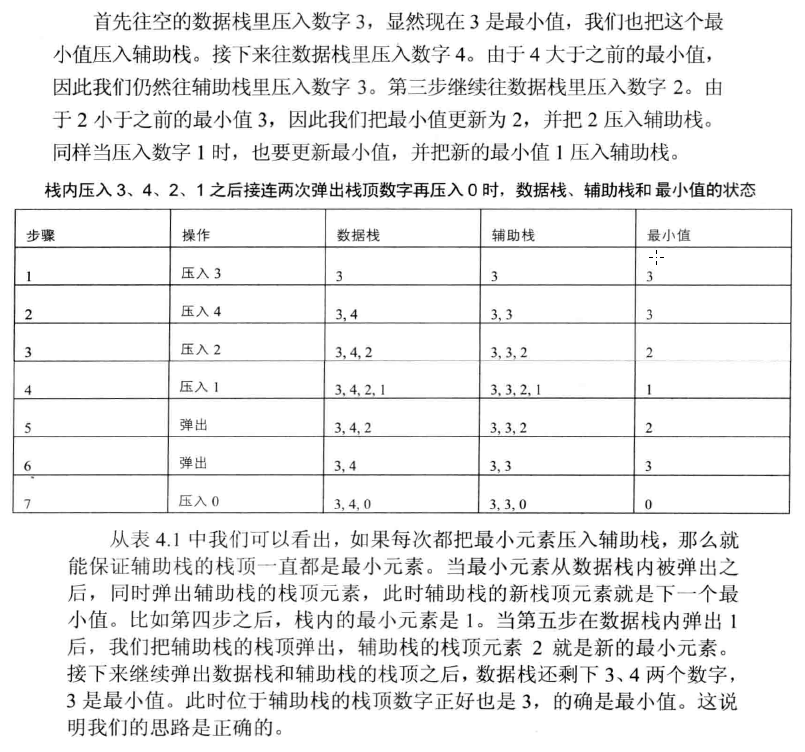

## 包含min函数的栈

把每次的最小元素（之前的最小元素和新压入栈的元素两者的较小值）都保存起来存放到另一个辅助栈里。



```c++
#include <stack>
#include <assert.h>

template <typename T> class StackWithMin
{
public:
    StackWithMin(void) {}
    virtual ~StackWithMin(void) {}

    T& top(void);
    const T& top(void) const;

    void push(const T& value);
    void pop(void);

    const T& min(void) const;

    bool empty() const;
    size_t size() const;

private:
    std::stack<T>   m_data;     // 数据栈，存放栈的所有元素
    std::stack<T>   m_min;      // 辅助栈，存放栈的最小元素
};

template <typename T> void StackWithMin<T>::push(const T& value)
{
    // 把新元素添加到辅助栈
    m_data.push(value);

    // 当新元素比之前的最小元素小时，把新元素插入辅助栈里；
    // 否则把之前的最小元素重复插入辅助栈里
    if(m_min.size() == 0 || value < m_min.top())
        m_min.push(value);
    else
        m_min.push(m_min.top());
}

template <typename T> void StackWithMin<T>::pop()
{
    assert(m_data.size() > 0 && m_min.size() > 0);

    m_data.pop();
    m_min.pop();
}


template <typename T> const T& StackWithMin<T>::min() const
{
    assert(m_data.size() > 0 && m_min.size() > 0);

    return m_min.top();
}

template <typename T> T& StackWithMin<T>::top()
{
    return m_data.top();
}

template <typename T> const T& StackWithMin<T>::top() const
{
    return m_data.top();
}

template <typename T> bool StackWithMin<T>::empty() const
{
    return m_data.empty();
}

template <typename T> size_t StackWithMin<T>::size() const
{
    return m_data.size();
}
```