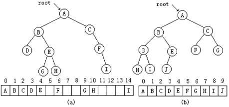
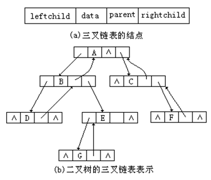

# 1. 二叉查找树简介

二叉查找树(Binary Search Tree)，又被称为二叉搜索树。

它是特殊的二叉树：对于二叉树，假设x为二叉树中的任意一个结点，x节点包含关键字key，节点x的key值记为key[x]。如果y是x的左子树中的一个结点，则key[y] <= key[x]；如果y是x的右子树的一个结点，则key[y] >= key[x]。那么，这棵树就是二叉查找树。如下图所示


在二叉查找树中：

- 若任意节点的左子树不空，则左子树上所有结点的值均小于它的根结点的值
- 任意节点的右子树不空，则右子树上所有结点的值均大于它的根结点的值
- 任意节点的左、右子树也分别为二叉查找树
- 没有键值相等的节点（no duplicate nodes）

# 2. 二叉查找树的Java实现

## 2.1 二叉查找树节点的定义

```java
public class BSTree<T extends Comparable<T>> {

    private BSTNode<T> mRoot;    // 根结点

    public class BSTNode<T extends Comparable<T>> {
        T key;                // 关键字(键值)
        BSTNode<T> left;      // 左孩子
        BSTNode<T> right;     // 右孩子
        BSTNode<T> parent;    // 父结点

        public BSTNode(T key, BSTNode<T> parent, BSTNode<T> left, BSTNode<T> right) {
            this.key = key;
            this.parent = parent;
            this.left = left;
            this.right = right;
        }
    }

        ......
}
```
BSTree是二叉树，它保护了二叉树的根节点mRoot；mRoot是BSTNode类型，而BSTNode是二叉查找树的节点，它是BSTree的内部类。BSTNode包含二叉查找树的几个基本信息：

- key -- 它是关键字，是用来对二叉查找树的节点进行排序的
- left -- 它指向当前节点的左孩子
- right -- 它指向当前节点的右孩子
- parent -- 它指向当前节点的父结点

## 2.2 遍历

这里讲解前序遍历、中序遍历、后序遍历3种方式。

### 2.2.1 前序遍历
若二叉树非空，则执行以下操作：

- 访问根结点
- 先序遍历左子树
- 先序遍历右子树

前序遍历代码

```java
private void preOrder(BSTNode<T> tree) {
    if(tree != null) {
        System.out.print(tree.key+" ");
        preOrder(tree.left);
        preOrder(tree.right);
    }
}

public void preOrder() {
    preOrder(mRoot);
}
```
### 2.2.2 中序遍历

若二叉树非空，则执行以下操作：

- 中序遍历左子树
- 访问根结点
- 中序遍历右子树

中序遍历代码

```java
private void inOrder(BSTNode<T> tree) {
    if(tree != null) {
        inOrder(tree.left);
        System.out.print(tree.key+" ");
        inOrder(tree.right);
    }
}

public void inOrder() {
    inOrder(mRoot);
}
```
### 2.2.3 后序遍历

若二叉树非空，则执行以下操作：

- 后序遍历左子树
- 后序遍历右子树
- 访问根结点

后序遍历代码

```java
private void postOrder(BSTNode<T> tree) {
    if(tree != null)
    {
        postOrder(tree.left);
        postOrder(tree.right);
        System.out.print(tree.key+" ");
    }
}

public void postOrder() {
    postOrder(mRoot);
}
```
看看下面这颗树的各种遍历方式：


对于上面的二叉树而言，

- 前序遍历结果： 3 1 2 5 4 6
- 中序遍历结果： 1 2 3 4 5 6 
- 后序遍历结果： 2 1 4 6 5 3

### 2.2.4 层序遍历

所谓层序遍历(Levelorder Traversal)二叉树，是指从二叉树的第一层(根结点)开始，自上至下逐层遍历，在同一层中，则按从左到右的顺序对结点逐个访问。对于右图所示的二叉树，按层序遍历方式进行遍历所得到的结点序列为：A、B、C、D、E、F、G、H、I


遍历的本质：三种遍历算法的访问路径是相同的，只是访问结点的时机不同。

### 对遍历的分析

从前面的三种遍历算法可以知道：如果将printf语句抹去，从递归的角度看，这三种算法是完全相同的，或者说这三种遍历算法的访问路径是相同的，只是访问结点的时机不同。

从虚线的出发点到终点的路径上，每个结点经过3次。

- 第1次经过时访问＝先序遍历
- 第2次经过时访问＝中序遍历
- 第3次经过时访问＝后序遍历


# 3. 二叉树的存储结构 

## 3.1 数组表示法
二叉树的数组表示就是采用一组连续存储空间存储二叉树结点中的数据元素，利用数组下标来反映数据元素之间的关系。

对具有n个结点的完全二叉树按从上到下、自左向右的顺序连续给结点编号0、1、2、…、n-1。按此结点编号将二叉树中各结点中的数据元素顺序地存放于一个一维数组中，首先将根结点中的数据元素储存在数组的0号位置；对于二叉树中任一个结点，如果它的数据元素存储在数组的第i个位置，就把它的左、右孩子结点中的数据元素分别存放在数组的第2*i+1个位置和第2*i+2个位置。这样就得到了二叉树的一种数组表示法。 

采用这种方法表示一般的二叉树时，空间利用效率低是一个主要的问题。当被表示的二叉树结构很不完整时，在数组中就会出现很多空位置，因此空间浪费就变得非常大。 




用这种方法表示二叉树时，还有一个问题需要注意的是：必须处理结点不存在的情况。如果一个结点不存在，就必须在数组中相应位置设置一个特殊标志，指明在这个位置没有结点。 

## 3.2 链表表示法 

在二叉树的链表表示中，树中的每一个元素用一个结点表示，结点一般包括三个域，其结构如图(a)所示。其中，Data域用于存放数据元素的信息；leftChild域用于存放指向其左孩子结点的指针；rightChild域用于存放指向其右孩子结点的指针。二叉树的这种链表表示称为二叉链表。 


二叉树的二叉链表表示，对于大多数的应用来说是适合的。但是，在二叉链表中要想找出一个结点的双亲是比较困难的，必须通过二叉树的遍历才能实现。如果在应用中需要方便地找到任何一个结点的双亲，可以在结点中增加一个Parent域来指向该结点的双亲，二叉树的这种表示方法称为三叉链表。 



树的表示法

```c
#include <stdlib.h>
#include <string.h>
#include <stdio.h>


/*
typedef struct BiTNode
{
	int data;
	struct BiTNode *lchild, *rchild;
}BiTNode, *BiTree;
*/


//二叉链表示法
struct BiTNode
{
	int data;
	struct BiTNode *lchild, *rchild;
};
typedef struct BiTNode		BiTNode;
typedef struct BiTNode*		BiTree;

//第二种表示方法 三叉链表
//三叉链表
typedef struct TriTNode 
{
	int data;
	//左右孩子指针
	struct TriTNode *lchild, *rchild;
	struct TriTNode *parent;
}TriTNode, *TriTree;

//双亲链表
#define MAX_TREE_SIZE 100
typedef struct BPTNode
{
	int data;
	int parentPosition; //指向双亲的指针 //数组下标
	char LRTag; //左右孩子标志域
}BPTNode;

typedef struct BPTree
{
	BPTNode nodes[100]; //因为节点之间是分散的，需要把节点存储到数组中
	int num_node;  //节点数目
	int root; //根结点的位置 //注意此域存储的是父亲节点在数组的下标
}BPTree;

//用这个数据结构能表达出一颗树。。。能，怎么表达？不能why

void main22()
{

	BPTree tree;

	//根结点
	tree.nodes[0].parentPosition = 1000;

	//B
	tree.nodes[1].parentPosition = 0;
	tree.nodes[1].data = 'B';
	tree.nodes[1].LRTag = 1;

	//c
	tree.nodes[2].parentPosition = 0;
	tree.nodes[2].data = 'C';
	tree.nodes[2].LRTag = 2;
	system("pause");

}

void main02()
{
	BiTNode *p1, *p2, *p3, *p4, *p5;
	p1 = (BiTNode *)malloc(sizeof(BiTNode));
	p2 = (BiTNode *)malloc(sizeof(BiTNode));
	p3 = (BiTNode *)malloc(sizeof(BiTNode));
	p4 = (BiTNode *)malloc(sizeof(BiTNode));
	p5 = (BiTNode *)malloc(sizeof(BiTNode));

	p1->data = 1;
	p2->data = 2;
	p3->data = 3;
	p4->data = 4;
	p5->data = 5;

	//建立关系
	p1->lchild = p2;
	p1->rchild = p3;
	p2->lchild = p4;
	p3->lchild = p5;

	//树的遍历

	printf("hello...\n");
	system("pause");
	return ;
}

void main()
{
	BiTNode t1, t2, t3, t4, t5;
	t1.data = 1;
	t2.data = 2;
	t3.data = 3;
	t4.data = 4;
	t5.data = 5;

	//建立关系
	t1.lchild = &t2;
	t1.rchild = &t3;
	t2.lchild = &t4;
	t3.lchild = &t5;

	//树的遍历

	printf("hello...\n");
	system("pause");
	return ;
}
```

树的遍历

```
#include <stdlib.h>
#include <string.h>
#include <stdio.h>

/*
typedef struct BiTNode
{
	int data;
	struct BiTNode *lchild, *rchild;
}BiTNode, *BiTree;
*/

//二叉链表示法
struct BiTNode
{
	int data;
	struct BiTNode *lchild, *rchild;
};
typedef struct BiTNode		BiTNode;
typedef struct BiTNode*		BiTree;


void preOrder(BiTNode *root)
{
	if (root == NULL)
	{
		return;
	}
	//printf("%d ", root->data);

	//遍历左子树
	preOrder(root->lchild);

	//遍历右子树
	preOrder(root->rchild);
}

void inOrder(BiTNode *root)
{
	if (root == NULL)
	{
		return;
	}
	//遍历左子树
	inOrder(root->lchild);
	//printf("%d ", root->data);
	//遍历右子树
	inOrder(root->rchild);
}

void postOrder(BiTNode *root)
{
	if (root == NULL)
	{
		return;
	}
	//遍历左子树
	postOrder(root->lchild);

	//遍历右子树
	postOrder(root->rchild);
	//printf("%d ", root->data);
}

int sum;

void coutLeaf2(BiTNode *T)
{
	if (T != NULL)
	{
		if (T->lchild == NULL && T->rchild==NULL)
		{
			sum ++ ;
		}
		if (T->lchild )
		{
			coutLeaf2(T->lchild);
		}

		if (T->rchild)
		{
			coutLeaf2(T->rchild);
		}
	}
}


void coutLeaf(BiTNode *T)
{
	if (T != NULL)
	{
		if (T->lchild == NULL && T->rchild==NULL)
		{
			sum ++ ;
		}
		if (T->lchild )
		{
			coutLeaf(T->lchild);
		}

		if (T->rchild)
		{
			coutLeaf(T->rchild);
		}
	}
}

void coutLeaf3(BiTNode *T, int *sum)
{
	if (T != NULL)
	{
		if (T->lchild == NULL && T->rchild==NULL)
		{
			(*sum) ++ ; //++  *p  p++ sum//
		}
		if (T->lchild )
		{
			coutLeaf3(T->lchild, sum);
		}

		if (T->rchild)
		{
			coutLeaf3(T->rchild, sum);
		}
	}
}

void coutLeaf4(BiTNode *T, int *sum)
{
	if (T != NULL)
	{
		if (T->lchild )
		{
			coutLeaf4(T->lchild, sum);
		}

		if (T->rchild)
		{
			coutLeaf4(T->rchild, sum);
		}

		if (T->lchild == NULL && T->rchild==NULL)
		{
			(*sum) ++ ; //++  *p  p++ sum//
		}
	}
}

void main()
{
	BiTNode t1, t2, t3, t4, t5;
	memset(&t1, 0, sizeof(BiTNode));
	memset(&t2, 0, sizeof(BiTNode));
	memset(&t3, 0, sizeof(BiTNode));
	memset(&t4, 0, sizeof(BiTNode));
	memset(&t5, 0, sizeof(BiTNode));
	t1.data = 1;
	t2.data = 2;
	t3.data = 3;
	t4.data = 4;
	t5.data = 5;

	//建立关系
	t1.lchild = &t2;
	t1.rchild = &t3;
	t2.lchild = &t4;
	t3.lchild = &t5;

	sum = 0;

	coutLeaf(&t1);
	printf("sum:%d \n", sum);

	{
		int mysum = 0;
		coutLeaf3(&t1, &mysum);
		printf("mysum:%d \n", mysum);
	}

	{
		int mysum4 = 0;
		coutLeaf4(&t1, &mysum4);
		printf("mysum4:%d \n", mysum4);
		
	}


	/*

	//树的遍历
	printf("preOrder\n");
	preOrder(&t1);
	printf("inorder\n");
	inOrder(&t1);

	printf("postOrder\n");
	postOrder(&t1);

	printf("hello...\n");
	*/
	system("pause");
	return ;
}
```


# 4. 二叉查找树实现

左小右大，中序遍历是有序的。
```java
public class BSTree
{
	private Node	root;	// 根节点

	private class Node
	{
		Node	parrent;	// 父节点
		Node	left;		// 左孩子
		Node	right;		// 右孩子
		Object	data;

		public Node(Object data) {
			this.data = data;
		}
	}

	/**
	 * @param data 传递的数据         
	 * @return 父节点的值
	 */
	private Node findParrent(Object data, Node currentNode) {
		// 从根节点找
		Node temp = currentNode;
		Node parrent = currentNode;
		// 循环找
		while (temp != null) {
			parrent = temp;
			// 比较
			if (compare(data, temp.data)) {
				// data 大于 当前节点
				temp = temp.right;
			} else {
				// data 小于 当前节点
				temp = temp.left;
			}
		}

		return parrent;
	}
	
	public void update(Object oldData,Object newData){
		remove(oldData);
		add(newData);
	}

	/**
	 * 添加数据
	 * 
	 * @param data 要添加的数据
	 */
	public void add(Object data) {
		// 判断该数据是否存在
		if (contains(data))
			return;
		// 1.把数据放到节点中
		Node node = new Node(data);
		// 2.把节点链接到二叉树中
		// 是否有根节点
		if (root == null) {
			root = node;// 保存到根节点中
		} else {
			// 找位置,找父节点,比较父节点的值，小左边 大右边
			Node parrent = findParrent(data, root);
			// 设置新增节点的父节点
			node.parrent = parrent;
			// 比较
			if (compare(data, parrent.data)) {
				// 自己比父节点大
				parrent.right = node;
			} else {
				// 自己比父节点小
				parrent.left = node;
			}
		}
	}
  
  	public void add(Object data, Node root) {
      	if(root = null){
          	root = new Node(data);
      	}else if(compare(data, root.data)){
          	add(data,root.right);
      	}else {
          	add(data,root.left);
      	}
  	}

	/**
	 * @param data
	 * @return 是否包含该数据
	 */
	public boolean contains(Object data) {

		return null != find(data);
	}
	
  	// 可用递归实现
	private Node find(Object data) {
		Node temp = root;// 从根节点找
		while (temp != null) {
			// 判断数据
			if (temp.data.equals(data)
					&& temp.data.hashCode() == data.hashCode()) {
				// 找到数据
				break;
			} else if (compare(data, temp.data)) {
				// true data > temp
				// 从右边找
				temp = temp.right;

			} else {
				// false data < temp
				// 从坐标边找
				temp = temp.left;
			}
		}
		return temp;
	}
  
  	private Node find(Object data, Node root) {
      	if(root.data.equals(data) && root.data.hashCode() == data.hashCode()){
          	return root;
      	}else if (compare(data, root.data)){
          	return find(root.right);
      	}else {
          	return find(root.left);
      	}
  	}

	public void remove(Object data) {
		// 1. 查找数据是否存在
		Node temp = find(data);

		// 2. 存在：找到数据节点
		if (temp != null) {
			// 存在
			// 3. 删除节点

			// 1. 根节点
			if (temp == root) {

				// 11 没有儿子
				if (temp.left == null && temp.right == null) {
					root = null;
				} else if (temp.right == null) {
					root = root.left;
					root.parrent = null;
					// 12 只有左儿子
				} else if (temp.left == null) {
					// 13 只有右儿子
					root = root.right;
					root.parrent = null;
				} else {
					// 14 两个儿子都有
					// 保留左儿子
					Node left = getLeft(temp);
					// left成为新的根节点
					root = left;
					left.parrent = null;
				}

			} else {// 2. 非根节点

				if (temp.left == null && temp.right == null) {
					// 21 没有儿子
					if (compare(temp.data, temp.parrent.data)) {
						//在父节点右边
						temp.parrent.right = null;
					} else {
						//在父节点左边
						temp.parrent.left = null;
					}
				} else if (temp.right == null) {
					// 22 只有左儿子
					if (compare(temp.data, temp.parrent.data)) {
						//在父节点右边
						temp.parrent.right = temp.left;
						temp.left.parrent = temp.parrent;
					} else {
						//在父节点左边
						temp.parrent.left = temp.left;
						temp.left.parrent = temp.parrent;
					}
				} else if (temp.left == null) {
					// 23 只有右儿子
					if (compare(temp.data, temp.parrent.data)) {
						//在父节点右边
						temp.parrent.right = temp.right;
						temp.right.parrent = temp.parrent;
					} else {
						//在父节点左边
						temp.parrent.left = temp.right;
						temp.right.parrent = temp.parrent;
					}
				} else {
					// 24 两个儿子都有
					Node left = getLeft(temp);
					//上面还有父节点（爷爷）
					if (compare(left.data, temp.parrent.data)) {
						//比爷爷节点大
						temp.parrent.right = left;
						left.parrent = temp.parrent;
					} else  {
						//比爷爷节点小
						temp.parrent.left = left;
						left.parrent = temp.parrent;
					}
				}

			}
		}

	}

	/**
	 * @param node 要删除的节点
	 * @return 左儿子节点
	 */
	private Node getLeft(Node node) {
		// 保留左儿子
		Node left = node.left;
		// 处理右节点
		Node rightNewParrent = findParrent(node.right.data, left);
		rightNewParrent.right = node.right;// 把删除节点的右节点放到删除节点的左儿子最右边
		node.right.parrent = rightNewParrent;
		return left;
	}

	/**
	 * @param o1 第一个值        
	 * @param o2 第二个值          
	 * @return 如果o1 大于 o2 返回true 否则false
	 */
	public boolean compare(Object o1, Object o2) {
		boolean res = false;

		// 判断o1 有没有实现比较器
		if (o1 instanceof Comparable) {
			Comparable c1 = (Comparable) o1;
			Comparable c2 = (Comparable) o2;
			if (c1.compareTo(c2) > 0) {
				res = true;
			} else {
				// 默认值就是false
			}
		} else {// 传递的对象没有比较器
			res = o1.toString().compareTo(o2.toString()) > 0 ? true : false;
		}
		return res;
	}

	// 递归打印
	public void print() {
		print(root);
	}

	public void print(Node node) {
		if (node == null) {
			return;
		} else {
			// 遍历 中序
			print(node.left);
			System.out.println(node.data + ",");
			print(node.right);
		}
	}

}
```

```java
public class TestTreeApp
{
	public static void main(String[] args) {
		
		BSTree trees = new BSTree();
		int[] datas = {55,33,44,88,66,99};
		for (int d : datas) {
			trees.add(d);
		}
		
		trees.print();
		System.out.println();
		
		//测试删除
		trees.update(33,77);
		trees.print();

	}

}
```
## 求树的深度、拷贝二叉树

```c
#include <stdlib.h>
#include <string.h>
#include <stdio.h>

/*
typedef struct BiTNode
{
	int data;
	struct BiTNode *lchild, *rchild;
}BiTNode, *BiTree;
*/

//二叉链表示法
struct BiTNode
{
	int data;
	struct BiTNode *lchild, *rchild;
};
typedef struct BiTNode		BiTNode;
typedef struct BiTNode*		BiTree;


void inOrder(BiTNode *root)
{
	if (root == NULL)
	{
		return;
	}
	//遍历左子树
	inOrder(root->lchild);
	printf("%d ", root->data);
	//遍历右子树
	inOrder(root->rchild);
}

int Depth(BiTNode *T)
{
	int		deptleft = 0;
	int		deptright = 0;
	int		deptval = 0;

	if (T == NULL)
	{
		deptval = 0;
		return deptval;
	}

	//求左子树的高度
	deptleft = Depth(T->lchild);

	//求右子树的高度
	deptright = Depth(T->rchild);

	//+1
	deptval = 1 + (deptleft>deptright ? deptleft:deptright);
	return deptval;
}


BiTNode * CopyTree(BiTNode *T)
{
	BiTNode *newNode = NULL;
	BiTNode *newLp = NULL;
	BiTNode *newRp = NULL;

	if (T == NULL)
	{
		return NULL;
	}

	//copy左子树
	if (T->lchild != NULL)
	{
		newLp = CopyTree(T->lchild); //copy左子树
	}
	else
	{
		newLp = NULL;
	}

	//copy右子树
	if (T->rchild != NULL)
	{
		newRp = CopyTree(T->rchild);
	}
	else
	{
		newRp = NULL;
	}

	//malloc根节点
	newNode = (BiTNode *)malloc(sizeof(BiTNode));
	if (newNode == NULL)
	{
		return NULL;
	}
	newNode->lchild = newLp;
	newNode->rchild = newRp;
	newNode->data = T->data;
	return newNode;
}

void main()
{
	BiTNode t1, t2, t3, t4, t5;
	memset(&t1, 0, sizeof(BiTNode));
	memset(&t2, 0, sizeof(BiTNode));
	memset(&t3, 0, sizeof(BiTNode));
	memset(&t4, 0, sizeof(BiTNode));
	memset(&t5, 0, sizeof(BiTNode));
	t1.data = 1;
	t2.data = 2;
	t3.data = 3;
	t4.data = 4;
	t5.data = 5;

	//建立关系
	t1.lchild = &t2;
	t1.rchild = &t3;
	t2.lchild = &t4;
	t3.lchild = &t5;

	//树的遍历
	printf("%d \n", Depth(&t1)) ;


	{
		BiTNode *root = CopyTree(&t1);
		printf("\ncopy inorder\n");
		inOrder(root);
		printf("hello...\n");

	}

	printf("\nolder inorder\n");
	inOrder(&t1);
	printf("hello...\n");

	system("pause");
	return ;
}
```