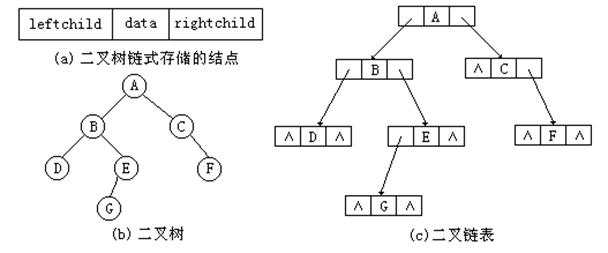
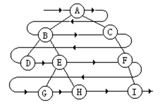

## 二叉树的存储结构

### 数组表示法

二叉树的数组表示就是采用一组连续存储空间存储二叉树结点中的数据元素，利用数组下标来反映数据元素之间的关系。

对具有n个结点的完全二叉树按从上到下、自左向右的顺序连续给结点编号0、1、2、…、n-1。按此结点编号将二叉树中各结点中的数据元素顺序地存放于一个一维数组中，首先将根结点中的数据元素储存在数组的0号位置；对于二叉树中任一个结点，如果它的数据元素存储在数组的第i个位置，就把它的左、右孩子结点中的数据元素分别存放在数组的第2\*i+1个位置和第2\*i+2个位置。这样就得到了二叉树的一种数组表示法。

采用这种方法表示一般的二叉树时，空间利用效率低是一个主要的问题。当被表示的二叉树结构很不完整时，在数组中就会出现很多空位置，因此空间浪费就变得非常大。


用这种方法表示二叉树时，还有一个问题需要注意的是：必须处理结点不存在的情况。如果一个结点不存在，就必须在数组中相应位置设置一个特殊标志，指明在这个位置没有结点。

### 链表表示法

在二叉树的链表表示中，树中的每一个元素用一个结点表示，结点一般包括三个域，其结构如图(a)所示。其中，Data域用于存放数据元素的信息；leftChild域用于存放指向其左孩子结点的指针；rightChild域用于存放指向其右孩子结点的指针。二叉树的这种链表表示称为二叉链表。



二叉树的二叉链表表示，对于大多数的应用来说是适合的。但是，在二叉链表中要想找出一个结点的双亲是比较困难的，必须通过二叉树的遍历才能实现。如果在应用中需要方便地找到任何一个结点的双亲，可以在结点中增加一个Parent域来指向该结点的双亲，二叉树的这种表示方法称为三叉链表。


树的表示法

```c
#include <stdlib.h>
#include <string.h>
#include <stdio.h>

/*
typedef struct BiTNode
{
	int data;
	struct BiTNode *lchild, *rchild;
}BiTNode, *BiTree;
*/

//二叉链表
struct BiTNode
{
	int data;
	struct BiTNode *lchild, *rchild;
};
typedef struct BiTNode		BiTNode;
typedef struct BiTNode*		BiTree;

//三叉链表
typedef struct TriTNode
{
	int data;
	//左右孩子指针
	struct TriTNode *lchild, *rchild;
	struct TriTNode *parent;
}TriTNode, *TriTree;

//双亲链表
#define MAX_TREE_SIZE 100
typedef struct BPTNode
{
	int data;
	int parentPosition; //指向双亲的指针，数组下标
	char LRTag; //左右孩子标志域
}BPTNode;

typedef struct BPTree
{
	BPTNode nodes[100]; //因为结点之间是分散的，需要把结点存储到数组中
	int num_node;  //结点数目
	int root; //根结点的位置，注意此域存储的是父亲结点在数组的下标
}BPTree;

void main1()
{
	BPTree tree;

	//根结点
	tree.nodes[0].parentPosition = 1000;

	//B
	tree.nodes[1].parentPosition = 0;
	tree.nodes[1].data = 'B';
	tree.nodes[1].LRTag = 1;

	//c
	tree.nodes[2].parentPosition = 0;
	tree.nodes[2].data = 'C';
	tree.nodes[2].LRTag = 2;
	system("pause");
}

void main2()
{
	BiTNode *p1, *p2, *p3, *p4, *p5;
	p1 = (BiTNode *)malloc(sizeof(BiTNode));
	p2 = (BiTNode *)malloc(sizeof(BiTNode));
	p3 = (BiTNode *)malloc(sizeof(BiTNode));
	p4 = (BiTNode *)malloc(sizeof(BiTNode));
	p5 = (BiTNode *)malloc(sizeof(BiTNode));

	p1->data = 1;
	p2->data = 2;
	p3->data = 3;
	p4->data = 4;
	p5->data = 5;

	//建立关系
	p1->lchild = p2;
	p1->rchild = p3;
	p2->lchild = p4;
	p3->lchild = p5;

	system("pause");
	return ;
}

void main()
{
	BiTNode t1, t2, t3, t4, t5;
	t1.data = 1;
	t2.data = 2;
	t3.data = 3;
	t4.data = 4;
	t5.data = 5;

	//建立关系
	t1.lchild = &t2;
	t1.rchild = &t3;
	t2.lchild = &t4;
	t3.lchild = &t5;

	system("pause");
	return ;
}
```

树的遍历

```c++
#include <stdlib.h>
#include <string.h>
#include <stdio.h>

/*
typedef struct BiTNode
{
	int data;
	struct BiTNode *lchild, *rchild;
}BiTNode, *BiTree;
*/

//二叉链表
struct BiTNode
{
	int data;
	struct BiTNode *lchild, *rchild;
};
typedef struct BiTNode		BiTNode;
typedef struct BiTNode*		BiTree;

void preOrder(BiTNode *root)
{
	if (root == NULL)
	{
		return;
	}
	//printf("%d ", root->data);

	//遍历左子树
	preOrder(root->lchild);

	//遍历右子树
	preOrder(root->rchild);
}

void inOrder(BiTNode *root)
{
	if (root == NULL)
	{
		return;
	}
	//遍历左子树
	inOrder(root->lchild);
	//printf("%d ", root->data);
	//遍历右子树
	inOrder(root->rchild);
}

void postOrder(BiTNode *root)
{
	if (root == NULL) return;

	//遍历左子树
	postOrder(root->lchild);

	//遍历右子树
	postOrder(root->rchild);
	//printf("%d ", root->data);
}

int sum;

void coutLeaf2(BiTNode *T)
{
	if (T != NULL)
	{
		if (T->lchild == NULL && T->rchild==NULL)
		{
			sum ++ ;
		}
		if (T->lchild )
		{
			coutLeaf2(T->lchild);
		}

		if (T->rchild)
		{
			coutLeaf2(T->rchild);
		}
	}
}


void coutLeaf(BiTNode *T)
{
	if (T != NULL)
	{
		if (T->lchild == NULL && T->rchild==NULL)
		{
			sum ++ ;
		}
		if (T->lchild )
		{
			coutLeaf(T->lchild);
		}

		if (T->rchild)
		{
			coutLeaf(T->rchild);
		}
	}
}

void coutLeaf3(BiTNode *T, int *sum)
{
	if (T != NULL)
	{
		if (T->lchild == NULL && T->rchild==NULL)
		{
			(*sum) ++ ;
		}
		if (T->lchild )
		{
			coutLeaf3(T->lchild, sum);
		}

		if (T->rchild)
		{
			coutLeaf3(T->rchild, sum);
		}
	}
}

void coutLeaf4(BiTNode *T, int *sum)
{
	if (T != NULL)
	{
		if (T->lchild )
		{
			coutLeaf4(T->lchild, sum);
		}

		if (T->rchild)
		{
			coutLeaf4(T->rchild, sum);
		}

		if (T->lchild == NULL && T->rchild==NULL)
		{
			(*sum) ++ ;
		}
	}
}

void main()
{
	BiTNode t1, t2, t3, t4, t5;
	memset(&t1, 0, sizeof(BiTNode));
	memset(&t2, 0, sizeof(BiTNode));
	memset(&t3, 0, sizeof(BiTNode));
	memset(&t4, 0, sizeof(BiTNode));
	memset(&t5, 0, sizeof(BiTNode));
	t1.data = 1;
	t2.data = 2;
	t3.data = 3;
	t4.data = 4;
	t5.data = 5;

	//建立关系
	t1.lchild = &t2;
	t1.rchild = &t3;
	t2.lchild = &t4;
	t3.lchild = &t5;

	sum = 0;

	coutLeaf(&t1);
	printf("sum:%d \n", sum);

	{
		int mysum = 0;
		coutLeaf3(&t1, &mysum);
		printf("mysum:%d \n", mysum);
	}

	{
		int mysum4 = 0;
		coutLeaf4(&t1, &mysum4);
		printf("mysum4:%d \n", mysum4);
	}


	/*
	//树的遍历
	printf("preOrder\n");
	preOrder(&t1);
	printf("inorder\n");
	inOrder(&t1);

	printf("postOrder\n");
	postOrder(&t1);
	*/
	system("pause");
	return ;
}
```
## 二叉树的遍历

这里讲解前序遍历、中序遍历、后序遍历3种方式。

### 前序遍历
若二叉树非空，则执行以下操作：

- 访问根结点
- 先序遍历左子树
- 先序遍历右子树

前序遍历代码

```java
private void preOrder(BSTNode<T> tree) {
    if(tree != null) {
        System.out.print(tree.key+" ");
        preOrder(tree.left);
        preOrder(tree.right);
    }
}

public void preOrder() {
    preOrder(mRoot);
}
```
### 中序遍历

若二叉树非空，则执行以下操作：

- 中序遍历左子树
- 访问根结点
- 中序遍历右子树

中序遍历代码

```java
private void inOrder(BSTNode<T> tree) {
    if(tree != null) {
        inOrder(tree.left);
        System.out.print(tree.key+" ");
        inOrder(tree.right);
    }
}

public void inOrder() {
    inOrder(mRoot);
}
```
### 后序遍历

若二叉树非空，则执行以下操作：

- 后序遍历左子树
- 后序遍历右子树
- 访问根结点

后序遍历代码

```java
private void postOrder(BSTNode<T> tree) {
    if(tree != null)
    {
        postOrder(tree.left);
        postOrder(tree.right);
        System.out.print(tree.key+" ");
    }
}

public void postOrder() {
    postOrder(mRoot);
}
```
看看下面这颗树的各种遍历方式：


对于上面的二叉树而言，

- 前序遍历结果： 3 1 2 5 4 6
- 中序遍历结果： 1 2 3 4 5 6
- 后序遍历结果： 2 1 4 6 5 3

### 层序遍历



所谓层序遍历(Levelorder Traversal)二叉树，是指从二叉树的第一层(根结点)开始，自上至下逐层遍历，在同一层中，则按从左到右的顺序对结点逐个访问。对于右图所示的二叉树，按层序遍历方式进行遍历所得到的结点序列为：A、B、C、D、E、F、G、H、I

在进行层序遍历时，需要设置一个队列结构，并按下述步骤层序遍历二叉树：

1. 初始化队列，并将根结点入队。
2. 当队列非空时，取出队头结点p，转步骤3；如果队列为空，则结束遍历。
3. 访问结点p；如果该结点有左孩子，则将其左孩子入队列；如果该结点有右孩子，则将其右孩子入队列。
4. 重复步骤2、3，直到队列为空。

下面给出层序遍历算法的C++描述，其中二叉树的存储结构仍为二叉链表。在此还用到了前面定义的队列Queue。

```c++
template <class Type> void BinaryTree<Type>::LevelOrder ( ) {
 	linkqueue <BinTreeNode * > q;
	BinTreeNode * p=root;
    if  (p )  q.add(p);
    While (!q.IsEmpty( )) {
       p = *q.delete ();
       cout << p.GetData()<< endl;
       if (p->GetLeftChild( ) ) q.add (p→GetLeftChild( ) );
       if (p->GetRightChild( ) ) q.add (p→GetRightChild( ) ); }
}
```

在遍历二叉树时，无论采用前面所讲的哪一种方式进行遍历，其基本操作都是访问结点。所以，对具有n个结点的二叉树，遍历操作的时间复杂度均为O(n)。

在前序、中序和后序遍历的过程中，递归时栈所需要的空间最多等于树的深度h乘以每个栈元素所需空间，在最坏的情况下，二叉树的深度等于结点数目，所以空间复杂度为O(n)。在层序遍历时，所设置队列的大小显然小于二叉树中结点的个数，所以空间复杂度也为O(n)。

利用二叉树的遍历可以实现许多关于二叉树的运算，例如计算二叉树的结点数目、计算二叉树的高度、二叉树的复制等。

遍历的本质：三种遍历算法的访问路径是相同的，只是访问结点的时机不同。

### 对遍历的分析

从前面的三种遍历算法可以知道：如果将printf语句抹去，从递归的角度看，这三种算法是完全相同的，或者说这三种遍历算法的访问路径是相同的，只是访问结点的时机不同。

从虚线的出发点到终点的路径上，每个结点经过3次。

- 第1次经过时访问＝先序遍历
- 第2次经过时访问＝中序遍历
- 第3次经过时访问＝后序遍历


