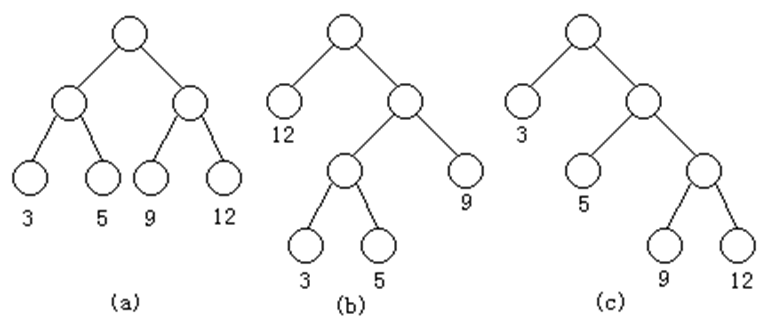
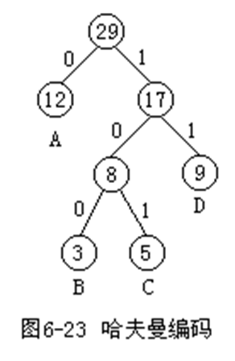

## 1. 哈夫曼树的介绍

在一棵二叉树中由根结点到某个结点所经过的分支序列叫做由根结点到这个结点的路径，由根结点到某个结点所经过的分支数称为由根结点到该结点的路径长度。由根结点到所有叶结点的路径长度之和称为该二叉树的路径长度。

如果二叉树中每一个叶结点都带有某一确定值，就可以将二叉树的路径长度的概念加以推广。设一棵具有n个带权值叶结点的二叉树，那么从根结点到各个叶结点的路径长度与对应叶结点权值的乘积之和叫做二叉树的带权路径长度，记作：


其中W<sub>k</sub>为第k个叶结点的权值，L<sub>k</sub>为第K个叶结点的路径长度。

如果给定一组具体确定权值的叶结点，可以构造出叶结点数相同的形态各异的二叉树。例如，给定4个叶子结点，其权值分别为（3、5、9、12）。可以构造出多棵形状不同的二叉树，它们的带权路径长度不一定相同。图6-21给出了其中三棵不同形状的二叉树。它们的带权路径长度为分别为58、54和76。



由此可见，对于一组确定权值的叶结点，所构造出的不同形态二叉树的带权路径长度并不相同。在此把其中具有最小带权路径长度的二叉树称为最优二叉树，最优二叉树也称作哈夫曼树，可以证明，图(c)所示的二叉树就是一棵哈夫曼树。

根据哈夫曼树的定义，要使一棵二叉树的其WPL值最小，显然必须使权值越大的叶结点越靠近根结点，而权值越小的结点越远离根结点。

Huffman Tree，中文名是哈夫曼树或霍夫曼树，它是最优二叉树。

**定义**：给定n个权值作为n个叶子结点，构造一棵二叉树，若树的带权路径长度达到最小，则这棵树被称为哈夫曼树。 这个定义里面涉及到了几个陌生的概念，下面就是一颗哈夫曼树，我们来看图解答。


### 1.1 路径和路径长度

**定义**：在一棵树中，从一个结点往下可以达到的孩子或孙子结点之间的通路，称为路径。通路中分支的数目称为路径长度。若规定根结点的层数为1，则从根结点到第L层结点的路径长度为L-1。 

**例子**：100和80的路径长度是1，50和30的路径长度是2，20和10的路径长度是3。

### 1.2  结点的权及带权路径长度

**定义**：若将树中结点赋给一个有着某种含义的数值，则这个数值称为该结点的权。结点的带权路径长度为：从根结点到该结点之间的路径长度与该结点的权的乘积。 

**例子**：节点20的路径长度是3，它的带权路径长度= 路径长度  x 权 = 3 x 20 = 60。

### 1.3  树的带权路径长度

**定义**：树的带权路径长度规定为所有叶子结点的带权路径长度之和，记为WPL。 

**例子**：示例中，树的WPL= 1 x 100 + 2 x 80 + 3 x 20 + 3 x 10 = 100 + 160 + 60 + 30 = 350

比较下面两棵树


上面的两棵树都是以{10, 20, 50, 100}为叶子节点的树。

左边的树WPL=2 x 10 + 2 x 20 + 2 x 50 + 2 x 100 = 360 

右边的树WPL=350

左边的树WPL > 右边的树的WPL。你也可以计算除上面两种示例之外的情况，但实际上右边的树就是{10,20,50,100}对应的哈夫曼树。至此，应该堆哈夫曼树的概念有了一定的了解了，下面看看如何去构造一棵哈夫曼树。

## **2. 哈夫曼树的图文解析**

假设有n个权值，则构造出的哈夫曼树有n个叶子结点。 n个权值分别设为 w1、w2、…、wn，哈夫曼树的构造规则为：

**1**. 将w1、w2、…，wn看成是有n 棵树的森林(每棵树仅有一个结点)； 
**2**. 在森林中选出根结点的权值最小的两棵树进行合并，作为一棵新树的左、右子树，且新树的根结点权值为其左、右子树根结点权值之和； 
**3**. 从森林中删除选取的两棵树，并将新树加入森林； 
**4**. 重复(02)、(03)步，直到森林中只剩一棵树为止，该树即为所求得的哈夫曼树。

以{5,6,7,8,15}为例，来构造一棵哈夫曼树。


**第1步**：创建森林，森林包括5棵树，这5棵树的权值分别是5,6,7,8,15。 

**第2步**：在森林中，选择根节点权值最小的两棵树(5和6)来进行合并，将它们作为一颗新树的左右孩子(谁左谁右无关紧要，这里，我们选择较小的作为左孩子)，并且新树的权值是左右孩子的权值之和。即，新树的权值是11。 然后，将"树5"和"树6"从森林中删除，并将新的树(树11)添加到森林中。 

**第3步**：在森林中，选择根节点权值最小的两棵树(7和8)来进行合并。得到的新树的权值是15。 然后，将"树7"和"树8"从森林中删除，并将新的树(树15)添加到森林中。 

**第4步**：在森林中，选择根节点权值最小的两棵树(11和15)来进行合并。得到的新树的权值是26。 然后，将"树11"和"树15"从森林中删除，并将新的树(树26)添加到森林中。 

**第5步**：在森林中，选择根节点权值最小的两棵树(15和26)来进行合并。得到的新树的权值是41。 然后，将"树15"和"树26"从森林中删除，并将新的树(树41)添加到森林中。 

此时，森林中只有一棵树(树41)。这棵树就是我们需要的哈夫曼树！

## **3. 哈夫曼树的基本操作**

哈夫曼树的重点是如何构造哈夫曼树。本文构造哈夫曼时，用到了以前介绍过的"(二叉堆)最小堆"。下面对哈夫曼树进行讲解。

### **基本定义**

```java
public class HuffmanNode implements Comparable, Cloneable {
    protected int key;              // 权值
    protected HuffmanNode left;     // 左孩子
    protected HuffmanNode right;    // 右孩子
    protected HuffmanNode parent;   // 父结点

    protected HuffmanNode(int key, HuffmanNode left, HuffmanNode right, HuffmanNode parent) {
        this.key = key;
        this.left = left;
        this.right = right;
        this.parent = parent;
    }

    @Override
    public Object clone() {
        Object obj=null;

        try {
            obj = (HuffmanNode)super.clone();//Object 中的clone()识别出你要复制的是哪一个对象。    
        } catch(CloneNotSupportedException e) {
            System.out.println(e.toString());
        }

        return obj;    
    }

    @Override
    public int compareTo(Object obj) {
        return this.key - ((HuffmanNode)obj).key;
    }
}
```

HuffmanNode是哈夫曼树的节点类。

```java
public class Huffman {

    private HuffmanNode mRoot;  // 根结点

    ...
}
```

Huffman是哈夫曼树对应的类，它包含了哈夫曼树的根节点和哈夫曼树的相关操作。

## 哈夫曼树在编码问题中的应用

在数据通信中，经常需要将传送的电文转换成由二进制数字0、1组成的串，一般称之为编码。例如，假设要传送的电文为AADDBCAAABDDCADAAADD，电文中只有A、B、C、D四种字符；若这四种字符的编码分别为：A(00)、B(01)、C(10)、D(11)，则电文的代码为：0000111101100000000111111000110000001111，电文代码的长度为40。在这种编码方案中，四种字符的编码长度均为2，这是一种等长编码。

在传送电文时，人们总是希望传送时间尽可能短，这就要求使电文代码长度尽可能短。显然，上述编码方案所产生的电文代码还不够短。如果这四种字符的编码分别为：A(0)、B(1)、C(10)、D(01)，则用此编码方案对上述电文进行编码得到的电文代码为：00010111000010101100010000101，此电文代码的长度只有29。但这样的电文代码是无法正确翻译成原来的电文的。显然对“01”，你可以认为是“D”，也可以认为是“AB”。因为这四个字符的编码不是前缀码（前缀码要求任一字符的编码均非其他字符编码的前缀），因而无法获得唯一的译码。

可以利用哈夫曼树构造出使电文代码总长最短的编码方案。具体做法如下：设需要编码的字符集合为{C1、C2、…、Cn}，它们在电文中出现的次数或频率集合为{W1、W2、…、Wn}。以C1、C2、…、Cn作为叶结点，W1、W2、…、Wn作为它们的权值，构造一棵哈夫曼树，规定哈夫曼树中的左分支代表0，右分支代表1，则从根结点到每个叶结点所经过的路径分支组成的0或1序列作为该叶结点对应字符的编码，我们称之为哈夫曼编码。



例如：对于一段电文：AADDBCAAABDDCADAAADDCDDBAACCA。其字符集合为：{A、B、C、D}，各个字符出现的频率(次数)是 W＝{12、3、5、9}。若给每个字符以等长编码：A(00)、B(10)、C(01)、D(11)。则电文代码的长度为：(12+3+5+9)*2=58。

若按各个字符出现的频率不同而给予不等长编码，可望减少电文代码的长度。因各字符出现的频率为{12/29、3/29、5/29、9/29}，化成整数为{12、3、5、9}，以它们为各叶结点上的权值，建立哈夫曼树，如图6-23所示，得哈夫曼编码为：A(0)、B(100)、C(101)、D(11)。它的总代码长度：12*1+(3+5)*2+9*3=54，正好等于哈夫曼树的带权路径长度WPL，显然比等长编码的代码长度要短。哈夫曼编码是一种前缀编码，解码时不会混淆。

## **4. 构造哈夫曼树**

```java
/* 
 * 创建Huffman树
 *
 * @param 权值数组
 */
public Huffman(int a[]) {
    HuffmanNode parent = null;
    MinHeap heap;

    // 建立数组a对应的最小堆
    heap = new MinHeap(a);

    for(int i=0; i<a.length-1; i++) {   
        HuffmanNode left = heap.dumpFromMinimum();  // 最小节点是左孩子
        HuffmanNode right = heap.dumpFromMinimum(); // 其次才是右孩子

        // 新建parent节点，左右孩子分别是left/right；
        // parent的大小是左右孩子之和
        parent = new HuffmanNode(left.key+right.key, left, right, null);
        left.parent = parent;
        right.parent = parent;

        // 将parent节点数据拷贝到"最小堆"中
        heap.insert(parent);
    }

    mRoot = parent;

    // 销毁最小堆
    heap.destroy();
}
```
首先创建最小堆，然后进入for循环。每次循环时：

- 首先，将最小堆中的最小节点拷贝一份并赋值给left，然后重塑最小堆(将最小节点和后面的节点交换位置，接着将"交换位置后的最小节点"之前的全部元素重新构造成最小堆)； 
- 接着，再将最小堆中的最小节点拷贝一份并将其赋值right，然后再次重塑最小堆； 
- 然后，新建节点parent，并将它作为left和right的父节点； 
- 接着，将parent的数据复制给最小堆中的指定节点。

在二叉堆中已经介绍过堆，这里就不再对堆的代码进行说明了。若有疑问，直接参考后文的源码。其它的相关代码，也Please RTFSC(Read The Fucking Source Code)！

## **5. 哈夫曼树的完整源码**

### 哈夫曼树的节点类(HuffmanNode.java)

```java
/**
 * Huffman节点类(Huffman.java的辅助类)
 *
 * @author skywang
 * @date 2014/03/27
 */

public class HuffmanNode implements Comparable, Cloneable {
	protected int key;				// 权值
	protected HuffmanNode left;		// 左孩子
	protected HuffmanNode right;	// 右孩子
	protected HuffmanNode parent;	// 父结点

	protected HuffmanNode(int key, HuffmanNode left, HuffmanNode right, HuffmanNode parent) {
		this.key = key;
		this.left = left;
		this.right = right;
		this.parent = parent;
	}

	@Override
	public Object clone() {
		Object obj=null;
		
		try {
			obj = (HuffmanNode)super.clone();//Object 中的clone()识别出你要复制的是哪一个对象。    
		} catch(CloneNotSupportedException e) {
			System.out.println(e.toString());
		}
		
		return obj;    
	}

	@Override
	public int compareTo(Object obj) {
		return this.key - ((HuffmanNode)obj).key;
	}
}
```

### 哈夫曼树的实现文件(Huffman.java)

```java
/**
 * Huffman树
 *
 * @author skywang
 * @date 2014/03/27
 */

import java.util.List;
import java.util.ArrayList;
import java.util.Collections;

public class Huffman {

	private HuffmanNode mRoot;	// 根结点

	/* 
	 * 创建Huffman树
	 *
	 * @param 权值数组
	 */
	public Huffman(int a[]) {
        HuffmanNode parent = null;
		MinHeap heap;

		// 建立数组a对应的最小堆
		heap = new MinHeap(a);
	 
		for(int i=0; i<a.length-1; i++) {   
        	HuffmanNode left = heap.dumpFromMinimum();  // 最小节点是左孩子
        	HuffmanNode right = heap.dumpFromMinimum(); // 其次才是右孩子
	 
			// 新建parent节点，左右孩子分别是left/right；
			// parent的大小是左右孩子之和
			parent = new HuffmanNode(left.key+right.key, left, right, null);
			left.parent = parent;
			right.parent = parent;

			// 将parent节点数据拷贝到"最小堆"中
			heap.insert(parent);
		}

		mRoot = parent;

		// 销毁最小堆
		heap.destroy();
	}

	/*
	 * 前序遍历"Huffman树"
	 */
	private void preOrder(HuffmanNode tree) {
		if(tree != null) {
			System.out.print(tree.key+" ");
			preOrder(tree.left);
			preOrder(tree.right);
		}
	}

	public void preOrder() {
		preOrder(mRoot);
	}

	/*
	 * 中序遍历"Huffman树"
	 */
	private void inOrder(HuffmanNode tree) {
		if(tree != null) {
			inOrder(tree.left);
			System.out.print(tree.key+" ");
			inOrder(tree.right);
		}
	}

	public void inOrder() {
		inOrder(mRoot);
	}


	/*
	 * 后序遍历"Huffman树"
	 */
	private void postOrder(HuffmanNode tree) {
		if(tree != null)
		{
			postOrder(tree.left);
			postOrder(tree.right);
			System.out.print(tree.key+" ");
		}
	}

	public void postOrder() {
		postOrder(mRoot);
	}

	/*
	 * 销毁Huffman树
	 */
	private void destroy(HuffmanNode tree) {
		if (tree==null)
			return ;

		if (tree.left != null)
			destroy(tree.left);
		if (tree.right != null)
			destroy(tree.right);

		tree=null;
	}

	public void destroy() {
		destroy(mRoot);
		mRoot = null;
	}

	/*
	 * 打印"Huffman树"
	 *
	 * key        -- 节点的键值 
	 * direction  --  0，表示该节点是根节点;
	 *               -1，表示该节点是它的父结点的左孩子;
	 *                1，表示该节点是它的父结点的右孩子。
	 */
	private void print(HuffmanNode tree, int key, int direction) {

		if(tree != null) {

			if(direction==0)	// tree是根节点
				System.out.printf("%2d is root\n", tree.key);
			else				// tree是分支节点
				System.out.printf("%2d is %2d's %6s child\n", tree.key, key, direction==1?"right" : "left");

			print(tree.left, tree.key, -1);
			print(tree.right,tree.key,  1);
		}
	}

	public void print() {
		if (mRoot != null)
			print(mRoot, mRoot.key, 0);
	}
}
```

### 哈夫曼树对应的最小堆(MinHeap.java)

```java
/**
 * 最小堆(Huffman.java的辅助类)
 *
 * @author skywang
 * @date 2014/03/27
 */

import java.util.ArrayList;
import java.util.List;

public class MinHeap {

	private List<HuffmanNode> mHeap;		// 存放堆的数组

	/* 
	 * 创建最小堆
	 *
	 * 参数说明：
	 *     a -- 数据所在的数组
	 */
	protected MinHeap(int a[]) {
		mHeap = new ArrayList<HuffmanNode>();
		// 初始化数组
		for(int i=0; i<a.length; i++) {
		    HuffmanNode node = new HuffmanNode(a[i], null, null, null);
			mHeap.add(node);
		}

		// 从(size/2-1) --> 0逐次遍历。遍历之后，得到的数组实际上是一个最小堆。
		for (int i = a.length / 2 - 1; i >= 0; i--)
			filterdown(i, a.length-1);
	}

	/* 
	 * 最小堆的向下调整算法
	 *
	 * 注：数组实现的堆中，第N个节点的左孩子的索引值是(2N+1)，右孩子的索引是(2N+2)。
	 *
	 * 参数说明：
	 *     start -- 被下调节点的起始位置(一般为0，表示从第1个开始)
	 *     end   -- 截至范围(一般为数组中最后一个元素的索引)
	 */
	protected void filterdown(int start, int end) {
		int c = start; 	 	// 当前(current)节点的位置
		int l = 2*c + 1; 	// 左(left)孩子的位置
		HuffmanNode tmp = mHeap.get(c);	// 当前(current)节点

		while(l <= end) {
			// "l"是左孩子，"l+1"是右孩子
			if(l < end && (mHeap.get(l).compareTo(mHeap.get(l+1))>0))
				l++;		// 左右两孩子中选择较小者，即mHeap[l+1]

			int cmp = tmp.compareTo(mHeap.get(l));
			if(cmp <= 0)
				break;		//调整结束
			else {
				mHeap.set(c, mHeap.get(l));
				c = l;
				l = 2*l + 1;   
			}       
		}   
		mHeap.set(c, tmp);
	}
	
	/*
	 * 最小堆的向上调整算法(从start开始向上直到0，调整堆)
	 *
	 * 注：数组实现的堆中，第N个节点的左孩子的索引值是(2N+1)，右孩子的索引是(2N+2)。
	 *
	 * 参数说明：
	 *     start -- 被上调节点的起始位置(一般为数组中最后一个元素的索引)
	 */
	protected void filterup(int start) {
		int c = start;			// 当前节点(current)的位置
		int p = (c-1)/2;		// 父(parent)结点的位置 
		HuffmanNode tmp = mHeap.get(c);	// 当前(current)节点

		while(c > 0) {
			int cmp = mHeap.get(p).compareTo(tmp);
			if(cmp <= 0)
				break;
			else {
				mHeap.set(c, mHeap.get(p));
				c = p;
				p = (p-1)/2;   
			}       
		}
		mHeap.set(c, tmp);
	} 
 
	/* 
	 * 将node插入到二叉堆中
	 */
	protected void insert(HuffmanNode node) {
		int size = mHeap.size();

		mHeap.add(node);	// 将"数组"插在表尾
		filterup(size);		// 向上调整堆
	}

	/*
	 * 交换两个HuffmanNode节点的全部数据
	 */
	private void swapNode(int i, int j) {
		HuffmanNode tmp = mHeap.get(i);
		mHeap.set(i, mHeap.get(j));
		mHeap.set(j, tmp);
	}

	/* 
	 * 新建一个节点，并将最小堆中最小节点的数据复制给该节点。
	 * 然后除最小节点之外的数据重新构造成最小堆。
	 *
	 * 返回值：
	 *     失败返回null。
	 */
	protected HuffmanNode dumpFromMinimum() {
		int size = mHeap.size();

		// 如果"堆"已空，则返回
		if(size == 0)
			return null;

		// 将"最小节点"克隆一份，将克隆得到的对象赋值给node
		HuffmanNode node = (HuffmanNode)mHeap.get(0).clone();

		// 交换"最小节点"和"最后一个节点"
		mHeap.set(0, mHeap.get(size-1));
		// 删除最后的元素
		mHeap.remove(size-1);

		if (mHeap.size() > 1)
			filterdown(0, mHeap.size()-1);

		return node;
	}

	// 销毁最小堆
	protected void destroy() {
		mHeap.clear();
		mHeap = null;
	}
}
```

### 哈夫曼树的测试程序(HuffmanTest.java)

```java
/**
 * Huffman树的测试程序
 *
 * @author skywang
 * @date 2014/03/27
 */

public class HuffmanTest {

	private static final int a[]= {5,6,8,7,15};

	public static void main(String[] args) {
		int i;
		Huffman tree;

		System.out.print("== 添加数组: ");
		for(i=0; i<a.length; i++) 
			System.out.print(a[i]+" ");
	
		// 创建数组a对应的Huffman树
		tree = new Huffman(a);

		System.out.print("\n== 前序遍历: ");
		tree.preOrder();

		System.out.print("\n== 中序遍历: ");
		tree.inOrder();

		System.out.print("\n== 后序遍历: ");
		tree.postOrder();
		System.out.println();

		System.out.println("== 树的详细信息: ");
		tree.print();

		// 销毁二叉树
		tree.destroy();
	}
}
```