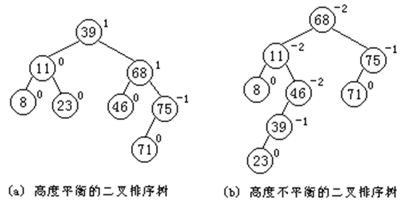
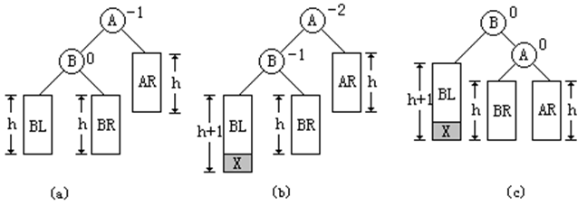
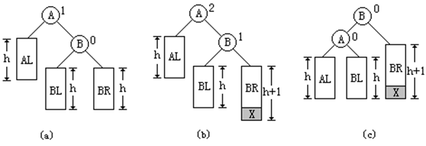

## 平衡二叉树 

一棵平衡二叉树或者是空树，或者是具有下列性质的二叉排序树：它的左子树和右子树都是平衡二叉树，且左子树和右子树的高度之差的绝对值不超过1。

结点右子树的高度减去左子树的高度所得的高度差，称为该结点的平衡因子。根据平衡二叉树的定义，任一结点的平衡因子只能取-1、0和1。如果一个结点的平衡因子的绝对值大于1，则这棵二叉排序树就失去了平衡，就不是平衡二叉树了。

 高度平衡的二叉排序树和高度平衡不二叉排序树示例 ：



一棵具有n个结点的平衡二叉树，其平均查找长度为O(log2n）。 

## 平衡旋转

假定向平衡树中插入一个新结点后破坏了它的平衡性，首先需要找到插入新结点后失去平衡的最小子树的根结点，然后对它进行相应的旋转，使之成为新的平衡子树。

设失去平衡的最小子树的根为A，则平衡调整可有以下四种情况： 

### LL平衡旋转

如果是因为在A的左孩子B的左子树上插入新结点，使A的平衡因子由-1变成-2，则需要进行LL平衡旋转。 



### RR平衡旋转

如果是因为在A的右孩子B的右子树上插入新结点，使A的平衡因子由1变成2，则需要进行RR平衡旋转。 



### LR平衡旋转

如果是因为在A的左孩子B的右子树上插入新结点，使A的平衡因子由-1变成-2，则需要进行LR平衡旋转。


### RL平衡旋转

如果是因为在A的右孩子B的左子树上插入新结点，使A的平衡因子由1变成2，则需要进行RL平衡旋转。


## 平衡二叉树的算法实现

二叉树的二叉链表结点结构定义

```c++
typedef  struct BiTNode
{
	int data;
	int bf; // 结点的平衡因子
	struct BiTNode *lchild, *rchild;
} BiTNode, *BiTree;
```

右旋

```c++
/* 对以p为根的二叉排序树作右旋处理， */
/* 处理之后p指向新的树根结点，即旋转处理之前的左子树的根结点 */
void R_Rotate(BiTree *P)
{ 
	BiTree L;
	L=(*P)->lchild; /*  L指向P的左子树根结点 */ 
	(*P)->lchild=L->rchild; /*  L的右子树挂接为P的左子树 */ 
	L->rchild=(*P);
	*P=L; /*  P指向新的根结点 */ 
}
```