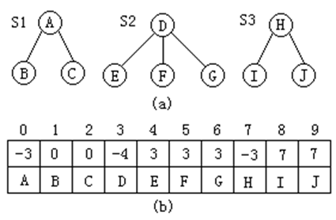
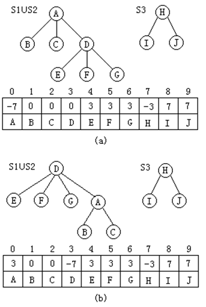
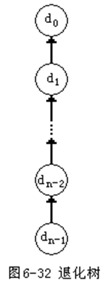
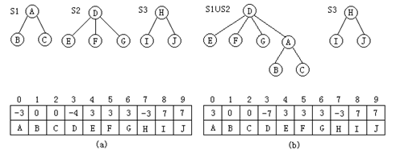
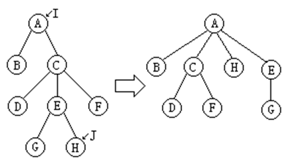
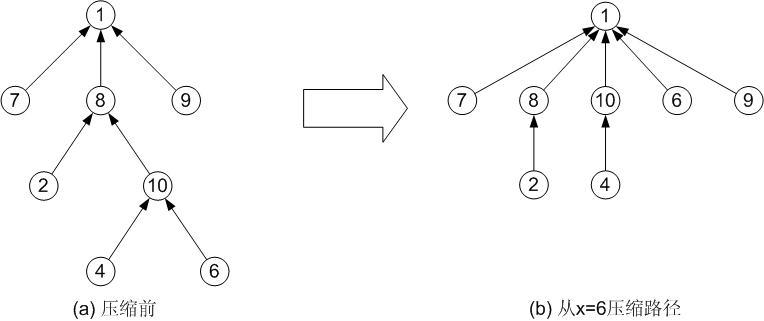
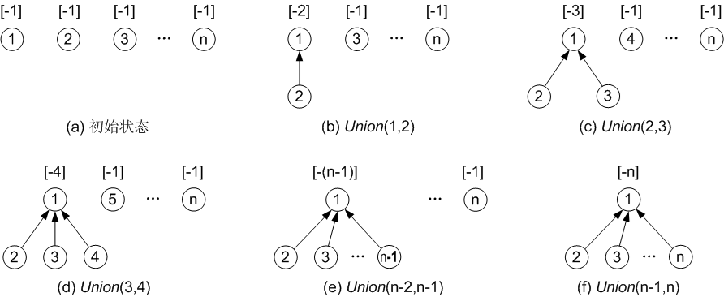
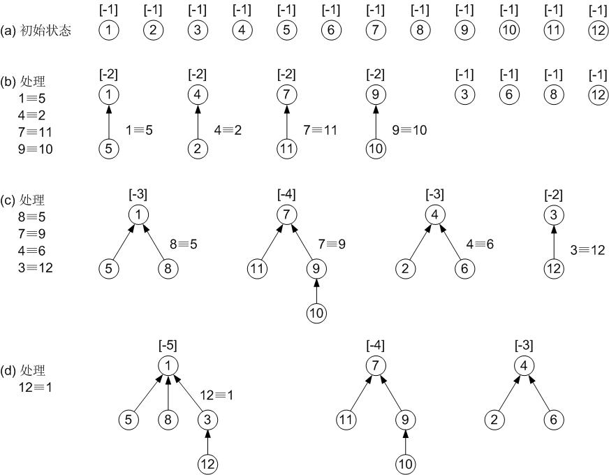

## 等价类和并查集

### 等价关系与等价类

在实际应用，经常会遇到等价类的问题。例如，在进行软件测试时，需要把测试的数据按条件分类，测试同一功能的数据作为一个等价类。

在数学上，等价类是一个对象(或成员)的集合，在此集合中的所有对象应满足等价关系（用符号“≡”表示）。等价关系是一个自反的、对称的和传递的关系。

一般地，一个集合S中的所有对象可以通过等价关系划分为m个互不相交的子集S1、S2、…、Sm，即对于S中的任何两个元素x和y（x、y ∈ S），如果x和y是等价的（x≡y），则x和y被划分在同一个子集Si中（i=1、2、…、m）。这些子集被称为等价类。

1. 在求解实际应用问题时常会遇到等价类的问题。
2. 从数学上看，等价类是一个对象(或成员)的集合，在此集合中的所有对象应满足等价关系。
3. 若用符号“≡”表示集合上的等价关系，那么对于该集合中的任意对象x, y, z，下列性质成立：
   - 自反性：x ≡ x (即等于自身)
   - 对称性：若 x ≡ y, 则 y ≡ x
   - 传递性：若 x ≡ y且 y ≡ z, 则 x ≡ z
4. 因此，等价关系是集合上的一个自反、对称、传递的关系。
5. “相等”(=)就是一种等价关系，它满足上述的三个特性。
6. 一个集合 S 中的所有对象可以通过等价关系划分为若干个互不相交的子集 S1, S2, S3, …，它们的并就是 S。这些子集即为等价类。

等价关系的例子很多，例如平面上三角形集合中，三角形的相似关系是一个等价关系；在学校的学生集合中，在同一个班级的关系也是一个等价关系。 

利用等价关系把集合S划分成若干等价类的算法分两步走：

（1）首先把S中的每一个对象看成是一个等价类；
（2）依次处理各个等价对（x≡y）：若x∈Si、y∈Sj，且Si≠Sj，则把集合Si、Sj合并成一个集合。

## 并查集

把n个不同的元素的集合划分为若干个等价类时，先把每一个对象看作是一个单元素集合，然后依次将属于同一等价类的元素所在的集合合并。在此过程中将反复地使用一个查找运算，确定一个元素在哪一个集合中。能够完成这种功能的集合就是并查集，它支持以下三种操作：

（1）Ufsets(n)：构造函数，将并查集中n个元素初始化为n个只有一个单元素的子集合。
（2）Union(S1，S2)：把集合S2并入集合S1中。要求S1与S2互不相交，否则没有结果。
（3）Find(d)：查找单元素d所在的集合，并返回该集合的名字。

对于并查集来说，每个子集合（等价类）用一棵树表示，子集合中每个元素用树中的一个结点表示。为了处理简单，用树的根结点来代表相应的等价类集合。在此，等价类树用双亲表示法表示（当然根据需要可以建立集合名字到表示该集合的树的根结点之间的对应关系）；

此外，树的根结点的双亲域的值设为-k（parent=-k），其中k为该树中的结点数（即所代表等价类中的元素数目）。若有三个等价类：S1={a、b、c}，S2={d、e、f、g}，S3={h、i、j}，则表示它们的并查集的树结构如图所示。



在这种表示方法中，可以方便的实现并查集的合并和查找操作。

对于任意给定的集合元素d，只要通过双亲指针向上一直走到树的根结点，就可以得到元素d所在的等价类（用根结点代表相应的等价类）。

对于两个集合的并，只要将表示其中一个集合的树的根结点置为表示另一个集合的树的根结点的孩子即可。

如图给出了对前图所表示的三个等价类S1、S2和S3实现S1∪S2的两种方法。



1、建立等价类的另一种解决方案是先把每一个对象看作是一个单元素集合，然后按一定顺序将属于同一等价类的元素所在的集合合并。

2、在此过程中将反复地使用一个搜索运算，确定一个元素在哪一个集合中。

3、能够完成这种功能的集合就是并查集。它支持以下三种操作：

- Union (Root1, Root2) //并操作；
- Find (x) //搜索操作；
- UFSets (s) //构造函数。

4、一般情形，并查集主要涉及两种数据类型：集合名类型和集合元素的类型。

5、对于并查集来说，每个集合用一棵树表示。

6、集合中每个元素的元素名分别存放在树的结点中，此外，树的每一个结点还有一个指向其双亲结点的指针。

7、为此，需要有两个映射： 

- 集合元素到存放该元素名的树结点间的对应；
- 集合名到表示该集合的树的根结点间的对应。

### 并查集的类定义

```c++
template <class Type> class UFSets;
template <class Type> class TreeNode {
//定义树的双亲表示结点类
friend class UFSets;
private:
    Type data;  //数据域
    int parent; //双亲域
};

template <class Type>
class UFSets { //并查集的类定义
public:
    UFSets ( Type * arr , int n );   //构造函数
    ~UFSets ( ) { delete [ ] sets; }  //析造函数
    void Union ( int set1, int set2 ); //合并函数
    int Find ( Type d );           //查找函数
    void UnionByHeight ( int set , set2 );
private:
    TreeNode<Type> *sets; //存储集合元素的数组
    int size;             //集合的大小
    int Order( Type d );  //定位函数，确定数据元素d在数组中的位置
};
```
下面给出并查集主要成员函数的实现。

构造函数UFSets( )根据arr[]数组中给出的数据元素（数组中有n个元素），构造n个只含有一个单元素的等价类的集合。

```c++
template <class Type> int UFSets<Type> :: 
UFSets (Type * arr , int n ) { //构造函数
    size = n;
    sets = new TreeNode<Type> [size];
    for( int i = 0; i < size; i++ ) {
    sets.parent[i] = -1; sets.data[i] = arr[i];}
}
```

私有成员函数Order( )用于确定给定数据元素d在集合数组中的位置（即数组的下标）。如果在集合中不存在元素d，函数返回-1；否则返回元素d在数组中的下标。

```c++
template <class Type> int UFSets<Type> :: 
Order ( Type d ) { //定位函数，确定数据元素d在数组中的位置
    int p=0;
    while (p<size)
      if ( sets[p].data=d ) return p;
  else  p++;
    return -1;
}
```

成员函数Find( )确定数据元素d所在的等价类，如果元素d不在任何等价类中，函数返回-1；否则返回元素d所在等价类的根结点在数组中的下标。

```c++
template <class Type> int UFSets<Type> :: 
Find ( Type d ) { //查找函数，确定数据元素d所在的等价类
    int p;
    if ( (p = Order(d) ) == -1 ) return -1 ; //元素d不在任何等价类中
    if ( sets[p].parent < 0 )  return p;  //p为一个等价类根结点的序号
         else
           return Find (sets[sets[p].parent].data );//求p的双亲所在的等价类
}
```

成员函数Union( )把以s1、s2为根的两个等价类合并成一个等价类，把结点s2为根的树作为s1的子树。

```c++
template <class Type> void UFSets<Type> :: 
Union ( int s1,int s2 ){
    sets[s1].parent = sets[s1].parent + sets[s2].parent;
    sets[s2].parent = s1;       //s2的双亲指针指向s1
}
```

显然，这些函数的实现都比较简单，但性能特性并不好。

假设初始时有n个元素{d0、d1、…、dn-1}的集合，相应有n棵树组成的森林，如果执行了如下处理：Union（n-2，n-1）、Union（n-3，n-2）、…、Union（0、1），则最后将产生如图6-32所示的退化的树。

此时若查找元素di，完成Find(di)操作需要时间为O(i)，所以执行Find(d0)、Find(d1)、…、Find(dn-1)，完成n次查找需要的总时间为O(n²)。



为了避免产生退化的树，一种改进的方法是在合并两个集合时，先判断两集合中元素的个数，如果以i为根的树中的结点个数少于以j为根的树中的结点个数(即sets[i].parent＞sets[j].parent)，则让，j成为i的双亲，否则，让i成为j的双亲，把此称为Union（i，j）的加权规则。

如图所示，以A（A在数组中的位置是0）为根的树中结点个数为3，以D（D在数组中的位置是3）为根的树中结点个数为4，因此sets[0].parent＞sets[4].parent，所以在执行Union（0，3）时让3成为0的双亲（即sets[0].parent＝3）。



带加权规则的合并函数的C++实现：

```c++
template <class Type> void UFSets<Type> ::
WeightedUnion ( int s1, int s2 ) {//带加权规则的合并算法    
int  temp = sets[s1].parent + sets[s2].parent;
    if (sets[s1]parent <= sets[s2]parent ) {
        sets[s2].parent = s1;      //s1中的结点个数，s2指向s1       
        sets[s1].parent] = temp;  
        }
    else {  
        sets[s1].parent = s2;      //s1中的结点个数少，s1指向s2 
        sets[s2].parent] = temp;       
        }
}
```

为了进一步减少查找的时间，改进树的性能，可以使用如下的折叠规则来“压缩路径”。即：设j是以i为根的树中的一个结点，则对于从j到根i的路径上的每一个结点k，如果k的双亲（sets[k].parent）不等于i，则把i设置为k的双亲（sets[k].parent=i）。下图给出使用折叠规则压缩查找路径的示例



使用折叠规则压缩路径的查找算法如下：

```c++
template <class Type> int UFSets<Type> ::
CollapsingFind ( Type d )
 {//折叠规则压缩路径的查找函数
    int i, j, k;
    if ( (j = Order(d) ) == -1 ) 
      return -1 ; //元素d不在任何等价类中
  	for(i=j ; sets[i].parent >= 0; i= sets[i].parent) ; 
     //查找j的根结点的序号i
    while ( i!= sets[j].parent ) 
    {  //从j开始向上逐层压缩
      k = sets[j].parent ;
      sets[j].parent = i;
      j = k; }
    return i
}
```

## 等价类与并查集

并查集主要用来解决判断两个元素是否同属一个集合，以及把两个集合合并成一个集合的问题。

“同属一个集合”关系是一个等价关系，因为它满足等价关系（equivalent relation）的三个条件（或称为性质）：

1)  自反性：如x≡x，则x≡x；（假设用“x≡y”表示“x与y等价”）
2)  对称性：如x≡y，则y≡x；
3)  传递性：如x≡y，且y≡Ｚ，则x≡Ｚ。

如果x≡y，则称x与y是一个等价对（equivalence）。

等价类（equivalent class）：设R是集合A上的等价关系，对任何a∈A，集合[a]R = { x | x∈A，且aRx }称为元素a形成的R等价类，其中，aRx表示a与x等价。所谓元素a的等价类，通俗地讲，就是所有跟a等价的元素构成的集合。

等价类应用：设初始时有一集合S = { 1, 2, 3, 4, 5, 6, 7, 8, 9, 10, 11, 12 }；依次读若干事先定义的等价对1≡5，4≡2，7≡11，9≡10，8≡5，7≡9，4≡6，3≡12，12≡1；现在需要根据这些等价对将集合S划分成若干个等价类。

在每次读入一个等价对后，把等价类合并起来。初始时，各个元素自成一个等价类（用{ }表示一个等价类）。在每读入一个等价对后，各等价类的变化依次为：

- 初始： { 1 }, { 2 }, { 3 }, { 4 }, { 5 }, { 6 }, { 7 }, { 8 }, { 9 }, { 10 }, { 11 }, { 12 }
- 1≡5：  { 1, 5 }, { 2 }, { 3 }, { 5 }, { 6 }, { 7 }, { 8 }, { 9 }, { 10 }, { 11 }, { 12 }
- 4≡2：  { 1, 5 }, { 2, 4 }, { 3 }, { 6 }, { 7 }, { 8 }, { 9 }, { 10 }, { 11 }, { 12 }
- 7≡11： { 1, 5 }, { 2, 4 }, { 3 }, { 6 }, { 7, 11 }, { 8 }, { 9 }, { 10 }, { 12 }
- 9≡10： { 1, 5 }, { 2, 4 }, { 3 }, { 6 }, { 7, 11 }, { 8 }, { 9, 10 }, { 12 }
- 8≡5：   { 1, 5, 8 }, { 2, 4 }, { 3 }, { 6 }, { 7, 11 }, { 9, 10 }, { 12 }
- 7≡9：   { 1, 5, 8 }, { 2, 4 }, { 3 }, { 6 }, { 7, 9, 10, 11 }, { 12 }
- 4≡6：   { 1, 5, 8 }, { 2, 4, 6 }, { 3 }, { 7, 9, 10, 11 }, { 12 }
- 3≡12：  { 1, 5, 8 }, { 2, 4, 6 }, { 3, 12 }, { 7, 9, 10, 11 }
- 12≡1：  { 1, 3, 5, 8, 12 }, { 2, 4, 6 }, { 7, 9, 10, 11 }

并查集（union-find set）这个数据结构可以方便快速地实现这个问题。并查集对这个问题的处理思想是：初始时把每一个对象看作是一个单元素集合；然后依次按顺序读入等价对后，将等价对中的两个元素所在的集合合并。在此过程中将重复地使用一个搜索（find）运算，确定一个元素在哪一个集合中。当读入一个等价对A≡B时，先检测A和B是否同属一个集合，如果是，则不用合并；如果不是，则用一个合并（union）运算把A、B所在的集合合并，使这两个集合中的任两个元素都是等价的（依据是等价的传递性）。因此，并查集在处理时主要有搜索和合并两个运算。

为了方便并查集的描述与实现，通常把先后加入到一个集合中的元素表示成一个树结构，并用根结点的序号来代表这个集合。因此定义一个parent[n]的数组，parent[i]中存放的就是结点i所在的树中结点i父亲结点的序号。例如，如果parent[4] = 5，就是说4号结点的父亲是5号结点。约定：如果结点i的父结点（即parent[i]）是负数的话，表示结点i就是它所在集合的根结点，因为集合中没有结点的序号是负的；并且用负的绝对值作为这个集合中所含结点个数。例如，如果parent[7] = -4，说明7号结点就是它所在集合的根结点，这个集合有4个元素。初始时，所有结点的parent[ ]值为-1，说明每个结点都是根结点（N个独立结点集合），只包含一个元素（就是自己）。

实现并查集数据结构主要有三个函数。代码如下：

```c
void UFset( )   //初始化
{
    for( int i=0; i<N; i++ )
        parent[i] = -1;
}

int Find( int x )   //查找并返回结点x所属集合的根结点
{
    int s;  //查找位置
    //一直查找到parent[s]为负数(此时的s即为根结点)为止
    for( s=x; parent[s]>=0; s=parent[s] );
    while( s!=x )   //优化方案―压缩路径，使后续的查找操作加速
    {
        int tmp = parent[x];
        parent[x] = s;
        x = tmp;
    }
    return s;
}

//R1和R2是两个元素，属于两个不同的集合，现在合并这两个集合
void Union( int R1, int R2 )
{
    //r1为R1的根结点，r2为R2的根结点
    int r1 = Find(R1),  r2 = Find(R2);
    int tmp = parent[r1] + parent[r2];  //两个集合结点个数之和(负数)
    
    //如果R2所在树结点个数 > R1所在树结点个数
    //注意parent[r1]和parent[r2]都是负数
    if( parent[r1] > parent[r2] ) //优化方案――加权法则
    {
        parent[r1] = r2;    //将根结点r1所在的树作为r2的子树(合并)
        parent[r2] = tmp;   //更新根结点r2的parent[ ]值
    }
    else
    {
        parent[r2] = r1;    //将根结点r2所在的树作为r1的子树(合并)
        parent[r1] = tmp;   //更新根结点r1的parent[ ]值
    }
}
```
接下来对Find函数和Union函数的实现过程作详细解释。

Find函数：在Find函数中如果仅仅靠一个循环来直接得到结点所属集合的根结点的话，通过多次的Union操作就会有很多结点在树的比较深层次中，再查找起来就会很费时。可以通过压缩路径来加快后续的查找速度：增加一个While循环，每次都把从结点x到集合根结点的路径上经过的结点直接设置为根结点的子女结点。虽然这增加了时间，但以后的查找会更快。如图所示，假设从结点x = 6开始压缩路径，则从结点6到根结点1的路径上有3个结点：6、10、8，压缩后，这3个结点都直接成为根结点的子女结点，如图(b)所示。



Union函数：两个集合并时，任一方可做为另一方的子孙。怎样来处理呢，现在一般采用加权合并，把两个集合中元素个数少的根结点做为元素个数多的根结点的子女结点。这样处理有什么优势呢？直观上看，可以减少树中的深层元素的个数，减少后续查找时间。

例如，假设从1开始到n，不断合并第i个结点与第i+1个结点，采用加权合并思路的过程如图所示（各子树根结点上方的数字为其parent[ ]值）。这样查找任一结点所属集合的时间复杂度几乎都是O(1)



不用加权规则可能会得到下图所示的结果。这就是典型的退化树（只有一个叶结点，且每个非叶结点只有一个子结点）现象，再查找起来就会很费时，例如查找结点n的根结点时复杂度为O(n)。


下图演示了用并查集实现前面的等价类应用例子时完整的查找和合并过程。



并查集通过一个一维数组来实现，其本质是维护一个森林。并查集也称为不相交集数据结构。

```c
int main(){
  	int f[1000] = {0}, n, m , k;
  
  	void init(){
      	for(int i=0; i<=n; i++){
          	f[i] = i;
      	}
  	}
  	
  	int getf(int v){
      	if(f[v] == v){
          	return v;
      	}else{
          	f[v] = getf(f[v]);
          	return f[v];
      	}
  	}
  
  	void merge(int v, int u){
      	int t1, t2;
      	t1 = getf(v);
      	t2 = getf(u);
      	if(t1 != t2){
          	f[t2] = t1;
      	}
  	}
}
```