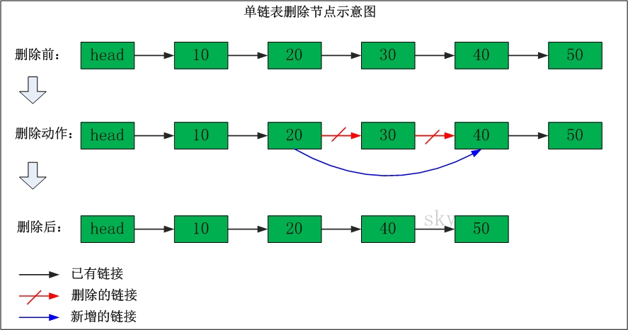
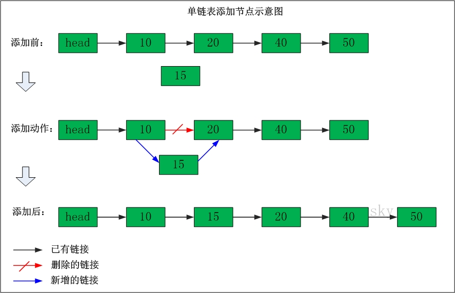
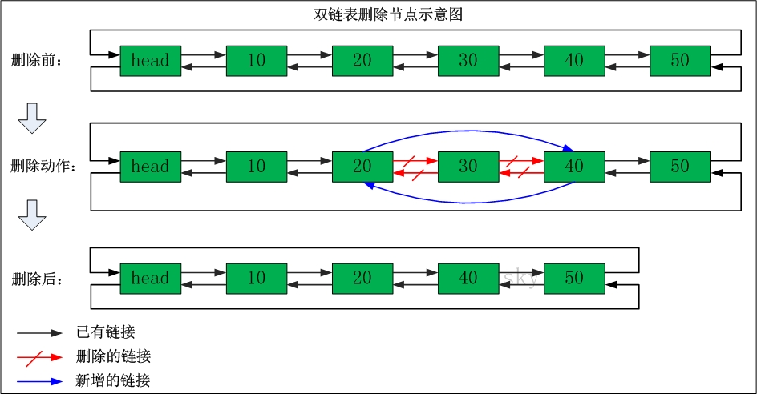

# 1. 概要

线性表是一种线性结构，它是具有相同类型的n(n≥0)个数据元素组成的有限序列。本章先介绍线性表的几个基本组成部分：数组、单向链表、双向链表；随后给出双向链表的C、C++和Java三种语言的实现

# 2. 数组

数组有上界和下界，数组的元素在上下界内是连续的。存储10,20,30,40,50的数组的示意图如下


数组的特点是：数据是连续的；随机访问速度快。

数组中稍微复杂一点的是多维数组和动态数组。对于C语言而言，多维数组本质上也是通过一维数组实现的。至于动态数组，是指数组的容量能动态增长的数组；对于C语言而言，若要提供动态数组，需要手动实现；而对于C++而言，STL提供了Vector；对于Java而言，Collection集合中提供了ArrayList和Vector。

# 3. 单向链表

单向链表(单链表)是链表的一种，它由节点组成，每个节点都包含下一个节点的指针。

单链表的示意图如下：


表头为空，表头的后继节点是"节点10"(数据为10的节点)，"节点10"的后继节点是"节点20"(数据为10的节点)

## 3.1 单链表删除节点



删除"节点30"
删除之前："节点20" 的后继节点为"节点30"，而"节点30" 的后继节点为"节点40"。
删除之后："节点20" 的后继节点为"节点40"。

## 3.2 单链表添加节点



在"节点10"与"节点20"之间添加"节点15"
添加之前："节点10" 的后继节点为"节点20"。
添加之后："节点10" 的后继节点为"节点15"，而"节点15" 的后继节点为"节点20"。

单链表的特点是：节点的链接方向是单向的；相对于数组来说，单链表的的随机访问速度较慢，但是单链表删除/添加数据的效率很高。

# 4. 双向链表

双向链表(双链表)是链表的一种。和单链表一样，双链表也是由节点组成，它的每个数据结点中都有两个指针，分别指向直接后继和直接前驱。所以，从双向链表中的任意一个结点开始，都可以很方便地访问它的前驱结点和后继结点。一般我们都构造双向循环链表。

双链表的示意图如下：


表头为空，表头的后继节点为"节点10"(数据为10的节点)；"节点10"的后继节点是"节点20"(数据为10的节点)，"节点20"的前继节点是"节点10"；"节点20"的后继节点是"节点30"，"节点30"的前继节点是"节点20"；...；末尾节点的后继节点是表头。

## 4.1 双链表删除节点



删除"节点30"
删除之前："节点20"的后继节点为"节点30"，"节点30" 的前继节点为"节点20"。"节点30"的后继节点为"节点40"，"节点40" 的前继节点为"节点30"。
删除之后："节点20"的后继节点为"节点40"，"节点40" 的前继节点为"节点20"。

## 4.2 双链表添加节点


在"节点10"与"节点20"之间添加"节点15"
添加之前："节点10"的后继节点为"节点20"，"节点20" 的前继节点为"节点10"。
添加之后："节点10"的后继节点为"节点15"，"节点15" 的前继节点为"节点10"。"节点15"的后继节点为"节点20"，"节点20" 的前继节点为"节点15"。

# 5. Java实现双链表

```java
/**
 * Java 实现的双向链表。 
 * 注：java自带的集合包中有实现双向链表，路径是:java.util.LinkedList
 */
public class DoubleLink<T> {

    // 表头
    private DNode<T> mHead;
    // 节点个数
    private int mCount;

    // 双向链表“节点”对应的结构体
    private class DNode<T> {
        public DNode prev;
        public DNode next;
        public T value;

        public DNode(T value, DNode prev, DNode next) {
            this.value = value;
            this.prev = prev;
            this.next = next;
        }
    }

    // 构造函数
    public DoubleLink() {
        // 创建“表头”。注意：表头没有存储数据！
        mHead = new DNode<T>(null, null, null);
        mHead.prev = mHead.next = mHead;
        // 初始化“节点个数”为0
        mCount = 0;
    }

    // 返回节点数目
    public int size() {
        return mCount;
    }

    // 返回链表是否为空
    public boolean isEmpty() {
        return mCount==0;
    }

    // 获取第index位置的节点
    private DNode<T> getNode(int index) {
        if (index<0 || index>=mCount)
            throw new IndexOutOfBoundsException();

        // 正向查找
        if (index <= mCount/2) {
            DNode<T> node = mHead.next;
            for (int i=0; i<index; i++)
                node = node.next;

            return node;
        }

        // 反向查找
        DNode<T> rnode = mHead.prev;
        int rindex = mCount - index -1;
        for (int j=0; j<rindex; j++)
            rnode = rnode.prev;

        return rnode;
    }

    // 获取第index位置的节点的值
    public T get(int index) {
        return getNode(index).value;
    }

    // 获取第1个节点的值
    public T getFirst() {
        return getNode(0).value;
    }

    // 获取最后一个节点的值
    public T getLast() {
        return getNode(mCount-1).value;
    }

    // 将节点插入到第index位置之前
    public void insert(int index, T t) {
        if (index==0) {
            DNode<T> node = new DNode<T>(t, mHead, mHead.next);
            mHead.next.prev = node;
            mHead.next = node;
            mCount++;
            return ;
        }

        DNode<T> inode = getNode(index);
        DNode<T> tnode = new DNode<T>(t, inode.prev, inode);
        inode.prev.next = tnode;
        inode.next = tnode;
        mCount++;
        return ;
    }

    // 将节点插入第一个节点处。
    public void insertFirst(T t) {
        insert(0, t);
    }

    // 将节点追加到链表的末尾
    public void appendLast(T t) {
        DNode<T> node = new DNode<T>(t, mHead.prev, mHead);
        mHead.prev.next = node;
        mHead.prev = node;
        mCount++;
    }

    // 删除index位置的节点
    public void del(int index) {
        DNode<T> inode = getNode(index);
        inode.prev.next = inode.next;
        inode.next.prev = inode.prev;
        inode = null;
        mCount--;
    }

    // 删除第一个节点
    public void deleteFirst() {
        del(0);
    }

    // 删除最后一个节点
    public void deleteLast() {
        del(mCount-1);
    }
}
```
测试程序(DlinkTest.java)
```java
/**
 * Java 实现的双向链表。 
 * 注：java自带的集合包中有实现双向链表，路径是:java.util.LinkedList
 */

public class DlinkTest {

    // 双向链表操作int数据
    private static void int_test() {
        int[] iarr = {10, 20, 30, 40};

        System.out.println("\n----int_test----");
        // 创建双向链表
        DoubleLink<Integer> dlink = new DoubleLink<Integer>();

        dlink.insert(0, 20);    // 将 20 插入到第一个位置
        dlink.appendLast(10);    // 将 10 追加到链表末尾
        dlink.insertFirst(30);    // 将 30 插入到第一个位置

        // 双向链表是否为空
        System.out.printf("isEmpty()=%b\n", dlink.isEmpty());
        // 双向链表的大小
        System.out.printf("size()=%d\n", dlink.size());

        // 打印出全部的节点
        for (int i=0; i<dlink.size(); i++)
            System.out.println("dlink("+i+")="+ dlink.get(i));
    }


    private static void string_test() {
        String[] sarr = {"ten", "twenty", "thirty", "forty"};

        System.out.println("\n----string_test----");
        // 创建双向链表
        DoubleLink<String> dlink = new DoubleLink<String>();

        dlink.insert(0, sarr[1]);    // 将 sarr中第2个元素 插入到第一个位置
        dlink.appendLast(sarr[0]);    // 将 sarr中第1个元素 追加到链表末尾
        dlink.insertFirst(sarr[2]);    // 将 sarr中第3个元素 插入到第一个位置

        // 双向链表是否为空
        System.out.printf("isEmpty()=%b\n", dlink.isEmpty());
        // 双向链表的大小
        System.out.printf("size()=%d\n", dlink.size());

        // 打印出全部的节点
        for (int i=0; i<dlink.size(); i++)
            System.out.println("dlink("+i+")="+ dlink.get(i));
    }


    // 内部类
    private static class Student {
        private int id;
        private String name;

        public Student(int id, String name) {
            this.id = id;
            this.name = name;
        }

        @Override
        public String toString() {
            return "["+id+", "+name+"]";
        }
    }

    private static Student[] students = new Student[]{
        new Student(10, "sky"),
        new Student(20, "jody"),
        new Student(30, "vic"),
        new Student(40, "dan"),
    };

    private static void object_test() {
        System.out.println("\n----object_test----");
        // 创建双向链表
        DoubleLink<Student> dlink = new DoubleLink<Student>();

        dlink.insert(0, students[1]);    // 将 students中第2个元素 插入到第一个位置
        dlink.appendLast(students[0]);    // 将 students中第1个元素 追加到链表末尾
        dlink.insertFirst(students[2]);    // 将 students中第3个元素 插入到第一个位置

        // 双向链表是否为空
        System.out.printf("isEmpty()=%b\n", dlink.isEmpty());
        // 双向链表的大小
        System.out.printf("size()=%d\n", dlink.size());

        // 打印出全部的节点
        for (int i=0; i<dlink.size(); i++) {
            System.out.println("dlink("+i+")="+ dlink.get(i));
        }
    }

 
    public static void main(String[] args) {
        int_test();        // 演示向双向链表操作“int数据”。
        string_test();    // 演示向双向链表操作“字符串数据”。
        object_test();    // 演示向双向链表操作“对象”。
    }
}
```
运行结果

```
----int_test----
isEmpty()=false
size()=3
dlink(0)=30
dlink(1)=20
dlink(2)=10

----string_test----
isEmpty()=false
size()=3
dlink(0)=thirty
dlink(1)=twenty
dlink(2)=ten

----object_test----
isEmpty()=false
size()=3
dlink(0)=[30, vic]
dlink(1)=[20, jody]
dlink(2)=[10, sky]
```
# 6. 双链表实现2
```java
public class MyDoubleLink implements Iterable<Object>{
	private class Node{
		public Node(Object data){
			this.data = data;
		}
		Node next;
		Node prev;
		Object data;
	}
	private Node head;
	private Node rear;
	
	public void add(Object data){
		Node node = new Node(data);
		if (head == null){
			head = node;
			rear = node;
		} else {
			rear.next = node;
			node.prev = rear;
			rear = node;
		}
	}
	
	public boolean contains(Object data){
		Node node = find(data);
		return node != null;
	}
	
	public void print(){
		Node temp = head;
		while(temp != null){
			System.out.print(temp.data + ",");
			temp = temp.next;
		}
		System.out.println();
	}
	private Node find(Object data){
		Node node = head;
		while (node != null){
			if (node.data.equals(data) && node.data.hashCode() == data.hashCode()){
				break;
			} else {
				node = node.next;
			}
		}
		return node;
	}
	
	public void remove(Object data){
		Node node = find(data);
		if (node != null){
			if (node == head && node == rear){//只有一个节点
				head = null;
				rear = null;
			} else if (node == head){ //头节点
				head = head.next;
				head.prev = null;
			} else if (node == rear){ //尾节点
				rear = rear.prev;
				rear.next = null;
			} else { //中间节点
				node.prev.next = node.next;
				node.next.prev = node.prev;
			}
		}
	}

	@Override
	public Iterator<Object> iterator() {
		Iterator<Object> ite = new Iterator<Object>() {
			private Node temp = head;
			@Override
			public boolean hasNext() {
				return temp != null;
			}

			@Override
			public Object next() {
				// TODO Auto-generated method stub
				Object data = temp.data;
				temp = temp.next;
				return data;
			}

			@Override
			public void remove() {
				// TODO Auto-generated method stub		
			}
		};
		return ite;
	}	
}
```
## 6.1 测试双链表
```java
public class Test {
	
	public static  class Instance{
		public Instance(int i){
			
		}
		public Instance(){
			
		}
	}

	public static void main(String[] args) {
		Instance in  = new Instance(){
			
		};
		MyDoubleLink datas = new MyDoubleLink();
		datas.add("aaa");
		datas.add("bbb");
		datas.add("ccc");
		datas.print();
		datas.remove("ccc");
		datas.print();
		for (Object d : datas) {
			System.out.println(d);
		}
	}
}
```
# 7. 双链表
```java
import java.util.Iterator;
public class MyDoubleLink implements Iterable<Object>{
	private class Node{
		public Node(Object data){
			this.data = data;
		}
		Node next;
		Node prev;
		Object data;
	}
	private Node head;
	private Node rear;
	
	public void add(Object data){
		Node node = new Node(data);
		if (head == null){
			head = node;
			rear = node;
		} else {
			rear.next = node;
			node.prev = rear;
			rear = node;
		}
	}
	
	public boolean contains(Object data){
		Node node = find(data);
		return node != null;
	}
	
	public void print(){
		Node temp = head;
		while(temp != null){
			System.out.print(temp.data + ",");
			temp = temp.next;
		}
		System.out.println();
	}
	private Node find(Object data){
		Node node = head;
		while (node != null){
			if (node.data.equals(data) && node.data.hashCode() == data.hashCode()){
				break;
			} else {
				node = node.next;
			}
		}
		return node;
	}
	
	public void remove(Object data){
		Node node = find(data);
		if (node != null){
			if (node == head && node == rear){//只有一个节点
				head = null;
				rear = null;
			} else if (node == head){ //头节点
				head = head.next;
				head.prev = null;
			} else if (node == rear){ //尾节点
				rear = rear.prev;
				rear.next = null;
			} else { //中间节点
				node.prev.next = node.next;
				node.next.prev = node.prev;
			}
		}
	}

	@Override
	public Iterator<Object> iterator() {
		Iterator<Object> ite = new Iterator<Object>() {
			private Node temp = head;
			@Override
			public boolean hasNext() {
				return temp != null;
			}

			@Override
			public Object next() {
				// TODO Auto-generated method stub
				Object data = temp.data;
				temp = temp.next;
				return data;
			}

			@Override
			public void remove() {
				// TODO Auto-generated method stub
			}
		};
		return ite;
	}
}
```

```java

public class TEst {
	
	public static  class Instance{
		public Instance(int i){
			
		}
		public Instance(){
			
		}
	}

	/**
	 * @param args
	 */
	public static void main(String[] args) {
		// TODO Auto-generated method stub
		Instance in  = new Instance(){
			
		};
		MyDoubleLink datas = new MyDoubleLink();
		datas.add("aaa");
		datas.add("bbb");
		datas.add("ccc");
		datas.print();
		datas.remove("ccc");
		datas.print();
		for (Object d : datas) {
			System.out.println(d);
		}
	}
}
```

## 7.1 单链表的实现

```java
// linkList2.java
// demonstrates linked list
// to run this program: C>java LinkList2App
////////////////////////////////////////////////////////////////
class Link
   {
   public int iData;              // data item (key)
   public double dData;           // data item
   public Link next;              // next link in list
// -------------------------------------------------------------
   public Link(int id, double dd) // constructor
      {
      iData = id;
      dData = dd;
      }
// -------------------------------------------------------------
   public void displayLink()      // display ourself
      {
      System.out.print("{" + iData + ", " + dData + "} ");
      }
   }  // end class Link
////////////////////////////////////////////////////////////////
class LinkList
   {
   private Link first;            // ref to first link on list

// -------------------------------------------------------------
   public LinkList()              // constructor
      {
      first = null;               // no links on list yet
      }
// -------------------------------------------------------------
   public void insertFirst(int id, double dd)
      {                           // make new link
      Link newLink = new Link(id, dd);
      newLink.next = first;       // it points to old first link
      first = newLink;            // now first points to this
      }
// -------------------------------------------------------------
   public Link find(int key)      // find link with given key
      {                           // (assumes non-empty list)
      Link current = first;              // start at 'first'
      while(current.iData != key)        // while no match,
         {
         if(current.next == null)        // if end of list,
            return null;                 // didn't find it
         else                            // not end of list,
            current = current.next;      // go to next link
         }
      return current;                    // found it
      }
// -------------------------------------------------------------
   public Link delete(int key)    // delete link with given key
      {                           // (assumes non-empty list)
      Link current = first;              // search for link
      Link previous = first;
      while(current.iData != key)
         {
         if(current.next == null)
            return null;                 // didn't find it
         else
            {
            previous = current;          // go to next link
            current = current.next;
            }
         }                               // found it
      if(current == first)               // if first link,
         first = first.next;             //    change first
      else                               // otherwise,
         previous.next = current.next;   //    bypass it
      return current;
      }
// -------------------------------------------------------------
   public void displayList()      // display the list
      {
      System.out.print("List (first-->last): ");
      Link current = first;       // start at beginning of list
      while(current != null)      // until end of list,
         {
         current.displayLink();   // print data
         current = current.next;  // move to next link
         }
      System.out.println("");
      }
// -------------------------------------------------------------
   }  // end class LinkList
////////////////////////////////////////////////////////////////
class LinkList2App
   {
   public static void main(String[] args)
      {
      LinkList theList = new LinkList();  // make list

      theList.insertFirst(22, 2.99);      // insert 4 items
      theList.insertFirst(44, 4.99);
      theList.insertFirst(66, 6.99);
      theList.insertFirst(88, 8.99);

      theList.displayList();              // display list

      Link f = theList.find(44);          // find item
      if( f != null)
         System.out.println("Found link with key " + f.iData);
      else
         System.out.println("Can't find link");

      Link d = theList.delete(66);        // delete item
      if( d != null )
         System.out.println("Deleted link with key " + d.iData);
      else
         System.out.println("Can't delete link");

      theList.displayList();              // display list
      }  // end main()
   }  // end class LinkList2App
////////////////////////////////////////////////////////////////
```

## 7.2 有序链表

```java
// sortedList.java
// demonstrates sorted list
// to run this program: C>java SortedListApp
////////////////////////////////////////////////////////////////
class Link
   {
   public long dData;                  // data item
   public Link next;                   // next link in list
// -------------------------------------------------------------
   public Link(long dd)                // constructor
      { dData = dd; }
// -------------------------------------------------------------
   public void displayLink()           // display this link
      { System.out.print(dData + " "); }
   }  // end class Link
////////////////////////////////////////////////////////////////
class SortedList
   {
   private Link first;                 // ref to first item
// -------------------------------------------------------------
   public SortedList()                 // constructor
      { first = null; }
// -------------------------------------------------------------
   public boolean isEmpty()            // true if no links
      { return (first==null); }
// -------------------------------------------------------------
   public void insert(long key)        // insert, in order
      {
      Link newLink = new Link(key);    // make new link
      Link previous = null;            // start at first
      Link current = first;
                                       // until end of list,
      while(current != null && key > current.dData)
         {                             // or key > current,
         previous = current;
         current = current.next;       // go to next item
         }
      if(previous==null)               // at beginning of list
         first = newLink;              // first --> newLink
      else                             // not at beginning
         previous.next = newLink;      // old prev --> newLink
      newLink.next = current;          // newLink --> old currnt
      }  // end insert()
// -------------------------------------------------------------
   public Link remove()           // return & delete first link
      {                           // (assumes non-empty list)
      Link temp = first;               // save first
      first = first.next;              // delete first
      return temp;                     // return value
      }
// -------------------------------------------------------------
   public void displayList()
      {
      System.out.print("List (first-->last): ");
      Link current = first;       // start at beginning of list
      while(current != null)      // until end of list,
         {
         current.displayLink();   // print data
         current = current.next;  // move to next link
         }
      System.out.println("");
      }
   }  // end class SortedList
////////////////////////////////////////////////////////////////
class SortedListApp
   {
   public static void main(String[] args)
      {                            // create new list
      SortedList theSortedList = new SortedList();
      theSortedList.insert(20);    // insert 2 items
      theSortedList.insert(40);

      theSortedList.displayList(); // display list

      theSortedList.insert(10);    // insert 3 more items
      theSortedList.insert(30);
      theSortedList.insert(50);

      theSortedList.displayList(); // display list

      theSortedList.remove();      // remove an item

      theSortedList.displayList(); // display list
      }  // end main()
   }  // end class SortedListApp
////////////////////////////////////////////////////////////////

```
## 7.3 双向链表

```java
// doublyLinked.java
// demonstrates doubly-linked list
// to run this program: C>java DoublyLinkedApp
////////////////////////////////////////////////////////////////
class Link
   {
   public long dData;                 // data item
   public Link next;                  // next link in list
   public Link previous;              // previous link in list
// -------------------------------------------------------------
   public Link(long d)                // constructor
      { dData = d; }
// -------------------------------------------------------------
   public void displayLink()          // display this link
      { System.out.print(dData + " "); }
// -------------------------------------------------------------
   }  // end class Link
////////////////////////////////////////////////////////////////
class DoublyLinkedList
   {
   private Link first;               // ref to first item
   private Link last;                // ref to last item
// -------------------------------------------------------------
   public DoublyLinkedList()         // constructor
      {
      first = null;                  // no items on list yet
      last = null;
      }
// -------------------------------------------------------------
   public boolean isEmpty()          // true if no links
      { return first==null; }
// -------------------------------------------------------------
   public void insertFirst(long dd)  // insert at front of list
      {
      Link newLink = new Link(dd);   // make new link

      if( isEmpty() )                // if empty list,
         last = newLink;             // newLink <-- last
      else
         first.previous = newLink;   // newLink <-- old first
      newLink.next = first;          // newLink --> old first
      first = newLink;               // first --> newLink
      }
// -------------------------------------------------------------
   public void insertLast(long dd)   // insert at end of list
      {
      Link newLink = new Link(dd);   // make new link
      if( isEmpty() )                // if empty list,
         first = newLink;            // first --> newLink
      else
         {
         last.next = newLink;        // old last --> newLink
         newLink.previous = last;    // old last <-- newLink
         }
      last = newLink;                // newLink <-- last
      }
// -------------------------------------------------------------
   public Link deleteFirst()         // delete first link
      {                              // (assumes non-empty list)
      Link temp = first;
      if(first.next == null)         // if only one item
         last = null;                // null <-- last
      else
         first.next.previous = null; // null <-- old next
      first = first.next;            // first --> old next
      return temp;
      }
// -------------------------------------------------------------
   public Link deleteLast()          // delete last link
      {                              // (assumes non-empty list)
      Link temp = last;
      if(first.next == null)         // if only one item
         first = null;               // first --> null
      else
         last.previous.next = null;  // old previous --> null
      last = last.previous;          // old previous <-- last
      return temp;
      }
// -------------------------------------------------------------
                                     // insert dd just after key
   public boolean insertAfter(long key, long dd)
      {                              // (assumes non-empty list)
      Link current = first;          // start at beginning
      while(current.dData != key)    // until match is found,
         {
         current = current.next;     // move to next link
         if(current == null)
            return false;            // didn't find it
         }
      Link newLink = new Link(dd);   // make new link

      if(current==last)              // if last link,
         {
         newLink.next = null;        // newLink --> null
         last = newLink;             // newLink <-- last
         }
      else                           // not last link,
         {
         newLink.next = current.next; // newLink --> old next
                                      // newLink <-- old next
         current.next.previous = newLink;
         }
      newLink.previous = current;    // old current <-- newLink
      current.next = newLink;        // old current --> newLink
      return true;                   // found it, did insertion
      }
// -------------------------------------------------------------
   public Link deleteKey(long key)   // delete item w/ given key
      {                              // (assumes non-empty list)
      Link current = first;          // start at beginning
      while(current.dData != key)    // until match is found,
         {
         current = current.next;     // move to next link
         if(current == null)
            return null;             // didn't find it
         }
      if(current==first)             // found it; first item?
         first = current.next;       // first --> old next
      else                           // not first
                                     // old previous --> old next
         current.previous.next = current.next;

      if(current==last)              // last item?
         last = current.previous;    // old previous <-- last
      else                           // not last
                                     // old previous <-- old next
         current.next.previous = current.previous;
      return current;                // return value
      }
// -------------------------------------------------------------
   public void displayForward()
      {
      System.out.print("List (first-->last): ");
      Link current = first;          // start at beginning
      while(current != null)         // until end of list,
         {
         current.displayLink();      // display data
         current = current.next;     // move to next link
         }
      System.out.println("");
      }
// -------------------------------------------------------------
   public void displayBackward()
      {
      System.out.print("List (last-->first): ");
      Link current = last;           // start at end
      while(current != null)         // until start of list,
         {
         current.displayLink();      // display data
         current = current.previous; // move to previous link
         }
      System.out.println("");
      }
// -------------------------------------------------------------
   }  // end class DoublyLinkedList
////////////////////////////////////////////////////////////////
class DoublyLinkedApp
   {
   public static void main(String[] args)
      {                             // make a new list
      DoublyLinkedList theList = new DoublyLinkedList();

      theList.insertFirst(22);      // insert at front
      theList.insertFirst(44);
      theList.insertFirst(66);

      theList.insertLast(11);       // insert at rear
      theList.insertLast(33);
      theList.insertLast(55);

      theList.displayForward();     // display list forward
      theList.displayBackward();    // display list backward

      theList.deleteFirst();        // delete first item
      theList.deleteLast();         // delete last item
      theList.deleteKey(11);        // delete item with key 11

      theList.displayForward();     // display list forward

      theList.insertAfter(22, 77);  // insert 77 after 22
      theList.insertAfter(33, 88);  // insert 88 after 33

      theList.displayForward();     // display list forward
      }  // end main()
   }  // end class DoublyLinkedApp
////////////////////////////////////////////////////////////////

```