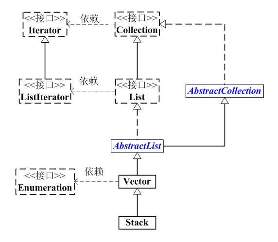
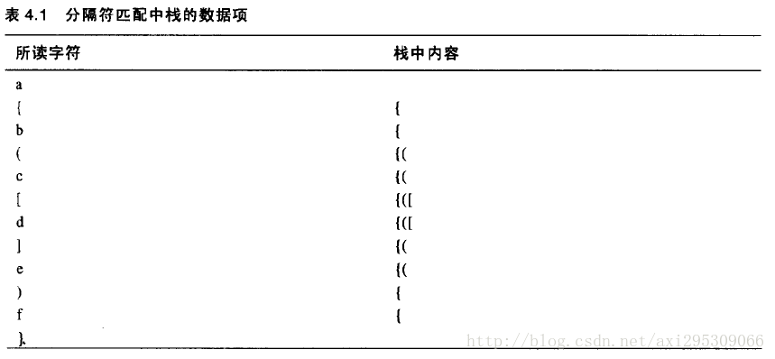

# 1. 栈的介绍
注意：本文所说的栈是数据结构中的栈，而不是内存模型中栈

栈（stack）是限定仅在表尾一端进行插入或删除操作的特殊线性表。对于栈来说, 允许进行插入或删除操作的一端称为栈顶（top）,而另一端称为栈底（bottom）。不含元素栈称为空栈，向栈中插入一个新元素称为入栈或压栈， 从栈中删除一个元素称为出栈或退栈。

假设有一个栈Ｓ＝（a1, a2, …, an), a1先进栈, an最后进栈。称a1为栈底元素, an为栈顶元素, 如图3.1所示。出栈时只允许在栈顶进行, 所以an先出栈, a1最后出栈。因此又称栈为后进先出（Last In First Out，LIFO）的线性表。

栈（stack），是一种线性存储结构，它有以下几个特点：

- 栈中数据是按照"后进先出（LIFO, Last In First Out）"方式进出栈的。
- 向栈中添加/删除数据时，只能从栈顶进行操作。

栈通常包括的三种操作：push、peek、pop。

- push -- 向栈中添加元素。
- peek -- 返回栈顶元素。
- pop  -- 返回并删除栈顶元素的操作。

## 1.1 栈的示意图


栈中的数据依次是 30 --> 20 --> 10

## 1.2 出栈


出栈前：栈顶元素是30。此时，栈中的元素依次是 30 --> 20 --> 10 
出栈后：30出栈之后，栈顶元素变成20。此时，栈中的元素依次是 20 --> 10

## 1.3 入栈


入栈前：栈顶元素是20。此时，栈中的元素依次是 20 --> 10 
入栈后：40入栈之后，栈顶元素变成40。此时，栈中的元素依次是 40 --> 20 --> 10

# 2. 栈的Java实现

JDK包中也提供了"栈"的实现，它就是集合框架中的Stack类。本部分给出2种Java实现

##  2.1 栈的数组实现

数组实现的栈，能存储任意类型的数据

```java
/**
 * Java : 数组实现的栈，能存储任意类型的数据
 */
import java.lang.reflect.Array;

public class GeneralArrayStack<T> {

    private static final int DEFAULT_SIZE = 12;
    private T[] mArray;
    private int count;

    public GeneralArrayStack(Class<T> type) {
        this(type, DEFAULT_SIZE);
    }

    public GeneralArrayStack(Class<T> type, int size) {
        // 不能直接使用mArray = new T[DEFAULT_SIZE];
        mArray = (T[]) Array.newInstance(type, size);
        count = 0;
    }

    // 将val添加到栈中
    public void push(T val) {
        mArray[count++] = val;
    }

    // 返回“栈顶元素值”
    public T peek() {
        return mArray[count-1];
    }

    // 返回“栈顶元素值”，并删除“栈顶元素”
    public T pop() {
        T ret = mArray[count-1];
        count--;
        return ret;
    }

    // 返回“栈”的大小
    public int size() {
        return count;
    }

    // 返回“栈”是否为空
    public boolean isEmpty() {
        return size()==0;
    }

    // 打印“栈”
    public void PrintArrayStack() {
        if (isEmpty()) {
            System.out.printf("stack is Empty\n");
        }

        System.out.printf("stack size()=%d\n", size());

        int i=size()-1;
        while (i>=0) {
            System.out.println(mArray[i]);
            i--;
        }
    }

    public static void main(String[] args) {
        String tmp;
        GeneralArrayStack<String> astack = new GeneralArrayStack<String>(String.class);

        // 将10, 20, 30 依次推入栈中
        astack.push("10");
        astack.push("20");
        astack.push("30");

        // 将“栈顶元素”赋值给tmp，并删除“栈顶元素”
        tmp = astack.pop();
        System.out.println("tmp="+tmp);

        // 只将“栈顶”赋值给tmp，不删除该元素.
        tmp = astack.peek();
        System.out.println("tmp="+tmp);

        astack.push("40");
        astack.PrintArrayStack();    // 打印栈
    }
}
```

运行结果：

```
tmp=30
tmp=20
stack size()=3
40
20
10
```
结果说明：GeneralArrayStack是通过数组实现的栈，而且GeneralArrayStack中使用到了泛型

## 2.2 栈Stack

Java的 Collection集合 中自带的"栈"(stack)的示例

```java
import java.util.Stack;

/**
 * Java : java集合包中的Stack的演示程序
 */
public class StackTest {

    public static void main(String[] args) {
        int tmp=0;
        Stack<Integer> astack = new Stack<Integer>();

        // 将10, 20, 30 依次推入栈中
        astack.push(10);
        astack.push(20);
        astack.push(30);

        // 将“栈顶元素”赋值给tmp，并删除“栈顶元素”
        tmp = astack.pop();
        //System.out.printf("tmp=%d\n", tmp);

        // 只将“栈顶”赋值给tmp，不删除该元素.
        tmp = (int)astack.peek();
        //System.out.printf("tmp=%d\n", tmp);

        astack.push(40);
        while(!astack.empty()) {
            tmp = (int)astack.pop();
            System.out.printf("tmp=%d\n", tmp);
        }
    }
}
```
运行结果：

```
tmp=40
tmp=20
tmp=10
```
# **3. Stack详细介绍**
学完Vector了之后，接下来我们开始学习Stack。Stack很简单，它继承于Vector。学习方式还是和之前一样，先对Stack有个整体认识，然后再学习它的源码；最后再通过实例来学会使用它。内容包括：

- 第1部分 Stack介绍
- 第2部分 Stack源码解析(基于JDK1.6.0_45)
- 第3部分 Vector示例

## **3.1 Stack介绍**

Stack是栈。它的特性是：先进后出(FILO, First In Last Out)。

java工具包中的Stack是继承于Vector(矢量队列)的，由于Vector是通过数组实现的，这就意味着，Stack也是通过数组实现的，而非链表。当然，我们也可以将LinkedList当作栈来使用！在“Java 集合系列06之 Vector详细介绍(源码解析)和使用示例”中，已经详细介绍过Vector的数据结构，这里就不再对Stack的数据结构进行说明了。

## 3.2 Stack的继承关系
```
java.lang.Object
↳     java.util.AbstractCollection<E>
   ↳     java.util.AbstractList<E>
       ↳     java.util.Vector<E>
           ↳     java.util.Stack<E>

public class Stack<E> extends Vector<E> {}
```
Stack和Collection的关系如下图



# 4. 栈
## 4.1 栈的LinkedList实现
```java
public class MyStack {
	private LinkedList link;

	public MyStack() {
		link = new LinkedList();
	}

	public void add(Object obj) {
		link.addFirst(obj);
	}

	public Object get() {
		// return link.getFirst();
		return link.removeFirst();
	}

	public boolean isEmpty() {
		return link.isEmpty();
	}
}
```
## 4.2 栈的数组实现
```java
// stack.java
// demonstrates stacks
// to run this program: C>java StackApp
////////////////////////////////////////////////////////////////
class StackX
   {
   private int maxSize;        // size of stack array
   private long[] stackArray;
   private int top;            // top of stack
//--------------------------------------------------------------
   public StackX(int s)         // constructor
      {
      maxSize = s;             // set array size
      stackArray = new long[maxSize];  // create array
      top = -1;                // no items yet
      }
//--------------------------------------------------------------
   public void push(long j)    // put item on top of stack
      {
      stackArray[++top] = j;     // increment top, insert item
      }
//--------------------------------------------------------------
   public long pop()           // take item from top of stack
      {
      return stackArray[top--];  // access item, decrement top
      }
//--------------------------------------------------------------
   public long peek()          // peek at top of stack
      {
      return stackArray[top];
      }
//--------------------------------------------------------------
   public boolean isEmpty()    // true if stack is empty
      {
      return (top == -1);
      }
//--------------------------------------------------------------
   public boolean isFull()     // true if stack is full
      {
      return (top == maxSize-1);
      }
//--------------------------------------------------------------
   }  // end class StackX
////////////////////////////////////////////////////////////////
class StackApp
   {
   public static void main(String[] args)
      {
      StackX theStack = new StackX(10);  // make new stack
      theStack.push(20);               // push items onto stack
      theStack.push(40);
      theStack.push(60);
      theStack.push(80);

      while( !theStack.isEmpty() )     // until it's empty,
         {                             // delete item from stack
         long value = theStack.pop();
         System.out.print(value);      // display it
         System.out.print(" ");
         }  // end while
      System.out.println("");
      }  // end main()
   }  // end class StackApp
////////////////////////////////////////////////////////////////
```

## 4.3 栈实例1：单词逆序

```java
// reverse.java
// stack used to reverse a string
// to run this program: C>java ReverseApp
import java.io.*;                 // for I/O
////////////////////////////////////////////////////////////////
class StackX
   {
   private int maxSize;
   private char[] stackArray;
   private int top;
//--------------------------------------------------------------
   public StackX(int max)    // constructor
      {
      maxSize = max;
      stackArray = new char[maxSize];
      top = -1;
      }
//--------------------------------------------------------------
   public void push(char j)  // put item on top of stack
      {
      stackArray[++top] = j;
      }
//--------------------------------------------------------------
   public char pop()         // take item from top of stack
      {
      return stackArray[top--];
      }
//--------------------------------------------------------------
   public char peek()        // peek at top of stack
      {
      return stackArray[top];
      }
//--------------------------------------------------------------
   public boolean isEmpty()  // true if stack is empty
      {
      return (top == -1);
      }
//--------------------------------------------------------------
   }  // end class StackX
////////////////////////////////////////////////////////////////
class Reverser
   {
   private String input;                // input string
   private String output;               // output string
//--------------------------------------------------------------
   public Reverser(String in)           // constructor
      { input = in; }
//--------------------------------------------------------------
   public String doRev()                // reverse the string
      {
      int stackSize = input.length();   // get max stack size
      StackX theStack = new StackX(stackSize);  // make stack

      for(int j=0; j<input.length(); j++)
         {
         char ch = input.charAt(j);     // get a char from input
         theStack.push(ch);             // push it
         }
      output = "";
      while( !theStack.isEmpty() )
         {
         char ch = theStack.pop();      // pop a char,
         output = output + ch;          // append to output
         }
      return output;
      }  // end doRev()
//--------------------------------------------------------------
   }  // end class Reverser
////////////////////////////////////////////////////////////////
class ReverseApp
   {
   public static void main(String[] args) throws IOException
      {
      String input, output;
      while(true)
         {
         System.out.print("Enter a string: ");
         System.out.flush();
         input = getString();          // read a string from kbd
         if( input.equals("") )        // quit if [Enter]
            break;
                                       // make a Reverser
         Reverser theReverser = new Reverser(input);
         output = theReverser.doRev(); // use it
         System.out.println("Reversed: " + output);
         }  // end while
      }  // end main()
//--------------------------------------------------------------
   public static String getString() throws IOException
      {
      InputStreamReader isr = new InputStreamReader(System.in);
      BufferedReader br = new BufferedReader(isr);
      String s = br.readLine();
      return s;
      }
//--------------------------------------------------------------
   }  // end class ReverseApp
////////////////////////////////////////////////////////////////

```

## 4.4 栈实例2：分隔符匹配




```java
// brackets.java
// stacks used to check matching brackets
// to run this program: C>java bracketsApp
import java.io.*;                 // for I/O
////////////////////////////////////////////////////////////////
class StackX
   {
   private int maxSize;
   private char[] stackArray;
   private int top;
//--------------------------------------------------------------
   public StackX(int s)       // constructor
      {
      maxSize = s;
      stackArray = new char[maxSize];
      top = -1;
      }
//--------------------------------------------------------------
   public void push(char j)  // put item on top of stack
      {
      stackArray[++top] = j;
      }
//--------------------------------------------------------------
   public char pop()         // take item from top of stack
      {
      return stackArray[top--];
      }
//--------------------------------------------------------------
   public char peek()        // peek at top of stack
      {
      return stackArray[top];
      }
//--------------------------------------------------------------
   public boolean isEmpty()    // true if stack is empty
      {
      return (top == -1);
      }
//--------------------------------------------------------------
   }  // end class StackX
////////////////////////////////////////////////////////////////
class BracketChecker
   {
   private String input;                   // input string
//--------------------------------------------------------------
   public BracketChecker(String in)        // constructor
      { input = in; }
//--------------------------------------------------------------
   public void check()
      {
      int stackSize = input.length();      // get max stack size
      StackX theStack = new StackX(stackSize);  // make stack

      for(int j=0; j<input.length(); j++)  // get chars in turn
         {
         char ch = input.charAt(j);        // get char
         switch(ch)
            {
            case '{':                      // opening symbols
            case '[':
            case '(':
               theStack.push(ch);          // push them
               break;

            case '}':                      // closing symbols
            case ']':
            case ')':
               if( !theStack.isEmpty() )   // if stack not empty,
                  {
                  char chx = theStack.pop();  // pop and check
                  if( (ch=='}' && chx!='{') ||
                      (ch==']' && chx!='[') ||
                      (ch==')' && chx!='(') )
                     System.out.println("Error: "+ch+" at "+j);
                  }
               else                        // prematurely empty
                  System.out.println("Error: "+ch+" at "+j);
               break;
            default:    // no action on other characters
               break;
            }  // end switch
         }  // end for
      // at this point, all characters have been processed
      if( !theStack.isEmpty() )
         System.out.println("Error: missing right delimiter");
      }  // end check()
//--------------------------------------------------------------
   }  // end class BracketChecker
////////////////////////////////////////////////////////////////
class BracketsApp
   {
   public static void main(String[] args) throws IOException
      {
      String input;
      while(true)
         {
         System.out.print(
                      "Enter string containing delimiters: ");
         System.out.flush();
         input = getString();     // read a string from kbd
         if( input.equals("") )   // quit if [Enter]
            break;
                                  // make a BracketChecker
         BracketChecker theChecker = new BracketChecker(input);
         theChecker.check();      // check brackets
         }  // end while
      }  // end main()
//--------------------------------------------------------------
   public static String getString() throws IOException
      {
      InputStreamReader isr = new InputStreamReader(System.in);
      BufferedReader br = new BufferedReader(isr);
      String s = br.readLine();
      return s;
      }
//--------------------------------------------------------------
   }  // end class BracketsApp
////////////////////////////////////////////////////////////////

```
## 4.5 栈的链表实现

```java
// linkStack.java
// demonstrates a stack implemented as a list
// to run this program: C>java LinkStackApp
////////////////////////////////////////////////////////////////
class Link
   {
   public long dData;             // data item
   public Link next;              // next link in list
// -------------------------------------------------------------
   public Link(long dd)           // constructor
      { dData = dd; }
// -------------------------------------------------------------
   public void displayLink()      // display ourself
      { System.out.print(dData + " "); }
   }  // end class Link
////////////////////////////////////////////////////////////////
class LinkList
   {
   private Link first;            // ref to first item on list
// -------------------------------------------------------------
   public LinkList()              // constructor
      { first = null; }           // no items on list yet
// -------------------------------------------------------------
   public boolean isEmpty()       // true if list is empty
      { return (first==null); }
// -------------------------------------------------------------
   public void insertFirst(long dd) // insert at start of list
      {                           // make new link
      Link newLink = new Link(dd);
      newLink.next = first;       // newLink --> old first
      first = newLink;            // first --> newLink
      }
// -------------------------------------------------------------
   public long deleteFirst()      // delete first item
      {                           // (assumes list not empty)
      Link temp = first;          // save reference to link
      first = first.next;         // delete it: first-->old next
      return temp.dData;          // return deleted link
      }
// -------------------------------------------------------------
   public void displayList()
      {
      Link current = first;       // start at beginning of list
      while(current != null)      // until end of list,
         {
         current.displayLink();   // print data
         current = current.next;  // move to next link
         }
      System.out.println("");
      }
// -------------------------------------------------------------
   }  // end class LinkList
////////////////////////////////////////////////////////////////
class LinkStack
   {
   private LinkList theList;
//--------------------------------------------------------------
   public LinkStack()             // constructor
      {
      theList = new LinkList();
      }
//--------------------------------------------------------------
   public void push(long j)     // put item on top of stack
      {
      theList.insertFirst(j);
      }
//--------------------------------------------------------------
   public long pop()            // take item from top of stack
      {
      return theList.deleteFirst();
      }
//--------------------------------------------------------------
   public boolean isEmpty()       // true if stack is empty
      {
      return ( theList.isEmpty() );
      }
//--------------------------------------------------------------
   public void displayStack()
      {
      System.out.print("Stack (top-->bottom): ");
      theList.displayList();
      }
//--------------------------------------------------------------
   }  // end class LinkStack
////////////////////////////////////////////////////////////////
class LinkStackApp
   {
   public static void main(String[] args)
      {
      LinkStack theStack = new LinkStack(); // make stack

      theStack.push(20);                    // push items
      theStack.push(40);

      theStack.displayStack();              // display stack

      theStack.push(60);                    // push items
      theStack.push(80);

      theStack.displayStack();              // display stack

      theStack.pop();                       // pop items
      theStack.pop();

      theStack.displayStack();              // display stack
      }  // end main()
   }  // end class LinkStackApp
////////////////////////////////////////////////////////////////
```
> 原文出处：http://www.cnblogs.com/skywang12345/p/3562239.html

