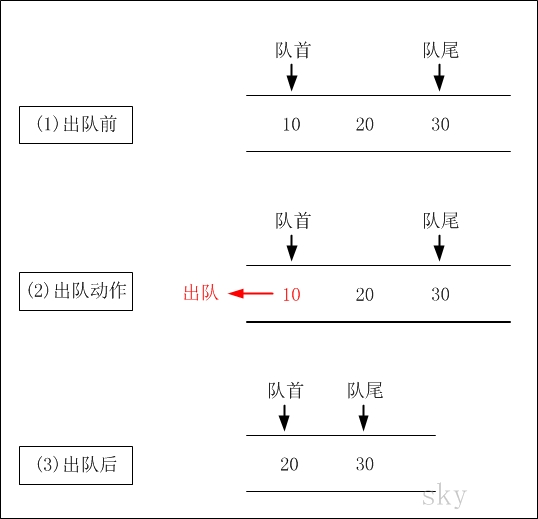
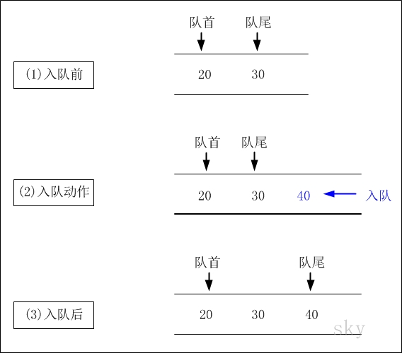
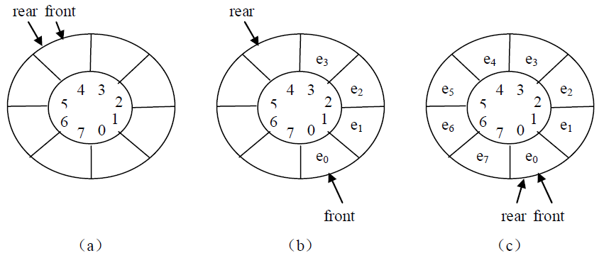
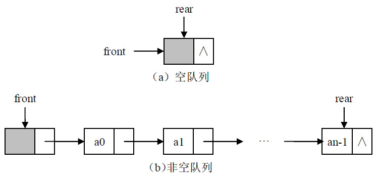

# **1. 队列的介绍**

队列 (Queue)是另一种限定性的线性表，它只允许在表的一端插入元素，而在另一端删除元素，所以队列具有先进先出(Fist In Fist Out， 缩写为FIFO)的特性。在队列中，允许插入的一端叫做队尾(rear)，允许删除的一端则称为队头(front)。 在队列中插入一个新元素的操作简称为进队或入队，新元素进队后就成为新的队尾元素；从队列中删除一个元素的操作简称为出队或离队，当元素出队后，其后继元素就成为新的队头元素

假设队列为q=(a1，a2，…，an)，那么a1就是队头元素，an则是队尾元素。队列中的元素是按照a1，a2，…，an的顺序进入的， 退出队列也必须按照同样的次序依次出队，也就是说，只有在a1，a2，…，an-1都离开队列之后，an才能退出队列。 


队列（Queue），是一种线性存储结构。它有以下几个特点：

- 队列中数据是按照"先进先出（FIFO, First-In-First-Out）"方式进出队列的。
- 队列只允许在"队首"进行删除操作，而在"队尾"进行插入操作。

队列通常包括的两种操作：入队列 和 出队列。

## **1.1 队列的示意图**


队列中有10，20，30共3个数据。

 

## **1.2 出队列**



出队列前：队首是10，队尾是30。
出队列后：出队列(队首)之后。队首是20，队尾是30。

## **1.3 入队列**



入队列前：队首是20，队尾是30。
入队列后：40入队列(队尾)之后。队首是20，队尾是40。

# 2. 队列的顺序存储结构

队列的顺序存储结构称为顺序队列。顺序队列可以利用一个一维数组和两个指针来实现。一维数组用来存储当前队列中的所有元素，两个指针front和rear分别指向当前队列的队首元素和队尾元素，分别称为队首指针和队尾指针。

# 3. 队列的链接存储结构

队列的链接存储结构是用一个单链表存放队列元素的。队列的链接存储结构称为链队列。由于队列只允许在表尾进行插入操作、在表头进行删除操作，因此，链队需设置两个指针：队头指针front和队尾指针rear，分别指向单链表的第一个结点(表的头结点)和最后一个结点(队尾结点)。


# **4. 队列的Java实现**

JDK包Queue中的也提供了"队列"的实现。JDK中的Queue接口就是"队列"，它的实现类也都是队列，用的最多的是LinkedList

## 4.1 队列的数组实现

数组实现的队列，能存储任意类型的数据

```java
/**
 * Java : 数组实现“队列”，只能存储int数据
 */
public class ArrayQueue {

    private int[] mArray;
    private int mCount;

    public ArrayQueue(int sz) {
        mArray = new int[sz];
        mCount = 0;
    }

    // 将val添加到队列的末尾
    public void add(int val) {
        mArray[mCount++] = val;
    }

    // 返回“队列开头元素”
    public int front() {
        return mArray[0];
    }

    // 返回“栈顶元素值”，并删除“栈顶元素”
    public int pop() {
        int ret = mArray[0];
        mCount--;
        for (int i=1; i<=mCount; i++)
            mArray[i-1] = mArray[i];
        return ret;
    }

    // 返回“栈”的大小
    public int size() {
        return mCount;
    }

    // 返回“栈”是否为空
    public boolean isEmpty() {
        return size()==0;
    }

    public static void main(String[] args) {
        int tmp=0;
        ArrayQueue astack = new ArrayQueue(12);

        // 将10, 20, 30 依次推入栈中
        astack.add(10);
        astack.add(20);
        astack.add(30);

        // 将“栈顶元素”赋值给tmp，并删除“栈顶元素”
        tmp = astack.pop();
        System.out.printf("tmp=%d\n", tmp);

        // 只将“栈顶”赋值给tmp，不删除该元素.
        tmp = astack.front();
        System.out.printf("tmp=%d\n", tmp);

        astack.add(40);

        System.out.printf("isEmpty()=%b\n", astack.isEmpty());
        System.out.printf("size()=%d\n", astack.size());
        while (!astack.isEmpty()) {
            System.out.printf("size()=%d\n", astack.pop());
        }
    }
}
```
运行结果

```
tmp=10
tmp=20
isEmpty()=false
size()=3
size()=20
size()=30
size()=40
```
结果说明：ArrayQueue是通过数组实现的队列，而且ArrayQueue中使用到了泛型，因此它支持任意类型的数据。

## 4.2 队列的LinkedList实现

Java的 Collection集合 中自带的"队列"(LinkedList)的示例

```java
import java.util.Stack;

/**
 * 用“栈”实现队列
 */
public class StackList<T> {

    // 向队列添加数据时：(01) 将“已有的全部数据”都移到mIn中。 (02) 将“新添加的数据”添加到mIn中。
    private Stack<T> mIn  = null;
    // 从队列获取元素时：(01) 将“已有的全部数据”都移到mOut中。(02) 返回并删除mOut栈顶元素。
    private Stack<T> mOut = null;
    // 统计计数
    private int mCount = 0;

    public StackList() {
        mIn = new Stack<T>();
        mOut = new Stack<T>();
        mCount = 0;
    }

    private void add(T t) {
        // 将“已有的全部数据”都移到mIn中
        while (!mOut.empty())
            mIn.push(mOut.pop());

        // 将“新添加的数据”添加到mIn中
        mIn.push(t);
        // 统计数+1
        mCount++;
    }

    private T get() {
        // 将“已有的全部数据”都移到mOut中
        while (!mIn.empty())
            mOut.push(mIn.pop());
        // 统计数-1
        mCount--;

        // 返回并删除mOut栈顶元素
        return mOut.pop();
    }

    private int size() {
        return mCount;
    }
    private boolean isEmpty() {
        return mCount==0;
    }

    public static void main(String[] args) {
        StackList slist = new StackList();

        // 将10, 20, 30 依次推入栈中
        slist.add(10);
        slist.add(20);
        slist.add(30);

        System.out.printf("isEmpty()=%b\n", slist.isEmpty());
        System.out.printf("size()=%d\n", slist.size());
        while(!slist.isEmpty()) {
            System.out.printf("%d\n", slist.get());
        }
    }
}
```
运行结果

```
tmp=10
tmp=20
isEmpty()=false
size()=3
tmp=20
tmp=30
tmp=40
```

## 4.3 队列的数组实现

```java
// Queue.java
// demonstrates queue
// to run this program: C>java QueueApp
////////////////////////////////////////////////////////////////
class Queue
   {
   private int maxSize;
   private long[] queArray;
   private int front;
   private int rear;
   private int nItems;
//--------------------------------------------------------------
   public Queue(int s)          // constructor
      {
      maxSize = s;
      queArray = new long[maxSize];
      front = 0;
      rear = -1;
      nItems = 0;
      }
//--------------------------------------------------------------
   public void insert(long j)   // put item at rear of queue
      {
      if(rear == maxSize-1)         // deal with wraparound
         rear = -1;
      queArray[++rear] = j;         // increment rear and insert
      nItems++;                     // one more item
      }
//--------------------------------------------------------------
   public long remove()         // take item from front of queue
      {
      long temp = queArray[front++]; // get value and incr front
      if(front == maxSize)           // deal with wraparound
         front = 0;
      nItems--;                      // one less item
      return temp;
      }
//--------------------------------------------------------------
   public long peekFront()      // peek at front of queue
      {
      return queArray[front];
      }
//--------------------------------------------------------------
   public boolean isEmpty()    // true if queue is empty
      {
      return (nItems==0);
      }
//--------------------------------------------------------------
   public boolean isFull()     // true if queue is full
      {
      return (nItems==maxSize);
      }
//--------------------------------------------------------------
   public int size()           // number of items in queue
      {
      return nItems;
      }
//--------------------------------------------------------------
   }  // end class Queue
////////////////////////////////////////////////////////////////
class QueueApp
   {
   public static void main(String[] args)
      {
      Queue theQueue = new Queue(5);  // queue holds 5 items

      theQueue.insert(10);            // insert 4 items
      theQueue.insert(20);
      theQueue.insert(30);
      theQueue.insert(40);

      theQueue.remove();              // remove 3 items
      theQueue.remove();              //    (10, 20, 30)
      theQueue.remove();

      theQueue.insert(50);            // insert 4 more items
      theQueue.insert(60);            //    (wraps around)
      theQueue.insert(70);
      theQueue.insert(80);

      while( !theQueue.isEmpty() )    // remove and display
         {                            //    all items
         long n = theQueue.remove();  // (40, 50, 60, 70, 80)
         System.out.print(n);
         System.out.print(" ");
         }
      System.out.println("");
      }  // end main()
   }  // end class QueueApp
////////////////////////////////////////////////////////////////

```

## 4.4 队列的链表实现

```java
// linkQueue.java
// demonstrates queue implemented as double-ended list
// to run this program: C>java LinkQueueApp
////////////////////////////////////////////////////////////////
class Link
   {
   public long dData;                // data item
   public Link next;                 // next link in list
// -------------------------------------------------------------
   public Link(long d)               // constructor
      { dData = d; }
// -------------------------------------------------------------
   public void displayLink()         // display this link
      { System.out.print(dData + " "); }
// -------------------------------------------------------------
   }  // end class Link
////////////////////////////////////////////////////////////////
class FirstLastList
   {
   private Link first;               // ref to first item
   private Link last;                // ref to last item
// -------------------------------------------------------------
   public FirstLastList()            // constructor
      {
      first = null;                  // no items on list yet
      last = null;
      }
// -------------------------------------------------------------
   public boolean isEmpty()          // true if no links
      { return first==null; }
// -------------------------------------------------------------
   public void insertLast(long dd) // insert at end of list
      {
      Link newLink = new Link(dd);   // make new link
      if( isEmpty() )                // if empty list,
         first = newLink;            // first --> newLink
      else
         last.next = newLink;        // old last --> newLink
      last = newLink;                // newLink <-- last
      }
// -------------------------------------------------------------
   public long deleteFirst()         // delete first link
      {                              // (assumes non-empty list)
      long temp = first.dData;
      if(first.next == null)         // if only one item
         last = null;                // null <-- last
      first = first.next;            // first --> old next
      return temp;
      }
// -------------------------------------------------------------
   public void displayList()
      {
      Link current = first;          // start at beginning
      while(current != null)         // until end of list,
         {
         current.displayLink();      // print data
         current = current.next;     // move to next link
         }
      System.out.println("");
      }
// -------------------------------------------------------------
   }  // end class FirstLastList
////////////////////////////////////////////////////////////////
class LinkQueue
   {
   private FirstLastList theList;
//--------------------------------------------------------------
   public LinkQueue()                // constructor
      { theList = new FirstLastList(); }  // make a 2-ended list
//--------------------------------------------------------------
   public boolean isEmpty()          // true if queue is empty
      { return theList.isEmpty(); }
//--------------------------------------------------------------
   public void insert(long j)        // insert, rear of queue
      { theList.insertLast(j); }
//--------------------------------------------------------------
   public long remove()              // remove, front of queue
      {  return theList.deleteFirst();  }
//--------------------------------------------------------------
   public void displayQueue()
      {
      System.out.print("Queue (front-->rear): ");
      theList.displayList();
      }
//--------------------------------------------------------------
   }  // end class LinkQueue
////////////////////////////////////////////////////////////////
class LinkQueueApp
   {
   public static void main(String[] args)
      {
      LinkQueue theQueue = new LinkQueue();
      theQueue.insert(20);                 // insert items
      theQueue.insert(40);

      theQueue.displayQueue();             // display queue

      theQueue.insert(60);                 // insert items
      theQueue.insert(80);

      theQueue.displayQueue();             // display queue

      theQueue.remove();                   // remove items
      theQueue.remove();

      theQueue.displayQueue();             // display queue
      }  // end main()
   }  // end class LinkQueueApp
////////////////////////////////////////////////////////////////

```

## 4.5 优先级队列

```java
// priorityQ.java
// demonstrates priority queue
// to run this program: C>java PriorityQApp
////////////////////////////////////////////////////////////////
class PriorityQ
   {
   // array in sorted order, from max at 0 to min at size-1
   private int maxSize;
   private long[] queArray;
   private int nItems;
//-------------------------------------------------------------
   public PriorityQ(int s)          // constructor
      {
      maxSize = s;
      queArray = new long[maxSize];
      nItems = 0;
      }
//-------------------------------------------------------------
   public void insert(long item)    // insert item
      {
      int j;

      if(nItems==0)                         // if no items,
         queArray[nItems++] = item;         // insert at 0
      else                                // if items,
         {
         for(j=nItems-1; j>=0; j--)         // start at end,
            {
            if( item > queArray[j] )      // if new item larger,
               queArray[j+1] = queArray[j]; // shift upward
            else                          // if smaller,
               break;                     // done shifting
            }  // end for
         queArray[j+1] = item;            // insert it
         nItems++;
         }  // end else (nItems > 0)
      }  // end insert()
//-------------------------------------------------------------
   public long remove()             // remove minimum item
      { return queArray[--nItems]; }
//-------------------------------------------------------------
   public long peekMin()            // peek at minimum item
      { return queArray[nItems-1]; }
//-------------------------------------------------------------
   public boolean isEmpty()         // true if queue is empty
      { return (nItems==0); }
//-------------------------------------------------------------
   public boolean isFull()          // true if queue is full
      { return (nItems == maxSize); }
//-------------------------------------------------------------
   }  // end class PriorityQ
////////////////////////////////////////////////////////////////
class PriorityQApp
   {
   public static void main(String[] args)
      {
      PriorityQ thePQ = new PriorityQ(5);
      thePQ.insert(30);
      thePQ.insert(50);
      thePQ.insert(10);
      thePQ.insert(40);
      thePQ.insert(20);

      while( !thePQ.isEmpty() )
         {
         long item = thePQ.remove();
         System.out.print(item + " ");  // 10, 20, 30, 40, 50
         }  // end while
      System.out.println("");
      }  // end main()
//-------------------------------------------------------------
   }  // end class PriorityQApp
////////////////////////////////////////////////////////////////

```

## 4.6 队列的应用

6个人围成圈数数，数到3的人退出，问最后退出的人是谁？

```java
public class MyQueue
{

	private Object datas[];
	private int pushIndex;//入队的下标
	private int popIndex; //出队的下标
	private int counts;//记录数据的个数
	
	public MyQueue(int size){
		datas = new Object[size];
	}
	public MyQueue(){
		this(10);
	}
	
	public boolean isEmpty(){
		return counts == 0;
	}
	public String toString(){
		StringBuilder mess = new StringBuilder();
		for (int i = popIndex; i <= counts; i++) {
			mess.append(datas[i % datas.length] + ",");
		}
		return mess + "";
	}
	
	public boolean isFull(){
		return counts == datas.length;
	}
	
	/**
	 * 入队列
	 * @param data
	 */
	public void push(Object data) {
		if (isFull()) {
			return;
		}
		datas[pushIndex++ % datas.length] = data;
		counts++;
	}
	
	public Object popup(){
		Object data = datas[popIndex++ % datas.length];
		counts--;
		return data;
	}
}
```

```java
public class TestApp
{

	public static void main(String[] args) {
		//初始化队列
		MyQueue queue = new MyQueue(6);
		//六个人入队
		for (int i = 0;i < 6; i++) {
			queue.push(i + 1);
		}
		//数数
		int counts = 0;//计数器
		while (!queue.isEmpty()) {
			Object d = queue.popup();
			counts++;
			//判断
			if (counts % 3 == 0) {
				System.out.println(d);
			} else {
				queue.push(d);//再放进队列
			}
		}
	}
}
```

## 4.7 循环队列




### 队列的顺序存储实现

用循环数组实现，以少使用一个存储单元的方案实现循环队列

```java
public interface Queue {
    //返回队列的大小
	public int getSize();
	
	//判断队列是否为空
	public boolean isEmpty();
	
	//数据元素e入队
	public void enqueue(Object e);
	
	//队首元素出队
	public Object dequeue() throws QueueEmptyException;
	
	//取队首元素
	public Object peek() throws QueueEmptyException;
}
```

```java
public class QueueArray implements Queue {
	private static final int CAP = 7;//队列默认大小
	private Object[] elements;	//数据元素数组
	private int capacity;		//数组的大小elements.length
	private int front;			//队首指针,指向队首
	private int rear;			//队尾指针,指向队尾后一个位置
	public QueueArray() {
		this(CAP);
	}
	public QueueArray(int cap){
		capacity = cap + 1;
		elements = new Object[capacity];
		front = rear = 0;
	}

	//返回队列的大小
	public int getSize() {
		return (capacity-front+rear)%capacity;
	}

	//判断队列是否为空
	public boolean isEmpty() {
		return front==rear;
	}

	//数据元素e入队
	public void enqueue(Object e) {
		if (getSize()==capacity-1) expandSpace();
		elements[rear] = e;
		rear = (rear+1)%capacity;
	}
	private void expandSpace(){
		Object[] a = new Object[elements.length*2];
		int i = front;
		int j = 0;
		while (i!=rear){
			a[j++] = elements[i];
			i = (i+1)%capacity;
		}
		elements = a;
		capacity = elements.length;
		front = 0;
		rear = j;
	}
	
	//队首元素出队
	public Object dequeue() throws QueueEmptyException {
		if (isEmpty())
			throw new QueueEmptyException("错误：队列为空");
		Object obj = elements[front];
		elements[front] = null;
		front = (front+1)%capacity;
		return obj;
	}

	//取队首元素
	public Object peek() throws QueueEmptyException {
		if (isEmpty())
			throw new QueueEmptyException("错误：队列为空");
		return elements[front];
	}	
}
```

### 队列的链式存储实现



```java
public interface Node {
    //获取结点数据域
	public Object getData();
	//设置结点数据域
	public void setData(Object obj);
}
```

```java
public class SLNode implements Node {
	
	private Object element;
	private SLNode next;
	
	public SLNode() {
		this(null,null);
	}
	
	public SLNode(Object ele, SLNode next){
		this.element = ele;
		this.next = next;
	}

	public SLNode getNext(){
		return next;
	}
	
	public void setNext(SLNode next){
		this.next = next;
	}
	/****************Node Interface Method**************/
	public Object getData() {
		return element;
	}

	public void setData(Object obj) {
		element = obj;
	}	
}
```

```java
public class QueueSLinked implements Queue {
	private SLNode front;
	private SLNode rear;
	private int    size;
	public QueueSLinked() {
		front = new SLNode();
		rear = front;
		size = 0;
	}

	//返回队列的大小
	public int getSize() {
		return size;
	}

	//判断队列是否为空
	public boolean isEmpty() {
		return size==0;
	}

	//数据元素e入队
	public void enqueue(Object e) {
		SLNode p = new SLNode(e,null);
		rear.setNext(p);
		rear = p;
		size++;
	}

	//队首元素出队
	public Object dequeue() throws QueueEmptyException {
		if (size<1)
			throw new QueueEmptyException("错误：队列为空");
		SLNode p = front.getNext();
		front.setNext(p.getNext());
		size--;
		if (size<1) rear = front;	//如果队列为空,rear指向头结点
		return p.getData();
	}

	//取队首元素
	public Object peek() throws QueueEmptyException {
		if (size<1)
			throw new QueueEmptyException("错误：队列为空");
		return front.getNext().getData();
	}	
}
```

原文出处：http://www.cnblogs.com/skywang12345/p/3562279.html