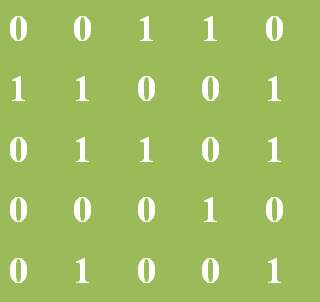

## 回溯法

- 首先暂时放弃问题规模大小的限制，并将问题的候选解按某种顺序逐一枚举和检验。当发现候选解不可能是解时，就选择下一候选解。如果当前候选解除了不满足规模要求外，满足其他所有要求时，继续扩大当前候选解的规模，并继续试探。如果当前的候选解满足包括问题规模在内的所有要求时，该候选解就是问题的一个解。
- 寻找下一候选解的过程称为回朔。
- 扩大当前候选解的规模，并继续试探的过程称为向前试探。
- 分书问题和八皇后都是典型的回溯法问题

### 实例：分书问题

有编号为0，1，2，3，4的5本书，准备分给5个人A，B，C，D，E，每个人的阅读兴趣用一个二维数组描述：

- Like\[i][j] = true  i喜欢书j
- Like\[i][j] = false  i不喜欢书j

写一个程序，输出所有皆大欢喜的分书方案

存储设计：

- 用一个二维数组like存储用户的兴趣
- take[i] = j表示第i本书分给了第j个人。如果第i本书尚未被分配，给take[i]一个特殊值，如-1。



解题思路：

设计一个函数trynext(i)给第i个人分书。

- 依次尝试把书j分给人i。

  - 如果第i个人不喜欢第j本书，则尝试下一本书，如果喜欢，并且第j本书尚未分配，则把书j分配给i。

  - 如果i是最后一个人，则方案数加1，输出该方案。否则调用trynext（i+1)为第i+1个人分书。

  - 回溯。让第i个人退回书j，尝试下一个j，即寻找下一个可行的方案
- 由于在每次try中都要用到like，take以及目前找到的方案数n，因此可将它们作为全局变量，以免每次函数调用时都要带一大串参数。

```c
void trynext(int i)
{
   int j, k;
 
    for (j=0; j<5; ++j) {
        if (like[i][j] && take[j]== -1)   {        //如果i喜欢j，并且j未被分配
            take[j] = i;                           //j分给i
            if (i == 4)  {                         //找到一种新方案，输出此方案
                  n++;
                  cout << "\n第" << n << "种方案: "<< endl;
                  cout << " 书\t人" << endl;
                  for (k=0; k<5; k++)  
                        cout <<k << '\t' << char(take[k] +'A') << endl;
            }
            else  trynext(i+1);	//为下一个人分书
            take[j] = -1;	//尝试找下一方案
        }
    }
}
```

### 实例：八皇后问题 

在一个8*8的棋盘上放8个皇后，使8个皇后中没有两个以上的皇后会在同一行、同一列或同一对角线上。

八皇后问题的求解过程：

求解过程从空配置开始，在第一列到第m列为合理配置的基础上再配置m+1列，直到第n列的配置也时合理时，就找到了一个解。另外在一列上也有n种配置。开始时配置在第一行，以后改变时，顺序选择第二行、第三行 ...... 第n行。当配置到第n行时还找不到一个合理的配置时，就要回朔，去改变前一列的配置。

```c
queen_all(k)
{   for (i = 1; i <=8; ++i)
        if (皇后放在第i行是可行的) {
             在第i行放入皇后；
             if（k == 8） 输出解；
             else queen_all(k+1);
            恢复该位置为空；
        }
}
```

棋盘的数据结构的设计：

- 比较直观的方法是采用一个二维数组，但仔细考察，就会发现，这种表示方法给调整候选解及检查其合理性会带来困难。
- 对于本题来说，我们关心的并不是皇后的具体位置，而是“一个皇后是否已经在某行和某条斜线合理地安置好了”。
- 因为在每一列上恰好放一个皇后，所以引入一个一维数组(设为col（9）)，值col[j]表示在棋盘第j列上的皇后位置。如col[3]的值为4，就表示第三列的皇后在第四行。另外，为了使程序在找完了全部解后回溯到最初位置，设定col[0]的初值为0。当回溯到第0列时，说明程序已求得全部解(或无解)，结束程序执行。

候选解的合理性检查：引入以下三个工作数组 

- 数组a[9]，a[A]=true表示第A行上还没有皇后；
- 数组b[16]，b[A]=true表示第A条右高左低斜线上没有皇后；从左上角依次编到右下角(1-15)。
- 数组c[16]，c[A]=true表示第A条左高右低斜线上没有皇后。从左下角依次编到右上角(1-15)。

```c
void queen_a11(int k) //在8x8棋盘的第k列上找合理的配置
{int i, j;
 char awn;
 for(i = 1; i < 9; i++) // 依次在l至8行上配置k列的皇后
     if ( a[i] && b[k+i-1] && c[8+k-i]) {          //可行位置 
           col[k] = i;
           a[i] = b[k+i-1] = c[8+k-i] = false;     //置对应位置有皇后
           if (k == 8) {                           // 找到一个可行解 
                 for (j = 1; j <= 8; j++)  cout << j << col[j]<< '\t' ;
	      cout << endl;
                 cin >> awn;
                 if (awn=='Q' || awn=='q') exit(0);
           }
           else  queen_a11(k+1);              //递归至第k+1列
           a[i] = b[k+i-1] = c[8+k-i] = true; //恢复对应位置无皇后
     }
}      
```

主程序

```c
int col[9];
bool a[9], b[17],c[17];

int main()
{  int j;

   for(j = 0; j <=8; j++) a[j] = true;
   for(j = 0; j <= 16; j++) b[j] = c[j] = true;
   queen_a11(1);

   return 0;
} 
```

### 实例：迷宫问题

```c++
struct offsets{
  	int a, b;
  	char *dir; // 方向
};
offsets move[8];

seekpath(int x, int y){
  	int i, g, h; // 记录位置信息
  	char *d;
  	...
}
```