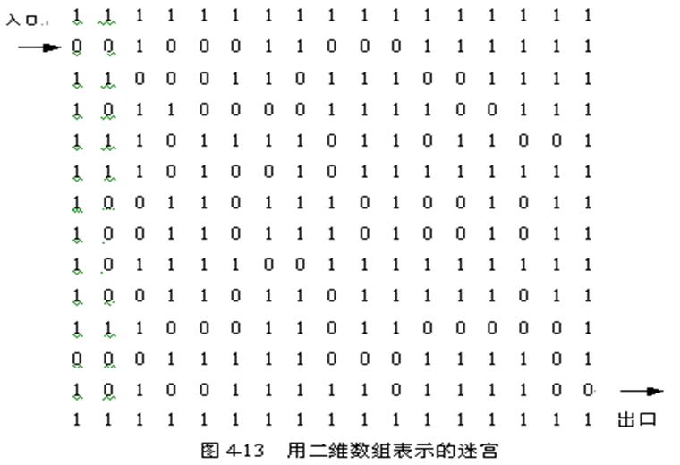
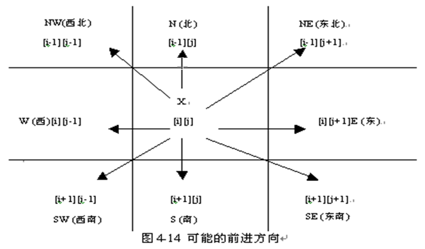

## 回溯法

- 首先暂时放弃问题规模大小的限制，并将问题的候选解按某种顺序逐一枚举和检验。当发现候选解不可能是解时，就选择下一候选解。如果当前候选解除了不满足规模要求外，满足其他所有要求时，继续扩大当前候选解的规模，并继续试探。如果当前的候选解满足包括问题规模在内的所有要求时，该候选解就是问题的一个解。
- 寻找下一候选解的过程称为回朔。
- 扩大当前候选解的规模，并继续试探的过程称为向前试探。
- 分书问题和八皇后都是典型的回溯法问题

### 实例：分书问题

有编号为0，1，2，3，4的5本书，准备分给5个人A，B，C，D，E，每个人的阅读兴趣用一个二维数组描述：

- Like\[i][j] = true  i喜欢书j
- Like\[i][j] = false  i不喜欢书j

写一个程序，输出所有皆大欢喜的分书方案

存储设计：

- 用一个二维数组like存储用户的兴趣
- take[i] = j表示第i本书分给了第j个人。如果第i本书尚未被分配，给take[i]一个特殊值，如-1。


解题思路：

设计一个函数trynext(i)给第i个人分书。

- 依次尝试把书j分给人i。

  - 如果第i个人不喜欢第j本书，则尝试下一本书，如果喜欢，并且第j本书尚未分配，则把书j分配给i。

  - 如果i是最后一个人，则方案数加1，输出该方案。否则调用trynext（i+1)为第i+1个人分书。

  - 回溯。让第i个人退回书j，尝试下一个j，即寻找下一个可行的方案
- 由于在每次try中都要用到like，take以及目前找到的方案数n，因此可将它们作为全局变量，以免每次函数调用时都要带一大串参数。

```c
void trynext(int i)
{
   int j, k;
 
    for (j=0; j<5; ++j) {
        if (like[i][j] && take[j]== -1)   {        //如果i喜欢j，并且j未被分配
            take[j] = i;                           //j分给i
            if (i == 4)  {                         //找到一种新方案，输出此方案
                  n++;
                  cout << "\n第" << n << "种方案: "<< endl;
                  cout << " 书\t人" << endl;
                  for (k=0; k<5; k++)  
                        cout <<k << '\t' << char(take[k] +'A') << endl;
            }
            else  trynext(i+1);	//为下一个人分书
            take[j] = -1;	//尝试找下一方案
        }
    }
}
```

### 实例：八皇后问题 

在一个8*8的棋盘上放8个皇后，使8个皇后中没有两个以上的皇后会在同一行、同一列或同一对角线上。

八皇后问题的求解过程：

求解过程从空配置开始，在第一列到第m列为合理配置的基础上再配置m+1列，直到第n列的配置也时合理时，就找到了一个解。另外在一列上也有n种配置。开始时配置在第一行，以后改变时，顺序选择第二行、第三行 ...... 第n行。当配置到第n行时还找不到一个合理的配置时，就要回朔，去改变前一列的配置。

```c
queen_all(k)
{   for (i = 1; i <=8; ++i)
        if (皇后放在第i行是可行的) {
             在第i行放入皇后；
             if（k == 8） 输出解；
             else queen_all(k+1);
            恢复该位置为空；
        }
}
```

棋盘的数据结构的设计：

- 比较直观的方法是采用一个二维数组，但仔细考察，就会发现，这种表示方法给调整候选解及检查其合理性会带来困难。
- 对于本题来说，我们关心的并不是皇后的具体位置，而是“一个皇后是否已经在某行和某条斜线合理地安置好了”。
- 因为在每一列上恰好放一个皇后，所以引入一个一维数组(设为col（9）)，值col[j]表示在棋盘第j列上的皇后位置。如col[3]的值为4，就表示第三列的皇后在第四行。另外，为了使程序在找完了全部解后回溯到最初位置，设定col[0]的初值为0。当回溯到第0列时，说明程序已求得全部解(或无解)，结束程序执行。

候选解的合理性检查：引入以下三个工作数组 

- 数组a[9]，a[A]=true表示第A行上还没有皇后；
- 数组b[16]，b[A]=true表示第A条右高左低斜线上没有皇后；从左上角依次编到右下角(1-15)。
- 数组c[16]，c[A]=true表示第A条左高右低斜线上没有皇后。从左下角依次编到右上角(1-15)。

```c
void queen_a11(int k) //在8x8棋盘的第k列上找合理的配置
{int i, j;
 char awn;
 for(i = 1; i < 9; i++) // 依次在l至8行上配置k列的皇后
     if ( a[i] && b[k+i-1] && c[8+k-i]) {          //可行位置 
           col[k] = i;
           a[i] = b[k+i-1] = c[8+k-i] = false;     //置对应位置有皇后
           if (k == 8) {                           // 找到一个可行解 
                 for (j = 1; j <= 8; j++)  cout << j << col[j]<< '\t' ;
	      cout << endl;
                 cin >> awn;
                 if (awn=='Q' || awn=='q') exit(0);
           }
           else  queen_a11(k+1);              //递归至第k+1列
           a[i] = b[k+i-1] = c[8+k-i] = true; //恢复对应位置无皇后
     }
}      
```

主程序

```c
int col[9];
bool a[9], b[17],c[17];

int main()
{  int j;

   for(j = 0; j <=8; j++) a[j] = true;
   for(j = 0; j <= 16; j++) b[j] = c[j] = true;
   queen_a11(1);

   return 0;
} 
```

### 实例：迷宫问题

迷宫问题是关于程序设计的一个典型问题，现在用递归的方法来求解迷宫问题。

所谓迷宫问题就是把一只老鼠从无顶盖的大盒子(迷宫)的入口处赶进迷宫。迷宫中设置了很多墙壁，对前进方向形成了多处障碍。在迷宫的唯一出口处放置了一块奶酪，吸引老鼠在迷宫中寻找通路以到达出口。

如果从迷宫的入口到达出口，途中不出现行进方向错误，则得到一条最佳路线。利用递归方法可获得迷宫从入口到出口的最佳路线。

用一个二维数组maze\[m+2]\[p+2]来表示迷宫。如图所示，当数组元素maze\[i]\[j]=1时，表示该位置是墙壁，不能通行；当maze\[i]\[j]=0时，表示该位置是通路。1≤i≤m，1≤j≤p。

数组的第0行、第m+1行，以及第0列和第p+1列是迷宫的围墙，第0列、p＋1列中各有一个0，表示迷宫的入口和出口。 



在求解迷宫问题的过程中，采用回溯法。老鼠在迷宫中任一时刻的位置可用数组行下标i和列下标j表示。从maze\[i]\[j]出发，可能的前进方向有8个，按顺时针方向为N(\[i-1]\[j])，NE(\[i-1]\[j+1])，E(\[i]\[j+1])，SE(\[i+1]\[j+1])，S(\[i+1]\[j])，SW(\[i+1]\[j-1])，W(\[i]\[j-1])，NW(\[i-1]\[j-1])



设位置\[i]\[j]标记为X，它实际是一个交通路口。X周围有8个前进方向，分别代表8个前进位置。如果某一方向是0值，表示该方向有路可通，否则表示该方向已堵死。

为了有效地选择下一位置，可以将从位置\[i]\[j]出发可能的前进方向预先定义在一个表内，参看表4-6。该表为前进方向表，它给出向各个方向的偏移量。

- 前进方向表move

| move[q].dir | move[q].a | move[q].b | move[q].dir | move[q].a | move[q].b |
| ----------- | --------- | --------- | ----------- | --------- | --------- |
| "N"         | 1         | 0         | "S"         | 1         | 0         |
| "NE"        | 1         | 1         | "SW"        | 1         | 1         |
| "E"         | 0         | 1         | "W"         | 0         | 1         |
| "SE"        | 1         | 1         | "NW"        | 1         | 1         |

```c++
struct offsets {      //位置在直角坐标系下的偏移
	int a, b;         //a，b是x，y方向的偏移
	char * dir;       //dir是方向
};
offsets move[8];      //各个方向的偏移表 
```
例如，当前位置在\[i]\[j]时，若向西南(SW)方向走，下一相邻位置\[g]\[h]则为：
g = i + move[5].a = i+1;   h = j + move[5].b = j-1;  d = move[5].dir;

当在迷宫中向前试探时，可根据表4-6所示的前进方向表，选择某一个前进方向向前试探。如果该前进方向走不通，则在前进路径上回退一步，再尝试其他的允许方向。

为了防止重走原路，另外设置一个标志矩阵mark\[m+2]\[p+2]，它的所有元素都初始化为0。一旦行进到迷宫的某个位置\[i]\[j]，则将mark\[i]\[j]置为1。下次这个位置不能再走了。

解决迷宫问题的递归算法

```c++
// 从迷宫某一位置[i][j]开始，寻找通向出口[m][p]的一条路径。
// 如果找到，则函数返回1。否则函数返回0。试探的出发点为[1][1]
int seekpath (int x, int y){
    int i, g, h;                     //用g，h记录位置信息
    char * d;                        //用d记录方向
    if (x == m && y == p) return 1;  //已到达出口，返回1
    for (i = 0; i<8; i++){   //依次对每一个方向寻找通向出口的路径
        g = x+move[i].a; 
        h = y+move[i].b;
        d = move[i].dir;     //找下一个位置和方向(g，h，dir)
        if (maze[g][h] == 0 && mark[g][h] == 0) // 下一位置可通，试探该方向
        {
                mark[g][h] = 1;                 //标记为已访问过
                if (seekpath (g , h)) 
                {   //从此位置递归试探
                    cout<<"("<<g<<"，"<<h<<")，"<<"Direction"<<dir<<"，";
                    return 1;       //试探成功，逆向输出路径坐标
                }
        }
 	//回溯，换一个方向再试探通向出口的路径
	}
    if (x == 1 && y == 1) cout<<"no path in maze"<<endl;
    return 0;
} 
```