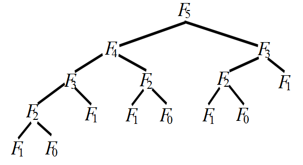
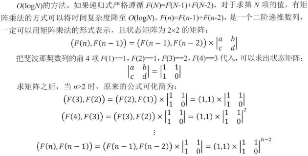
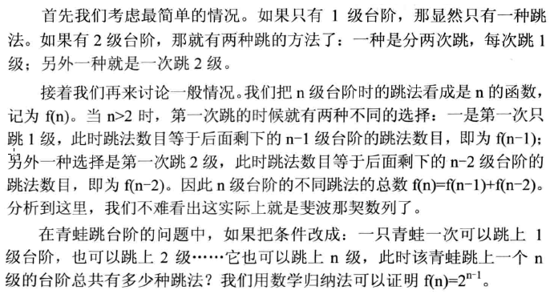

## 斐波那契数列

兔子在出生两个月后，就有繁殖能力，一对兔子每个月能生出一对小兔子来。如果所有兔都不死，那么一年以后可以繁殖多少对兔子？



```c
int f(int n){
   if(n==0){
     	return 0;
   }else if(n==1){
     	return 1;
   }else{
     	return (f(n-1)+f(n-2));
   }        
}
```

实现效率分析：消费的时间是灾难性的！！！

Fibonacci函数的迭代实现

```c
int f(int n)
{ 
  	int i, fn, fn_1 = 0, fn_2 = 1;
  	if (n == 0) return 0;
  	if (n == 1) return 1;
  	for ( i = 2; i<=n; ++i)
  	{
      	fn = fn_1 + fn_2;
  	    fn_1 = fn_2; 
      	fn_2 = fn; 
    }
 	return fn;
}
```

消耗的时间：执行n次加法和3n次赋值！！！

系统考虑：对递归函数的每次调用都需要内存空间。由于很多调用的活动都是同时进行的，操作系统可能会耗尽可用的内存,避免在处理过大的n时产生溢出问题。

## 输出斐波那契数列

写一个函数，输入n，求斐波那契（Fibonacci）数列的第n项。斐波那契数列的定义如下：


### 效率很低的解法

```c++
long long Fibonacci(unsigned int n){
  	if(n <= 0) return 0;
  	if(n == 1) return 1;
  	return Fibonacci(n-1) + Fibonacci(n-2);
}
```

### 使用解法

```c++
long long Fibonacci(unsigned int n)
{
    int result[2] = {0, 1};
    if(n < 2)
        return result[n];

    long long  fibNMinusOne = 1;
    long long  fibNMinusTwo = 0;
    long long  fibN = 0;
    for(unsigned int i = 2; i <= n; ++ i)
    {
        fibN = fibNMinusOne + fibNMinusTwo;

        fibNMinusTwo = fibNMinusOne;
        fibNMinusOne = fibN;
    }

     return fibN;
}
```

### 时间复杂度O(logN)但不实用的解法


把求斐波那契数列转换成矩阵的乘方。



```c++
struct Matrix2By2
{
    Matrix2By2
    (
        long long m00 = 0, 
        long long m01 = 0, 
        long long m10 = 0, 
        long long m11 = 0
    )
    :m_00(m00), m_01(m01), m_10(m10), m_11(m11) 
    {
    }

    long long m_00;
    long long m_01;
    long long m_10;
    long long m_11;
};

Matrix2By2 MatrixMultiply
(
    const Matrix2By2& matrix1, 
    const Matrix2By2& matrix2
)
{
    return Matrix2By2(
        matrix1.m_00 * matrix2.m_00 + matrix1.m_01 * matrix2.m_10,
        matrix1.m_00 * matrix2.m_01 + matrix1.m_01 * matrix2.m_11,
        matrix1.m_10 * matrix2.m_00 + matrix1.m_11 * matrix2.m_10,
        matrix1.m_10 * matrix2.m_01 + matrix1.m_11 * matrix2.m_11);
}

Matrix2By2 MatrixPower(unsigned int n)
{
    assert(n > 0);

    Matrix2By2 matrix;
    if(n == 1)
    {
        matrix = Matrix2By2(1, 1, 1, 0);
    }
    else if(n % 2 == 0)
    {
        matrix = MatrixPower(n / 2);
        matrix = MatrixMultiply(matrix, matrix);
    }
    else if(n % 2 == 1)
    {
        matrix = MatrixPower((n - 1) / 2);
        matrix = MatrixMultiply(matrix, matrix);
        matrix = MatrixMultiply(matrix, Matrix2By2(1, 1, 1, 0));
    }

    return matrix;
}

long long Fibonacci_Solution3(unsigned int n)
{
    int result[2] = {0, 1};
    if(n < 2)
        return result[n];

    Matrix2By2 PowerNMinus2 = MatrixPower(n - 1);
    return PowerNMinus2.m_00;
}
```

## 台阶问题

一只青蛙一次可以跳上1级台阶，也可以跳上2级，求该青蛙跳上一个n级的台阶总共有多少种跳法。




```c++
// 递归实现
public static int s1(int n) {
	if (n < 1) {
		return 0;
	}
	if (n == 1 || n == 2) {
		return n;
	}
	return s1(n - 1) + s1(n - 2);
}
// 循环实现
public static int s2(int n) {
	if (n < 1) {
		return 0;
	}
	if (n == 1 || n == 2) {
		return n;
	}
	int res = 2;
	int pre = 1;
	int tmp = 0;
	for (int i = 3; i <= n; i++) {
		tmp = res;
		res = res + pre;
		pre = tmp;
	}
	return res;
}
// 矩阵乘法实现
public static int s3(int n) {
	if (n < 1) {
		return 0;
	}
	if (n == 1 || n == 2) {
		return n;
	}
	int[][] base = { { 1, 1 }, { 1, 0 } };
	int[][] res = matrixPower(base, n - 2);
	return 2 * res[0][0] + res[1][0];
}
```

