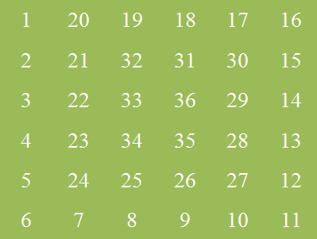

## 数字旋转方阵（蛇阵）

数字旋转方阵如图所示。编程输出任意N*N的蛇阵。



用递归的观点看问题

- 先填最外圈，然后再填内部内部的填法同上。也是先填最外圈，再填内部。
- 根据上述思想，可以设计一个递归函数fill。该函数先填外圈，然后递归调用自己填内部。

函数原型：

```c
void fill(int number, int begin, int size)
// number：表示要填入的起始数据
// begin：表示要填的起始位置
// size：蛇阵的规模
```
要生成一个6*6的蛇阵只要调用：fill(1,0,6)

```c
#include<iostream>
using namespace std; 

int p[20][20];
void fill( int, int, int );

int main()
{
	int row, col, size;
	cout << "请输入蛇阵的规模：";
	cin >> size;
	fill( 1, 0, size );
	
	for ( row = 0; row < size; row++ )
	{
		cout << endl;
		for ( col = 0; col < size; col++ ){
			cout << p[row][col] << '\t';
		}
	}
	return 0;
}

void fill( int number, int begin, int size )
{
	int i, row = begin, col = begin;
	
	if ( size == 0 ) return;
		
	if ( size == 1 )
	{
		p[begin][begin] = number; 
		return;
	}
	
	p[row][col] = number++;
	
	for ( i = 0; i < size - 1; i++ )
	{
		p[++row][col] = number++;
	}
	
	for ( i = 0; i < size - 1; i++ )
	{
		p[row][++col] = number++;
	}
	
	for ( i = 0; i < size - 1; i++ )
	{
		p[--row][col] = number++;
	}
	
	for ( i = 0; i < size - 2; i++ )
	{
		p[row][--col] = number++;
	}
	
	fill( number, begin + 1, size - 2 );
}
```

- 自上而下填最左列
- 自左而右填最下行
- 自下而上填最右列
- 自右而左填最上行
- 递归调用fill，规模减2，起始位置为原来的下一行下一列，填入的起始数字为填入一圈后的第一个数字。