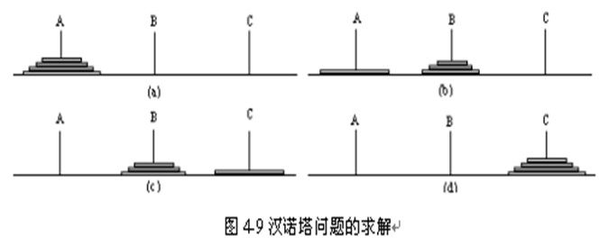
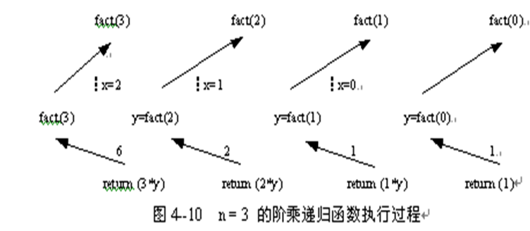
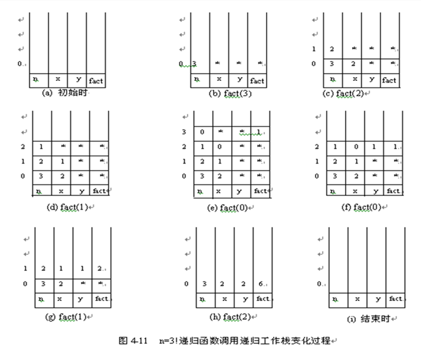
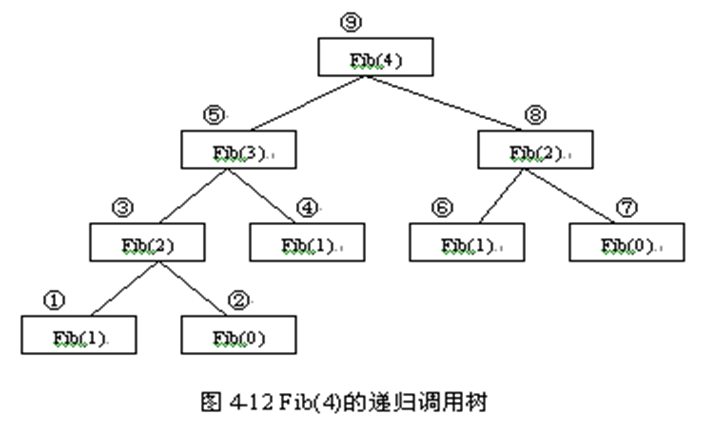

## 递归的概念

递归（recursion）在数学及程序设计中是一种很重要的工具。递归的定义是：若一个对象部分地包含它自己，或用它自己给自己定义，则这个对象是递归的；若一个过程直接地或间接地调用自己，则称这个过程是递归的过程。

在以下两种情况下，常常用到递归的方法。

### 定义是递归的

许多对象的定义是递归的，像阶乘函数，斐波那契数列等。例如，阶乘的定义是：


又例如，链表结点的定义，也是递归的。链表结点node的定义由数据域data和指针next组成，，而指针node则由next定义。

再例如，单链表的递归定义可以写为：

- 单个结点，其指针域next的值为NULL，是一个单链表；
- 一个结点，其指针域next指向一个单链表，整个仍是一个单链表。

### 问题的解法是递归的

汉诺塔问题是递归求解的一个典型问题，汉诺塔问题是：设有3根标号为A、B、C的针，在A 针上穿有n个盘子，一个比一个小。要求把A针上的盘子全部移到C针上。移动的规则是：

（1）一次只能移动一个盘子；

（2）移动过程中大盘子不能放在小盘子上面；

（3）在移动过程中盘子可以放在A、B、C的任意一根针上。

问题的解法为

如果n = 1，则将这一个盘子直接从A针移到C针上。否则执行以下三步：

（1） 用C针做过渡，将A针上的（n-1）个盘子移到B针上；
（2） 将A针上最后一个盘子直接移到C针上；
（3） 用A针做过渡，将B针上的(n-1)个盘子移到C针上。

移动过程如图4-9所示，图中n = 4。



移动n个盘子的汉诺塔问题归结为移动（n-1）个盘子的汉诺塔问题。与此类似，移动（n-1）个盘子的汉诺塔问题又可归结为移动（n-2）个盘子的汉诺塔问题，……，最后总可以归结到只移动一个盘子的汉诺塔问题。

求解汉诺塔问题的算法

```c++
# include <iostream.h>
void Hanoi (int n, char A, char B, char C)  {
	//把n 个盘子从A针借助B针移到C针上
	if (n == 1 ){ //递归出口，一个盘子直接移动
      	cout<<"Move"<<A<<"to"<<C<<endl;
	}else{
      	Hanoi (n-1 , A , C , B);       //将上面n-1个盘子移到B针上
      	cout<<"Move"<<A<<"to"<<C<<endl;//最后一个移到C针上
      	Hanoi (n-1, B,A,C);     //将B针上的n-1个盘子移到C针上
	}
}
```

### 递归过程与递归工作栈

我们知道，对一个非递归函数的调用，在函数调用前要保存以下三方面的信息：

- 返回地址
- 本函数调用时，与形参结合的实参值，包括函数名和函数参数。
- 本函数的局部变量值。

当函数调用返回时，要释放当初保存的实参值和局部变量值，然后按保存的返回地址返回。

对于一个递归函数的调用也是如此，在函数调用前也要保存上述三方面的信息。但因为递归函数的自调用特性，上述所保存的信息将由于函数不断地调用自身而互相重叠，如没有合适的存储结构来保存，这些信息就无法使用。在高级语言的处理程序中，使用了一个“递归工作栈”来进行处理。每一层递归调用所需保存的信息构成一个工作记录，每一个工作记录包括与前述类似的三方面的信息：

- 返回地址，即上一层中本次调用自身的语句的后继语句处
- 本次函数调用时，与形参结合的实参值，包括函数名、引用参数和值参数等
- 本层的局部变量值

在每进入一层递归时，系统就要建立一个新的工作记录，把上述项目登入，加到递归工作栈的栈顶。每退出一层递归，就从递归工作栈退出一个工作记录，栈顶的工作记录必定是当前正在执行的这一层的工作记录，也称其为“活动记录”。

下面以计算阶乘的递归函数为例，对于n为3时，分析递归函数的执行过程，以及递归函数调用时递归工作栈的变化过程。根据阶乘的定义


阶乘递归函数设计如下

```c++
long fact (int n) {
	if (n == 0){
      	return 1; //递归出口
	}else if{
      	return  n * fact(n-1); //递归调用
	}
}
```

计算3的阶乘时，递归函数调用的执行过程如图4-10所示。图中的x是自变量，y是x的阶乘，都是中间变量。图中箭头旁的数值代表函数的返回值y，最终fact(3) = 6。

当递归调用返回时，返回到上一层递归调用的下一语句，而这个返回位置正好是算法的结束处。这样，每次递归调用时保存的返回地址就不使用了。

n=3的阶乘递归函数调用的系统栈区的动态变化过程如图所示，图中符号 “*”表示值尚未知。 





## 消除递归

根据前面的介绍可知，递归算法是一种分而治之的方法，它把复杂问题分解为简单问题来求解。对于某些复杂问题，用递归算法来分析比较有效，用递归算法来描述也比较自然、易理解。但递归算法的时间效率通常比较差。因此，在求解某些问题时，人们希望用递归算法来分析问题，用非递归算法来求解问题；另外，有些计算机语言不支持递归功能，这就需要把递归算法转化为非递归算法。

把递归算法转化为非递归算法通常采用如下两种方法：

- 对于尾递归和单向递归的算法，可用循环结构的算法来替代。
- 自己用栈来模拟系统运行时的栈，保存有关的信息，从而用非递归算法来模拟递归算法

### 尾递归和单向递归的消除

尾递归是指在递归算法的函数中，递归调用语句只有一个，而且是处在函数的最后，如前述的求解阶乘的函数。由于当递归调用返回时，是返回到上一层递归调用的下一语句，而这个返回位置正好是算法的结束处。因此，每次递归调用时保存的返回地址就不使用了，事实上，函数返回值和函数的参数也是不使用的。由此可知，对于尾递归形式的算法，不必利用系统的运行时的栈来保存各种信息。尾递归形式的算法可以很方便地用循环结构的形式来替代。

阶乘的求解可以写成如下循环结构的非递归算法：

```c++
long fact(int n){
      int product=1;
      for (int i=1; i<=n; i++)
        product= producti
      return product
}
```

单向递归是指递归函数中虽然有递归调用语句，但各递归调用语句的参数只和主调用函数有关，相互之间参数无关，并且这些递归调用语句都处在算法的最后。显然，尾递归是单向递归的特例。单向递归的一个典型例子就是斐波那契数列的递归算法。

斐波那契数列的递归定义是：


计算此数列的递归函数如下：

```
long Fib(int n)
{ if (n == 0 || n ==1 ) return  n;        //递归出口
  else   return Fib(n-1)+Fib(n-2);     //递归调用
}
```

上述递归函数求Fib(4)过程可以用如图4-12所示的递归调用树来描述。

为了计算Fib(4)，必须先计算Fib(3)；为了计算Fib(3)，必须先计算Fib(2)，…。求解的顺序在图上由数字①②③…表示。 



### 用栈模拟系统运行时的栈

如果要把一个非单句递归算法转换成非递归算法，就必须使用一个栈来模拟系统在运行递归算法时的栈，从而消除递归。现以汉诺塔问题为例来介绍这种方法。