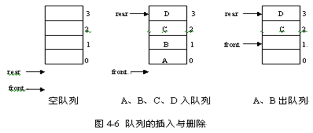
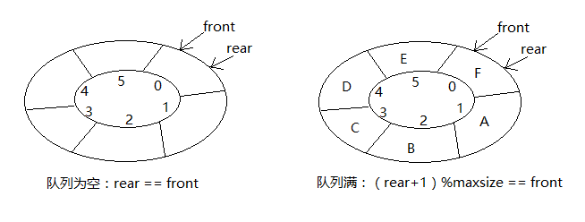
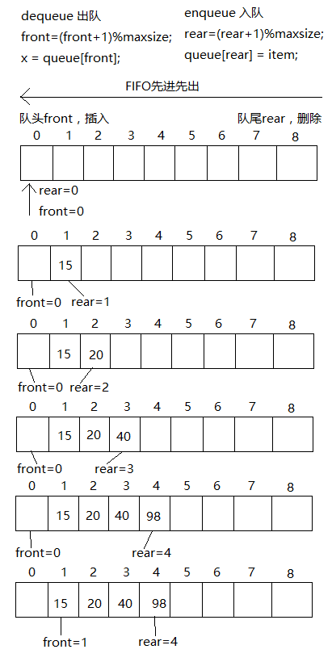

## 循环队列

队列的顺序存储表示是利用一维数组存储的。设置两个指针front和rear，分别指示队列的队头元素和队尾元素位置。

约定：队头指针front指示队头元素所在位置的前一位置；队尾指针rear指示的是实际的队尾元素位置。初始时队列为空，设front=rear=-1。当要添加一个元素到队列时，让队尾指针rear加1，再将新元素添加到rear所指位置。当要退出队头元素时，先把队头front指针加1，再把front所指的位置上的元素值返回。

由于队列的插入和删除操作分别在队尾和队首进行，每个元素必然按照进入的次序离队，也就是说先进队的元素必然先离队，所以称队列为先进先出表（First In First Out,简称FIFO）。队列结构与日常生活中排队等候服务的模型是一致的，最早进入队列的人，最早得到服务并从队首离开；最后到来的人只能排在队列的最后，最后得到服务并最后离开。

如图所示，假设有4个存储空间的队列，队列的最大长度maxsize为4，即队列中最多允许存储4个元素。初始时队列为空，接着有4个元素A、B、C、D依次入了队列，然后A、B又依次出队列。 



由于存在假溢出，实际软件系统中不使用上述顺序队列，而是使用下面所要讨论的顺序循环队列，即把顺序队列所使用的存储空间构造成一个逻辑上首尾相连的循环队列，简称为循环队列。

当队尾指针rear或队头指针front达到maxsize－1后，再进一个位置，就自动到0，这可以利用求模(或取余)(%)运算来实现。例如maxsize＝4，rear＝3，若再加1 ，则rear = (rear＋1)%4＝0，即队尾指针的下一个取值为0。  

对于循环队列，为了处理起来方便，设初始时为空队列，front=rear=0。

当要添加第一个元素到队列时，队尾指针rear加1等于1，要加入队列的元素放在序号1处。此时front=0，指示队头元素所在位置的前一位置，rear=1，指示的是实际的队尾元素位置，这与前面的约定是一致的。

判断循环队列的队列满和队列空：考虑front指针和rear指针的初始化值，设循环队列的maxsize＝6，令front＝rear＝0，其状态如图所示


当数据元素A、B、C、D、E、F入队列后，循环队列满，此时有rear＝front＝0，其状态如图所示。



可见队列空与队列满都有rear==front。解决的方法通常是少用一个存储空间，以队尾指针rear加1等于队头指针作为队列满的条件。

此时，队头指针front实际所指的是队头元素所在位置的前一位置，所以队列满的情形实际上空了一个位置。这样，就可以给出循环队列满和空的两个不同的判定条件。

循环队列满的条件为：(rear＋1)%maxsize==front

循环队列空的条件仍为：rear==front

## 队列的顺序存储实现

用循环数组实现，以少使用一个存储单元的方案实现循环队列

```java
public interface Queue {
    //返回队列的大小
	public int getSize();
	
	//判断队列是否为空
	public boolean isEmpty();
	
	//数据元素e入队
	public void enqueue(Object e);
	
	//队首元素出队
	public Object dequeue() throws QueueEmptyException;
	
	//取队首元素
	public Object peek() throws QueueEmptyException;
}
```

```java
public class QueueArray implements Queue {
	private static final int CAP = 7;//队列默认大小
	private Object[] elements;	//数据元素数组
	private int capacity;		//数组的大小elements.length
	private int front;			//队首指针,指向队首
	private int rear;			//队尾指针,指向队尾后一个位置
	public QueueArray() {
		this(CAP);
	}
	public QueueArray(int cap){
		capacity = cap + 1;
		elements = new Object[capacity];
		front = rear = 0;
	}

	//返回队列的大小
	public int getSize() {
		return (capacity-front+rear)%capacity;
	}

	//判断队列是否为空
	public boolean isEmpty() {
		return front==rear;
	}

	//数据元素e入队
	public void enqueue(Object e) {
		if (getSize()==capacity-1) expandSpace();
		elements[rear] = e;
		rear = (rear+1)%capacity;
	}
	private void expandSpace(){
		Object[] a = new Object[elements.length*2];
		int i = front;
		int j = 0;
		while (i!=rear){
			a[j++] = elements[i];
			i = (i+1)%capacity;
		}
		elements = a;
		capacity = elements.length;
		front = 0;
		rear = j;
	}
	
	//队首元素出队
	public Object dequeue() throws QueueEmptyException {
		if (isEmpty())
			throw new QueueEmptyException("错误：队列为空");
		Object obj = elements[front];
		elements[front] = null;
		front = (front+1)%capacity;
		return obj;
	}

	//取队首元素
	public Object peek() throws QueueEmptyException {
		if (isEmpty())
			throw new QueueEmptyException("错误：队列为空");
		return elements[front];
	}	
}
```
