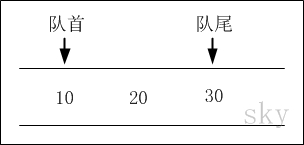
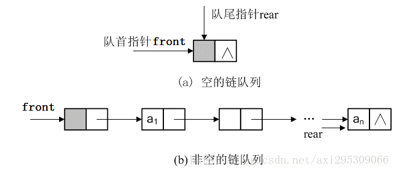

## 队列的介绍

队列(queue)是一种先进先出(First In First Out，FIFO)的线性表。它只允许在表的一端插入元素，而在另一端删除元素。在队列中，允许插入的一端叫做队尾(rear)，允许删除的一端叫做队头(front)。

队列 (Queue)是另一种限定性的线性表，它只允许在表的一端插入元素，而在另一端删除元素，所以队列具有先进先出(Fist In Fist Out， 缩写为FIFO)的特性。在队列中，允许插入的一端叫做队尾(rear)，允许删除的一端则称为队头(front)。 在队列中插入一个新元素的操作简称为进队或入队，新元素进队后就成为新的队尾元素；从队列中删除一个元素的操作简称为出队或离队，当元素出队后，其后继元素就成为新的队头元素

假设队列为q=(a1，a2，…，an)，那么a1就是队头元素，an则是队尾元素。队列中的元素是按照a1，a2，…，an的顺序进入的， 退出队列也必须按照同样的次序依次出队，也就是说，只有在a1，a2，…，an-1都离开队列之后，an才能退出队列。 

队列（Queue），是一种线性存储结构。它有以下几个特点：

- 队列中数据是按照"先进先出（FIFO, First-In-First-Out）"方式进出队列的。
- 队列只允许在"队首"进行删除操作，而在"队尾"进行插入操作。

队列通常包括的两种操作：入队列 和 出队列。

### 队列的示意图

队列中有10，20，30共3个数据。

### 出队列

出队列前：队首是10，队尾是30。
出队列后：出队列(队首)之后。队首是20，队尾是30。

### 入队列

入队列前：队首是20，队尾是30。
入队列后：40入队列(队尾)之后。队首是20，队尾是40。

队列的存储表示也有两种方式：一种是顺序方式，另一种是链接方式。 

## 队列的顺序存储结构

队列的顺序存储结构称为顺序队列。顺序队列可以利用一个一维数组和两个指针来实现。一维数组用来存储当前队列中的所有元素，两个指针front和rear分别指向当前队列的队首元素和队尾元素，分别称为队首指针和队尾指针。

## 队列的链接存储结构

队列的另一种存储表示是链表存储方式，最合适的就是不带头结点的单链表。

队列的头指针front指向单链表的第一个结点，队列的尾指针指向单链表的最后一个结点。出队也就是删除第一个结点，入队也就是在单链表尾追加一个结点。用单链表表示的链队列特别适合于数据元素变动比较大的情形，而且不存在队列满而产生溢出的情况。 

队列的链接存储结构是用一个单链表存放队列元素的。队列的链接存储结构称为链队列。由于队列只允许在表尾进行插入操作、在表头进行删除操作，因此，链队需设置两个指针：队头指针front和队尾指针rear，分别指向单链表的第一个结点(表的头结点)和最后一个结点(队尾结点)。

